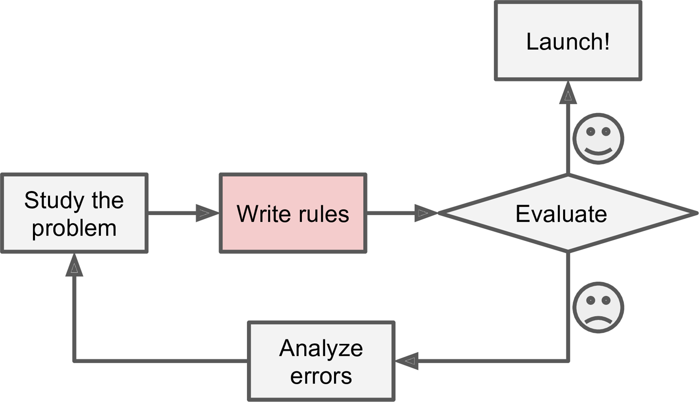

Chapter 01. The Machine Learning Landscape
===================================
# 기계학습이란 무엇인가?
기계학습이란 컴퓨터 프로그래밍 과학(혹은 기술)으로 컴퓨터가 데이터로 학습을 하는 것을 말한다.
* **일반적인 정의**  
  기계학습이란 그 어떤 명확하게 프로그래밍된 것없이 컴퓨터에게 학습하는 능력을 주는 학문 분야이다.-
_**Arthur Samuel, 1959**_
* **공학지향적 정의**  
  P로 측정되는 T의 퍼포먼스가 E

예를들면 스팸 메일 필터가 기계학습프로그램인데,
스팸이 아닌 메일과, 스팸인 메일의 예시를 받아서 스팸 매일을 표시하도록 학습한 프로그램이다.

# 왜 기계학습을 사용하는 것인가?
직접 기존의 프로그래밍 방법으로 스팸 메일 필터를 작성한다고 생각해보자.
1. 스팸메일들이 일반적으로 많이 보이는 특징을 찾는다.
2. 그리고나서 각각의 찾은 특징 및 패턴에 대한 탐지 알고리즘을 작성한다.
3. 그리고 작성한 알고리즘을 테스트해보고 탐지 능력이 좋아질 때까지 1번과 2번과정을 반복한다.



이런 방식의 접근 방법은 관리하기가 어렵고 수많은 복잡한 규칙들이 생성될 것이다.

하지만 기계학습 기술에 기반한 스팸 필터는 스팸이 아닌 메일의 예시 데이터와 비교해서 기존 일반 메일에서 자주 발견되지 않는 패턴을 찾아내는 스팸 예측 변수에 좋은 단어나 문장들을 알아서 학습한다. 


기존의 프로그래밍 방법을 생각해보자. 스팸메일을 보내는 사람이 "4U"라는 단어가 스팸메일 필터 규칙에 걸려 차단을 당한다는 사실을 알았다면 그 사람은 그냥 "For U"나 "4You"로 바꾸어 버리면 그만이다. 필터에는 이러한 규칙을 새로 작성을 해야합니다.

반면에 기계학습을 이용했다면 알아서 유저가 어떤 메일을 스팸처리를 하면 "For U"나 "4You"를 비정상적 패턴으로 자동으로 알아차릴 것이다.

기계학습은 예를 들면 음성인식 분야같은 기존에 사용하던 접근 방법이 너무 복잡하거나 심지어 해결하지못한 문제에서 빛을 발하고 있다. 

기계학습의 장점을 요약하자면 다음과 같다.
- <b>기존에 솔루션이 존재하지만 직접 수많은 규칙을 작성하는등으로 손으로 직접 모두 튜닝해야만 했던 문제들에서 단일의 기계학습 알고리즘으로 코드를 간단하게 만들면서도 더 좋은 수행능력을 보인다. </b>
- <b> 기존의 방법으로는 전혀 어떠한 솔루션이 없는 아주 복잡한 문제들에서 최적의 기계학습 기술이 솔루션을 찾아줄 수 있다. </b>
- <b> 변동이 너무 큰 환경에서 기계학습 시스템은 새로운 데이터에 적용할 수 있다.</b>
- <b> 대량의 데이터와 복잡한 문제에서 통찰력을 얻을 수 있다.</b>
 
# 기계학습 시스템의 종류
기계학습은 수많은 카테고리들을 분류하는 데 유용한데 이러한 기계학습에도 다양한 종류가 존재한다.
* 인간이 학습에 개입하는지 안하는지에 따라 지도학습, 비지도학습, 준지도 학습, 강화학습으로 구분
   * (Supervised, Unsupervised, Semisupervised, Reinforcement Learning)
* 학습의 진행이 계속해서 증가하는지 아니면 그 때 그 때 증가하는지에 따라 "실시간 학습" VS "비실시간 학습"으로 구분
   * (Online Versus batch Learning)
* 새로운 데이터 포인트와 기존의 데이터 포인트와 비교하는 것만으로 작동하는지, 아니면 수많은 과학자들이 하는 것처럼 예측 모델과 학습데이터에 기반하여 패턴을 찾아내는지에 따라 "예시 기반 학습" VS "모델 기반 학습"으로 구분
   * (Instance-based Versus Model based Learning)

하지만 이러한 분류는 서로 배타적인 것은 아니다. 필요하다면 섞어쓸 수도 있다.
요즘의 스팸 필터링은 심층신경망을 이용해서 모델 예측 기반으로 실시간, 지도학습을 하였다.

## 지도학습 / 비지도학습 (Supervised/Unsupervised Learning)
기계학습은 학습을 할 때 지도를 받는지 아닌지, 그리고 그 방식에 따라 나눌수 있다.
### 지도학습 (Supervised Learning)
지도학습은 학습 데이터와 흔히 "라벨(Label)"데이터라 부르는 정답 데이터를 같이 학습 알고리즘에 넣어 학습하는 방식이다.


전형적인 지도학습은 보통 Classification, 분류이다. 다시 스팸필터를 예로 들면 메일이 스팸인지 아닌지, 즉 스팸메일, 일반메일 이라는 두 개의 클래스로 분류하는 것이다. 

또 다른 지도학습 예로는 목표의 수치값을 예측하는 것이다. 자동차 가격을 예측하는 것을 예로 들면 흔히 예측 변수(Predictor)라고 하는 주어진 특징들(연식, 브랜드, 주행거리 등)을 통해 자동차 가격을 예측한다. 이러한 분류 작업은 Regression, 회귀라고 한다. 
```
기계학습에서 많은 사람들이 "attribute(요소)"와 "feature(특징)"를 혼용해서 사용한다.
* Attribute (요소): 보통 데이터 값의 종류, 이름들을 뜻한다. 예를 들면 위의 '주행거리'같은 것을 칭한다.
* Feature (특징): 상황에 따라 여러 의미로 사용이 된다. 일반적으로는 요소와 그 값을 합친 내용을 칭한다. ("주행거리 = 15000")

또한 Classification과 Regression을 많이 혼동하기도 한다. 뒤에 한 번 더 자세하게 설명한다.
* Classification : 주어진 데이터들을 두 가지 이상의 종류로 구분해내는 작업이다.
* Regression : 연속형 변수들에 대하여 두 변수 사이의 모형을 구한 뒤에, 적합도를 측정해내는 모델이다.
```

  
회귀 알고리즘은 분류 작업에서 자주 쓰이며, 반대로도 역할을 수행하기도 한다. 예를 들어 로지스틱 회귀(Logistic Regression)는 보통 분류에서 많이 사용되는데, 주어진 클래스에 대하여 상응하는 예측치의 값으로 결과를 출력해낸다. (ex: 20% 확률로 스팸 메일입니다.)

이 책에서는 다음과 같이 아주 중요한 지도학습 알고리즘을 다룰 것이다.
* **K-최근접 이웃 알고리즘** K-Nearest Neighbors(KNN)
* **선형 회귀** Linear Regression
* **로지스틱 회귀** Logistic Regression
* **서포트 벡터 머신** Support Vector Machine
* **의사결정트리와 랜덤 포레스트** Decision Trees and Random Forests
* **신경망** Neural Network

### 비지도학습 (Unsupervised Learning)
비지도 학습이란 어떠한 레이블 데이터 없이 학습을 하는 것이다.


이 책에서는 다음과 같이 아주 중요한 비지도학습 알고리즘을 다룰 것이다. (이는 chapter 8의 차원 축소법에서 다룰 예정이다.)
* **클러스터링** Clustering
  * **K-평균 알고리즘** K-means
  * **위계적 군집 분석** Hierarchical Cluster Analysis (HCA)
  * **기대치 최대화 알고리즘** Expectation Maximization
* **시각화 및 차원 축소법** Visualization and Dimensionality Reduction
  * **주성분(최적치) 알고리즘** Principal Component Algorithm (PCA)
  * **커널 기법 주성분(최적치) 알고리즘** Kernel PCA
  * **지역적 선형 위상 배치법** Locallly-Linear Embedding
  * **T개의 분산 기반 확률적 근접 위상 배치법** T-distributed Stochastic Neighbor Embedding (t-SNE)
* **연관 규칙 학습** Association rule learning
  * **선험(아프리오리)** Apriori
  * **화려함(에끌라)** Eclat

예를들어 나의 블로그 방문자에대한 데이터를 가지고 있다고 하자. 그리고 같은 부류의 방문자들 끼리 그룹지어주고 싶어한다고 하자. 여기서 비지도학습으로 학습 시키면 인간에게 어떠한 도움도 받지않고 알고리즘이 알아서 그 연결을 만들어갈 것이다. 만약 여기에다 위계적 군집 분석(HCA)를 적용한다면 각 그룹이 좀 더 세분화 되어 나누어 질 것이다.


시각화 알고리즘은 비지도학습의 좋은 예시이다. 레이블되지 않은 데이터들을 학습시키고 나서 2-D나 3-D로 쉽게 Plotting하여 데이터를 표시할 수 있다.
이러한 알고리즘들은 어떻게 데이터들이 정리되었고 비지도학습을 한 패턴들을 쉽게 이해할 수 있다.


여기에 관련된 것으로는 '차원 축소법'이라는 것이 있는데, 이는 정보 손실을 최소화하여 데이터를 간소화하는 것을 목표로 한다. 한 방법으로는 서로 관련이 있는 특징들을 하나로 합치는 것이 있다. 예를들면 어떤 차에 대한 주행거리와 연식은 어떤 차에 대한 마모도로 표현함으로써 2개의 변수를 하나로 줄이는 것으로 **차원의 축소**가 가능하다. 이를 보통 특징 추출이라고 한다.

```
기계학습에서 차원 축소법을 사용하면 아주 좋다. 차원을 축소한다는 것은 고려해야하는 변수들을 줄인다는 것을
의미를 하기 때문에 좀 더 빠른 학습이 가능하며 디스크 용량과 메모리를 덜 차지할 것이다.
```

그러나 또 다른 비지도 학습의 중요한 일은 바로 비정상 탐지다. 예를들면 사기거래를 예방할 수 있는 비정상적 신용카드 트랜잭션 탐지, 결함 생산 방지, 또 다른 학습 알고리즘에 데이터 셋을 학습 시키기 전에 이상한 데이터를 자동으로 제거하는 등의 작업이 존재한다. 이러한 시스템들은 평범한 경우를 학습하고, 새로운 경우를 보았을 때엔 이 경우가 정상적인 경우인지 아닌지를 말해준다. (아래의 그림을 참고하자)


마지막으로 또 다른 일반적인 비지도 학습은 연관 규칙 학습이다. 이는 수많은 데이터를 학습하고, 데이터 요소들 사이에서 관심점을 찾아낸다. 예를 들면 슈퍼마켓에서 손님들의 구매정보를 학습하여 보통 스테이크를 구매할 때 감자칩과 바비큐 소스를 같이 구매한다면 스테이크 코너 주위에 감자칩과 바비큐 소스를 배치할 수 있을 것이다.

## 준지도학습 (Semisupervised Learning)
일부 알고리즘들은 학습하는데 도움이 되는 레이블 데이터를 다루며, 종종 레이블이 없는 학습을하거나 약간의 레이블 데이터를 가지고 학습을 진행하기도 한다. 즉, 모든 데이터에 레이블 데이터가 존재하지않지만 일부 정보에 대한 레이블을 가지고 학습하는 것을 준지도학습이라고 한다.

Google Photos가 좋은 예이다. 모든 가족사진을 업로드하면, 자동으로 얼굴을 인식해서 사진에 누가 있는지 알려주면서 A라는 사람은 1번, 5번, 11번 사진에서 보이고, B라는 사람은 2번, 5번, 7번,에서 보인다라고 알려줄 것이다. 사람 한 명당 레이블 하나를 주는데 이는 모든 사진에 모든 사람들의 이름이 보여질 것이고 이는 사진을 검색하는데 도움을 줄 것이다.


대부분의 준지도학습 알고리즘은 지도학습과 비지도학습을 짬뽕한 것이다. 예로, _Deep Belief Networks (DBNs)_이라고 하는 것은 _Restricted Blotzmann machine(RBMs)이라 부르는 비지도 학습 요소들을 기반으로 해서 만들어 진 것으로, 비지도 학습 방법으로 RBMs을 연속으로 학습을 시킨 뒤에, 지도학습 방식으로 전체 시스템을 조율(Fine-tune)한다.

## 강화학습 (Reinforcement Learning)
강화학습은 많이 어려운 놈인데, 이 학습 맥락에서 Agent라고 하는 학습 시스템은 환경을 조사하고, 수행할 행동을 선택하여 결과로 보상을 얻는다. 만약 올바르지 못한 행동을 한다면 패널티를 얻는다.(아래의 그림을 참고하라) 보상을 얻기 위해서 정책이라 부르는 최고의 전략을 Agent 자기 스스로 학습을 해야한다. 정책은 주어진 상황에서 Agent가 어떻게 행동해야만 하는지 정의한 것이다.


예로 많은 로봇들이 강화학습을 통해 걷는 방법을 배우도록 구현되어있다. 2016년 3월에 DeepMind에서 만든 AlphaGo 프로그램 또한 강화학습으로 만들어진 것이다. 알파고는 수백만의 게임들을 분석하고, 자기 자신과 겨루어 보면서 자신만의 필승전략을 학습했다. 그렇지만 게임할 때에는 학습을 진행하지는 않는다. 단지 이전에 학습해온 전략들만을 적용한다.


# 비실시간 & 실시간 학습 (Batch and Online Learning)
기계학습 시스템에서 분류를 하는데 사용하는 또 다른 기준이 있는데, 끊임없이 들어오는 데이터로부터 계속 받아서 학습을 하는지 아닌지에 따라서 나눌 수 있다. 
## 비실시간 학습(Batch Learning)
비실시간 학습에서는 시스템이 지속적으로 학습을 하는 능력이 없다. 학습할 당시에 가능한 모든 데이터를 학습한다. 이는 일반적으로 많은 시간과 연산 자원을 사용하기 때문에, 전형적으로 오프라인 상에서 하도록 한다. 처음에 시스템을 학습시키고 나면, 더이상의 학습을 하지않는다. 이를 Offline Learning이라고도 한다.

즉 새로운 데이터가 들어와서 이 데이터를 학습해야한다면 기존의 데이터까지 모두 학습을 아예 처음부터 다시해야만 한다. 그리고 이전에 있던 학습 결과를 다시 새롭게 학습시킨 결과로 바꾸어주어야한다. 다행히 기계학습 시스템을 학습, 평가, 출시를 하는 과정이 쉽게 자동화할 수 있기에, 비실시간 학습도 변화를 받아들일수 있다. 그냥 학습이 필요할 때 마다 데이터를 업데이트하고 다시 학습시키기만 하면 될 뿐이다.

이런 솔루션도 나쁘지는 않지만 다시 처음부터 학습하는데 많은 시간이 필요하다. 게다가 컴퓨터의 연산자원들도 많이 요구한다. 학습할 데이터가 많다면 자원들을 많이 요구하게 될 것이고 끝내는 결국 돈이 문제가 될 것이다. 차라리 자주 업데이트 해주어야하는 시스템이라면 좀 더 반응적인 솔루션을 써야할 것이다. 

## 실시간 학습 (Online Learning)
실시간 학습에서는 지속적으로 데이터 경우들을 학습 시스템에 넣어주어 계속해서 시스템이 이를 학습한다. 한 덩어리씩 학습하기도 하고 이를 작게 그룹지어서(Mini batches) 학습하기도 한다. 각각의 학습 과정은 빠르며 저렴하기에, 시스템은 동작하는 동안에도 그 때 그 때 새로운 데이터에 대해 학습이 가능하다. 


실시간 학습은 연속적으로 흘러 들어오는 데이터를 받는 시스템에 아주 적합하며, 빠르며 자율적으로 변화를 잘 받아들인다. 물론 연산 자원이 한정되어있는 경우에도 아주 좋다. 새로운 데이터가 들어올 때마다 학습을 하기에 다시 학습을 할 필요도 없어서 공간도 많이 절약할 수 있다.

실시간 학습 알고리즘은 단일 컴퓨터의 메인 메모리의 크기에 맞지 않는 아주 거대한 데이터셋을 학습시킬 때도 사용이되곤한다. 데이터셋을 조금씩 나누어 학습을 하면 되기 때문이다. (이를 Out of core Learning, 메모리 초과 학습이라고 한다.) 


실시간 학습의 하나 중요한 파라미터는 얼마나 빨리 바뀌는 데이터에 적응하는가이다. (이를 학습률 Learning Rate라고 한다.) 학습률을 높게 설정하면 새로운 데이터들을 빠르게 학습할 수 있지만, 이전에 들어왔던 데이터 값들을 빠르게 잊어먹을 수 있다. (예로들면 너무 빠르게 학습을 하기 때문에 스팸메일 필터 규칙이 최근에 들어온 데이터들에 대한 특징들에 집중될 수도 있다는 것이다.) 그렇다고 반대로 학습률을 너무 낮게 설정하면, 시스템이 더욱 관성을 갖게되는데, 즉 학습은 느리게하지만 새로운 데이터에대한 노이즈나 전체를 대변하지 못하는 데이터 포인터들에게 덜 민감해진다. 

실시간 학습의 커다란 도전사항은 시스템에 좋지않은 데이터가 들어가게된다면 시스템의 수행능력이 점차 감소할 것이라는 것이다. 이러한 위험을 줄이기 위해서 즉각적으로 학습을 멈출수 있도록 감시할 필요가 있다.(그리고 이전 작업 상태로 되돌릴 수 있도록) 즉 수행능력이 떨어지고 있는 것을 발견했다면 입력데이터를 감시하고, 비정상적 데이터를 처리하길 원할 것이다.

# "예시 기반 학습" VS "모델 기반 학습" (Instance-based Versus Model based Learning)
기계학습을 분류할 수 있는 또다른 방법은 어떻게 알고리즘들이 일반화하는가에 구분할 수 있다. 대부분의 기계학습의 일들은 예측을 하는 것이다. 이는 주어진 학습 예시를 고려해서, 시스템이 이전에 보지 못했던 예시들에 대해 일반화를 할 필요가 있다는 것을 의미한다. 학습 데이터상으로 좋은 수행 측정치를 얻는 것도 좋지만 충분하지 않다. 진짜 목표는 새로운 경우에 대하여 예측을 잘해야하는 것이다.

## 예시 기반 학습 (Instance-based Learning)
아마 학습에 대한 대부분의 사소한 것들은 외워서 간단히 배울 수 있다. 스팸 필터를 이러한 방식대로 만든다면 만들수는 있지만, 그렇다고 최악의 솔루션은 아니지만 최고의 방법도 아닐 것이다. 스팸 메일로 식별하고 알고있는 이메일을 정하는 대신에 스팸 필터가 스팸 메일로 알고있는 메일들과 매우 유사한 메일들을 정할 수 있도록 프로그래밍 하는 것이다. 이는 두 메일 사이의 유사도를 측정하도록 연산할 수 있어야 한다. (매우 기본적인) 두 메일간 유사도 측정은 보통 메일들이 갖는 단어의 수를 세는 것이다. 시스템은 흔히 스팸 메일로 보이는 단어를 많이 가지고 있는 메일을 스팸으로 지정할 것이다. 

이를 예시기반 학습이라고 하며, 시스템이 예시를 외워서, 유사도 측정법을 사용해 새로운 경우에 대한 일반화를 진행한다.


## 모델 기반 학습 (Model based Learning)
수많은 예시를 통해 일반화하는 또 다른 방법은 이러한 예시들에 대한 모델을 만들어서 예측을 하는 모델을 사용하는 것이다. 이를 모델 기반 학습이라고 한다.


예를 들어서 돈이 사람들을 행복하게 해주는지 아닌지에 대해 알고싶다고 가정해보자. OECD 사이트에 있는 행복만족도와, IMF 사이트에 있는 GDP당 소득 값을 받아와서 이를 테이블로 만들어보고 GDP당 소득으로 테이블을 정렬해보자. 

 Country | GDP per Capita (USD) | Life satisfaction
 :-----: | :------------------: | :---------------:
 Hungary | 12,240 | 4.9
 Korea   | 27,195 | 5.8
 France  | 37,675 | 6.5
 Australia | 50,962 | 7.3
 United States| 55,805 | 7.2


이제 이를 임의의 몇개의 국가에 대한 데이터를 Plot해보자

            

이렇게 보면 GDP당 소득이 높을수록 행복 지수도 덩달아 높아지는 것처럼 보인다. 그래서 이제 GDP당 소득의 선형함수에 따른 삶의 만족도 모델을 만들었다. 이 단계를 흔히 "모델 선택과정, Model selection"이라 하며 단일 요소인 'GDP당 소득'으로 삶의 만족도 선형 모델을 고른 것이다. 이를 수학 공식으로 표현하면 다음과 같다.

###### Equation 1-1. 간단한 선형 모델


이 모델은 두개의 모델 파라미터인 θ0와 θ1을 가지고 있다. 이 파라미터들을 조절함으로써 아래의 그림과 같이 어느 선형 함수를 나타내는 모델을 만들 수 있다. 


모델을 사용하기 전에, 두 파라미터의 값을 정해줄 필요가 있다. 어떻게 해야 모델의 수행이 최고로 잘 할 수 있는 파라미터 값을 알 수 있을까? 이에대한 답은 우리가 수행 측정치를 명시해야할 필요가 있다. 또한 우리가 선택한 모델이 얼마나 좋은지 측정할 수 있는 utility function(혹은 fitness function)을 정의하거나, 얼마나 나쁜지 측정하는 Cost function을 정의할 수 있다. 선형 회귀 문제에 대해서, 사람들은 전형적으로 선형모델의 예측치와 학습 예시와의 거리차를 측정하는 Cost Function을 많이 사용한다. 그리고 우리의 목적은 이러한 거리차를 최소화하는 것이다.

선형회귀 문제에 대해 생각해보자. 선형 회귀 모델에 학습 데이터를 넣고, 모델은 학습 데이터에 잘 맞는 파라미터 값들을 찾는다. 이 과정을 "모델을 학습시긴다"라고 한다. 우리의 경우에서는 알고리즘이 최적의 값으로 θ0 = 4.85 그리고 θ1 = 4.91 X 10^-5를 찾아낼 것이다.


이제 모델이 예측하도록 실행할 준비가 되었다. 우리가 OECD 데이터에는 없다고 가정하고 키프로스가 얼마나 행복한지 알고 싶다고 해보자. 다행이도 우리의 모델이 좋은 예측 결과를 내는데 쓸 수 있다. 키프로스의 GDP당 소득을 보고, $22,587을 찾아라. 그리고 나서, 모델에 적용해보고 삶의 행복도가 4.85 + 22,587 X 4.97 X 10^-5 = 5.96 정도의 결과가 나오는지 해보아라.

아래의 파이썬 코드는 데이터를 불러오고 그 데이터를 준비하여 시각화하여 산포도로 나타낸다. 그리고 선형 모델을 학습시키고, 예측을 내린다.
###### Example 1-1. Scikit-Learn을 사용해서 선형 모델을 동작시켜보고 학습시키기
```
import matplotlib
import matplotlib.pyplot as plt
import numpy as np
import pandas as pd
import sklearn

# 데이터 불러오기
# OECD 삶 행복도 데이터 호출
oecd_bli = pd.read_csv(datapath+"oecd_bli_2015.csv", thousands=',')
# GDP당 소득 데이터 호출
gdp_per_capita = pd.read_csv(datapath+"gdp_per_capita.csv", thousands=',', delimiter='\t',
                             encoding='latin1', na_values="n/a")

# 데아터 준비
country_stats = prepare_country_stats(oecd_bli, gdp_per_capita)
X = np.c_[country_stats["GDP per capita"]]
y = np.c_[country_stats["Life satisfaction"]]

# 데이터 시각화
country_stats.plot(kind='scatter', x="GDP per capita", y='Life satisfaction')
plt.show()

# 선형모델 선택하기
model = sklearn.linear_model.LinearRegression()

# 모델 학습하기
model.fit(X, y)

# 키프로스 국가 행복도 예측
X_new = [[22587]]  # 키프로스의 GDP 당 소득
print(model.predict(X_new)) # 결과 : [[ 5.96242338]]
```
만약 위의 모든 코드들이 제대로 작동했다면 모델은 좋은 예측치를 보여줄 것이다. 그렇지 못했다면 좀 더 많은 요소들 (예를들면 고용률, 공기 오염도, 건강 등)을 더 넣거나 학습에 좀 더 좋은 질의 데이터를 넣어라. 이것도 아니라면 좀 더 강력한 모델을 사용해보자. (예 : Polynomial Regression model) 그래서 요약하자면

* 사용할 데이터에 대해 공부하자.
* 학습 모델을 선택하자.
* 학습데이터로 모델을 학습시키자.
   * 학습 알고리즘이 Cost Function을 최소화하는 모델 파라미터를 찾아갈 것이다
* 마지막으로 학습된 모델이 잘 일반화할 것이라고 바라며 새로운 데이터에 대하여 모델이 예측하게 해보자.
   * 이를 추론과정이라고 한다.

이것이 전형적인 기계학습 프로젝트의 진행 방식이다. Chapter 2에서는 종단간 프로젝트를 진행함으로써 처음으로 경험할 수 있을 것이다.

이제 기계학습이 진짜로 무엇인지, 왜 효율적인지, 가장 일반적인 기계학습 시스템에는 무엇이 있는지 그리고 전형적으로 프로젝트가 진행되는 방법을 알 것이다. 이제 학습하면서 무엇을 잘못할 수 있는지, 그리고 이를 막아 정확한 예측을 할 수 있도록 할 것이다.

```
만약 예시 기반 학습 알고리즘을 사용하고 싶다면, 선형회귀 모델을 KNN 알고리즘, K-최근접 이웃 회귀 모델로 바꾸어 사용하면 된다.
다음과 같이 코드를 변경해보자.
    model = sklearn.linear_model.LinearRegression()
을 아래와 같이 변경하자.
    model = sklean.neighbors.KNeighborsRegressior(n_neighbors = 3))
```

# 기계학습에서 주된 도전 사항!
짧게 말하면, 우리들이 하는 주된 일은 그냥 학습할 모델을 고르고 특정 데이터에 대하여 학습을 시키는 것이다. 그래서 대개 나쁜 알고리즘이나 나쁜 데이터를 사용함으로써 잘못하게된다.

## 학습데이터의 불충분
사과가 뭔지 이제 막 배우는 갓난아기에게, 당신이 그 애한테 "사과"라고 말하라고하면서 사과를 가르키도록 했다. (아마 몇번 반복해야할 것이다) 그럼 이제 그 아이는 모든 색과 모양을 구분해서 사과를 인식할 수 있다. 똑똑하다!

기계학습도 다르지 않다. 기계학습이 제대로 작동하기위해서는 많은 데이터가 필요하다. 아무리 간단한 문제라도 우리는 수천개의 예시가 필요하다. 그리고 더 복잡한 문제, 이미지 인식 혹은 음성인식 같은 문제는 수백만의 예시가 필요할 것이다. (이미 존재하는 모델을 다시 사용한다할 지라도 말이다)

```
비합리적인 데이터 효율성

2001년에 나온 한 유명한 논문에서, 마이크로소프트 연구원 Michele Banko와 Eric Brill은 , 꽤 간단한 것도 포함해서, 매우 다양한 기계학습
알고리즘들이 충분한 데이터를 받는다면 자연어의 애매모호한 단어들을 구분하는 복잡한 문제를 대부분 잘 구분을 해낸다고 한다. (아래의 그림 참고)

저자가 말하기를, "이러한 결과는 우리에게 알고리즘 개발에 돈과 시간을 쏟는 것과 말뭉치 개발에 쓰는 것의 사이에서 발생하는 Trade-off를 
다시고려해보는 것이 어떤가라고 제시합니다."
복잡한 문제에 대한 알고리즘 보다 데이터가 더 문제라는 아이디어는 2009년도에 나온 "The Unreasonable Effectiveness of Data"라는
제목의 논문에서 더욱 대중화 되었다. 하지만 알아야할 것은, 데이터도 중요하지만 알고리즘 또한 쉽게 버릴만한 것은 아니라는 것이다.
```


## 전체를 대변해주지 못하는 학습 데이터
일반화를 잘하기 위해서는 학습데이터가 우리가 일반화하기를 원하는 새로운 경우에 데이터를 대변해줄 수 있어야한다. 즉, 커버가 되야한다는 것이다.
예시기반 학습이든 모델기반 학습이든 모두 충족해야한다.

예를 들어 이전에 선형 모델을 학습하기위해 사용했던 국가 데이터 세트는 완벽하게 대변해주지 못하는 데이터 세트이다. 아래의 그림은 좀 더 많은 국가를 넣고 데이터 plotting을 해본 것이다.


이 데이터로 선형모델을 학습시킨다면, 위 그래프의 실선의 결과를 얻을 것이다. 반면에 이전에 우리가 학습시킨 모델의 결과는 점선으로 표현되어있다. 
보다시피 만약 이전에 학습시킨 데이터로 룩셈부르크를 예측하고자 했다면 완전 빗나갔을 것이다.

즉 이런 경우 처럼 모든 경우를 대변해줄 수 없는 데이터셋을 학습을 시키면 완전 틀린 결과를 낼 것이다. 따라서 우리가 일반화하기를 원하는 경우를 대변해줄 수 있는 학습 데이터세트를 사용하는 것은 아주 중요한 것이다.

## 질나쁜 학습 데이터
분명히 학습데이터가 오류 투성이라면 시스템이 근본적인 특징들을 찾는게 더 어려워져서 잘 예측할리가 없다. 그래서 종종 학습데이터를 깔끔하게 만드는데 시간을 쏟는게 가치가 있다. 사실 대부분의 데이터 과학자들은 여기에 상당한 시간을 쏟는다. 예로,
* 일부 경우들이 확실히 이상점이라면, 간단히 없애버리거나, 에러를 고치는게 도움이될 지 모른다.
* 일부 경우들이 특징들이 존재하지 않는다면, 없는 요소를 무시할 것인지 혹은 없는 특성을 무시할 것인지 아니면 빈 값을 채워넣어야한다.

## 관계없는 특징들
일반적으로 말하기를 쓰레기가 들어가면 쓰레기가 나온다고 하더라. 기계학습 프로젝트를 성공적으로 하는 중요한 부분은 학습시키기 좋은 특징 세트를 학습시키는 것이다. 이런 과정을 Feature engineering이라고 하며 다음과 같은 과정을 가진다.
* Feature Selection : 존재하는 특징들 중에서 학습시키기에 가장 유용한 특징들을 골라 가져온다.
* Feature Extraction : 좀 더 유용한 것으로 만들어내기 위해 존재하는 특징들을 혼합시킨다.
   * 앞에서 보았던 차원 축소법이 도움이 될 것이다.
* 새로운 데이터를 모아서 새로운 특징을 만들어낸다.

이제 나쁜 데이터에 대한 많은 예시를 보았으니, 두 가지의 나쁜 알고리즘 문제를 살펴보자.

## 학습데이터 오버피팅 (Overfitting)
당신이 외국을 방문하였는데 택시 기사가 당신에게서 도둑질을 했다고하자. 그러면 당신은 이 나라의 택시 기사들은 모두 도둑이라고 할 수도 있다. 이는 우리 인간들이 종종 저지르는 지나친 일반화이다. 근데 불행히도, 이러한 현상이 기계학습에서도 존재한다. 기계학습에서는 이를 Overfitting이라고 하는데, 이는 학습된 모델이 학습 데이터에 대해서는 수행을 잘하지만, 일반화를 잘 하지 못하는 것이다.

아래의 그림은 학습데이터를 과하게 학습한 고차원 다항식의 삶의 행복도 모델을 보여주고 있다.


심층 신경망 같은 복잡한 모델들은 데이터에서 발견하기 힘든 패턴을 탐지할 수 있지만, 학습데이터의 노이즈가 심하거나, 혹은 너무 작다면, 모델은 노이즈 자체에서 패턴을 찾아내곤 한다. 분명 이러한 패턴들은 새로운 경우를 제대로 일반화하지 못한다. 
```
Overfitting은 모델이 학습 데이터의 양과 그 노이즈가 너무 복잡하게 연결되어있어 발생하는 것이다.
또한 너무 과도하게 학습하여 학습데이터에 대한 연결 가중치가 그에 대한 값으로 높아지기도 한다.
가능한 솔루션들은 다음과 같다.

* 학습 데이터에서 요소의 수를 제거함으로써 좀 더 적은 파라미터들로 모델을 간소화한다.
  (고차원 다항식 보다는 선형 모델로)
* 학습 데이터양을 더 늘린다.
* 학습 데이터에 있는 노이즈를 제거한다.
  (데이터 에러를 고치거나 이상한 데이터를 제거한다)
```
오버피팅의 위험을 제거하고 학습 모델을 좀 더 간소화하는 것을 Regularization이라고 한다. 예를 들어 우리가 앞에서 정의했던 선형모델은 두개의 파라미터, θ0와 θ1이 있다. 이는 학습 알고리즘에게 학습 데이터를 모델에 적응 시키는 두 가지의 자유도를 준 것이다. 높이(θ0)와 선의 기울기(θ1) 모두를 자유자재로 가지고 놀 수 있다. 만약 기울기 θ1 = 0으로 만들어버리면, 알고리즘은 오직 하나만의 자유도를 가지게 된다. 이는 적절하게 데이터를 학습시키는 것을 더욱 어렵게 한다. 할 수 있는 것은 학습 예시와 가능한 가깝도록 선을 위 아래로 움직이게 하는 것이다. 그래서 이는 결국 평균치 근처에 도달할 것이다. 알고리즘이 θ1을 수정하도록 하지만, 그 값을 작게 유지하도록 할 수도 있는데, 그러면 학습 알고리즘은 효과적으로 한 개 혹은 두 개의 자유도 사이 어딘가에서 그 값을 가지고 있을 것이다. 두 개의 자유도를 가진 것 보다는 좀 더 간단한 모델을 가지지만, 단일 자유도보다는 좀 더 복잡하다. 완벽히 데이터를 학습시키는 것과 일반화를 잘하도록 충분히 모델을 간단하게 유지하는 것 사이에서 우리는 적당한 밸런스를 찾길 원한다. 

아래의 그림은 3가지의 모델을 보여준다. 점선은 몇개의 나라로만 학습시킨 오리지날 모델, 대시 선은 모든 나라를 학습시킨 모델, 실선은 맨 앞 모델처럼 몇개의 나라로만 학습했지만 Regularization을 수행한 모델을 나타낸다. Regularization은 모델에게 좀 더 작은 크기의 기울기를 가지도록 하지만, 좀 더 일반적인 경우로 되어 일부의 경우만 학습 했을 때와는 다르게 좀 더 일반화를 잘 수행해준다.


학습하면서 수많은 Regularization을 적용하는 것은 하이퍼 파라미터에 의해 컨트롤된다. 하이퍼 파라미터란 (모델이 아닌) 학습 알고리즘의 파라미터들을 일컫는다. 학습 알고리즘 자체에 의해 영향을 받지는 않는다. 학습하는 동안 변함없도록 유지하고 학습하기 전에 먼저 설정되어야한다. 만약 Regularization을 하이퍼 파라미터를 너무 높은 값으로 설정하면 (기울기가 0이 되면서)평평한 모양의 모델을 얻게될 것이다. 학습 알고리즘은 오버피팅에 빠지지않겠지만, 학습 모델이 좋은 솔루션을 찾기가 힘들어진다. 하이퍼 파라미터를 조율하는 것은 기계학습 시스템을 만드는데 있어 아주 중요하다. (다음 Chapter에서 볼 수 있을 것이다.) 

## 학습데이터 언더피팅(Underfitting)
예상했다시피, 언더피팅은 오버피팅의 반대 개념인데, 이는 모델이 너무 간단해서 데이터를 제대로 학습하지 못하는 것이다. 예를 들면 삶의 만족도에 대한 선형 모델은 언더피팅을 저지르기 쉽다. 실제로는 현재의 모델보다 좀 더 복잡한 문제이기 때문이기에, 예측이 심지어 학습 예시에 대해서도 부정확할 수 밖에 없다. 이를 해결하기위한 주된 선택사항들은 다음과 같다. 
* 좀 더 파라미터가 많은 복잡한 모델을 선택한다.
* 학습 알고리즘에 좀 더 나은 특징들을 입력한다. (Feature Engineering)
* 학습 모델에 걸려있는 제한사항들을 제거해준다. (예 : Regularization 하이퍼 파라미터를 제거한다)

## 한 걸음 물러나기 (Stepping Back)
지금 이미 기계학습에 대해서는 많이 알게되었지만, 여기까지 오면서 개념을 까먹었을 수도 있으니 다시 한번 되돌아보면서 큰 그림을 보자.
* 기계학습이란 기존의 코딩 방법이 아닌 데이터를 학습함으로써 기계가 자기의 업무를 좀 더 잘할 수 있도록 하는 것이다.
* 기계학습 시스템에는 많은 종류가 존재한다 : 지도학습, 비지도학습, 실시간학습, 비실시간학습, 예시기반학습, 모델기반학습, 등등
* 기계학습 프로젝트에서, 학습데이터를 모으고 그 데이터를 학습 알고리즘에 넣는다. 알고리즘이 모델 기반이라면 학습 데이터 셋에 맞도록 모델 파라미터들을 학습하면서 조율해나가고, 그리고나서 새로운 경우에 대해서도 잘 예측하기를 바란다. 만약 예시기반 학습이라면, 외우듯이 예시를 학습해서 새로운 예시를 일반화하는 유사도 측정법을 사용한다.
* 시스템은 학습 데이터 세트가 충분하지 않으면 수행을 제대로 못하고, 데이터가 전체를 대변해주지 못하거나 노이즈가 심하거나 관계없는 특징들로 오염이 되어있으면 이 또한 학습을 제대로 하지 못한다. 끝으로 학습모델은 너무 간단해서도 안되고(언더피팅) 너무 복잡해서도 안된다(오버피팅).

마지막으로 다루어야할 중요한 토픽이 하나 더 있다 : 한번 모델을 학습시키고 나면, 새로운 경우에 대해서 일반화만 하고 끝나는 것을 원하지는 않는다. 이를 평가하고 필요하다면 더 조율하고 싶을 것이다. 어떻게 하는지 알아보자.


# 실험과 검증(Testing and Validation)
모델이 새로운 경우를 잘 일반화하는지 알아보는 방법이 딱 한가지 있다. 여기서 말하는 "새로운 경우"가 아닌 정말 "실제 세계의 새로운 데이터"를 넣어보는 것이다. 그 방법은 제품상에 모델을 올려놓고 얼마나 잘 돌아가는지 지켜보는 것이다. 잘 작동하더라도 만약 학습모델의 결과가 최악이라면 사용자는 당신에게 컴플레인 넣을 것이다. 

더 나은 선택사항으로는 데이터 세트를 학습 데이터 세트와 실험 데이터 세트(Test) 두개로 나누는 것이다. 이름에서 알 수 있다시피, 학습 데이터 세트로 학습을 시키고 실험 데이터 세트로 모델을 테스트 한다. 새로운 경우 상에서 발생하는 에러를 일반화 오류 혹은 표본외 에러(Generalization Error or Out of sample error)라고 하며, 실험 데이터 세트로 모델을 평가하여 에러에 대한 평가를 얻을 수 있을 것이다. 이 값은 이전에 보지 못했던 경우에 대하여 얼마나 학습 모델이 잘 수행을 하는지에 대해서 알 수 있게 해준다. 학습 에러가 낮지만 일반화 에러가 높다면, 그 모델은 학습데이터에 대해서 너무 과도하게 학습(Overfitting)되었다는 것을 알 수 있다 
```
보통 데이터 세트의 80%정도를 학습에, 20% 정도를 실험 과정에서 사용한다.
```
그래서 학습 모델을 평가하는 것은 아주 간단하다. 그냥 실험 데이터 세트만 넣어서 결과를 보면 된다. 그래서 두 가지 모델 중(예로, 선형 모델과 다항식 모델)에서 선택을 해야한다고 가정할 때, 어떻게 이를 결정할 수 있을까? 하나의 방법으로, 테스트 데이터를 사용해서 어떤 모델이 일반화를 더욱 잘하는지 비교해보면 된다. 

그래서 이제 선형 모델이 더 결과가 좋았다고 하자. 하지만 우리가 여기에 오버피팅을 막기 위해서 Regularization을 적용하고 싶다고 해보자. 그렇다면 이제 질문은 어떻게 Regularization 하이퍼 파라미터의 값을 고를 수 있을까? 이다. 그래서 하나의 방법으로는, 100개의 다양한 값을 가진 하이퍼 파라미터로 100개의 학습 모델을 학습시켜보는 것이다. 그럼 이제 이런 방식으로 해서, 5%정도의 일반화 에러를 가지고 있는 모델의 하이퍼 파라미터 값을 찾았다고 해보자.

그래서 이제 학습 모델을 제품에 넣어보았는데 불행하게도. 에러 값이 15%라는 기대도 안한 값이 나왔다. 어떻게 된 것일까?

문제는 테스트 데이터 세트에 대하여 여러번 일반화 에러를 측정했다는 것이다. 이는 무슨 소리인가 하면, 그 하이퍼 파라미터의 값이 그 "테스트 데이터"에 대해서만 최고의 모델인 셈인 것이다. 이는 모델이 새로운 데이터에 대하여 수행을 잘 하지 못하는 것을 의미한다. 

그래서 이 문제에 대한 일반적인 솔루션으로는 소위 검증 데이터 세트(Validation dataset)이라는 것을 준비하는 것이다. 학습 데이터 세트를 사용해 다양한 하이퍼 파리미터 값들로 여러 모델을 학습시키고, 검증 데이터 세트를 잘 분석해 줄 수 있는 하이퍼 파라미터와 모델을 고른다. 그리고 우리가 우리의 모델에 대하여 만족할 때, 일반화 에러의 측정치를 얻는 테스트 데이터 세트에 대하여 마지막으로 테스트를 한번 하게된다.

검증 데이터 세트에다 학습 데이터 세트를 너무 낭비하는 것을 피하기 위해, 흔히 Cross-validation이라는 기술을 사용는데, 이는 학습 데이터 세트를 상호 보완적인 서브셋으로 나누고 각각의 모델이 서브셋의 일부를 조합해 학습하는데 사용하고 여기서 남은 서브셋을 검증 데이터 세트로 사용하는 것이다. 모델의 종류와 하이퍼 파라미터를 정하고나면, 마지막으로 여기서 정한 하이퍼 파라미터 값으로 최종 모델을 학습시켜본다. 그리고 테스트 데이터 세트로 모델에 대한 일반화 에러를 측정한다.

**[뒤로 돌아가기](https://github.com/Hahnnz/handson_ml-Kor/)**
