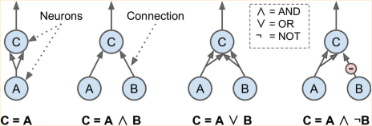
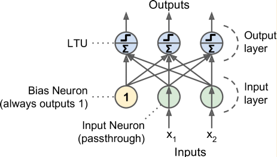

Chapter 10. 인공신경망 입문
=======================
새가 우리에게 비행에 대한 영감을 주듯이, 자연은 수많은 발명품에 영감을 주었다. 이는 지능을 가진 기계를 만드는 방법에 대한 영감으로 뇌의 구조를 보는 것도 합리적인 것처럼 보인다. 이는 인공신경망(*Artificail Neural Networks*:ANNs)에 영감을 주는 아주 중요한 아이디어이다. 하지만 비록 비행기들은 새로부터 영감을 받긴했지만 그렇다고 날개를 휘젓지는 않는다. 비슷하게, 인공신경망도 생물학과는 꽤 달라지기 시작했다. 일부 연구원들은 심지어 우리가 생물학적 분석에서 벗어나야한다고 한다. ("뉴런"이라고 하기 보다는 유닛라고 말하는 것처럼) 생물학적으로 그럴듯한 시스템에 우리의 창의성이 제한 받지 않도록 하기 위해 말이다.

인공 신경망은 딥러닝의 핵심이 되는 것이다. 인공신경망은 다재다능하고 강력하며, 크기도 다양하다. 그리고 거대하고 매우 복잡한 기계학습 관련 일도 매우 이상적으로 수행해준다. 예를들면 수백만개의 이미지를 분류하는 것이나(예: Google Images), 음성인식 서비스를 더 강력하게 만들어주고(예: Apple의 Siri), 매일 수억명의 사용자에게 최적의 영상을 추천해주기도 한다(YouTube). 또한 바둑 게임에서 최고의 세계 챔피언에 대해서 이전의 수백만의 대국 기록들을 참고해서 자기 스스로와 대국을 해봄으로써 학습을 하기도 한다(Deep Mind의 AlphaGo).

이번 Chapter에서는 우리는 초창기 인공신경망에 대해서 빠르게 둘러보면서 인공신경망에 대해서 다루어 볼 것이다. 그리고나서 우리는 다중 레이어 퍼셉트론(*Multi-Layer Perceptrons*: MLPs)에 대해 볼 것이고 Chapter3에서 다루었던 MNIST 숫자 분류를 Tensorflow를 사용해 다중레이어 퍼셉트론을 구현해 볼 것이다.

# 생물학적 뉴런에서 인공뉴런까지
놀랍게도, 인공신경망은 오랬동안이나 우리 주위에 있었다. 1943년 신경생리학자 *Warren McCulloch*과 수학자 *Walter pitts*에 의해 인공 신경망이 처음 소개되었다. 이 ["A Logical Calculus of Ideas Immanent in Nervous Activity",](https://pdfs.semanticscholar.org/5272/8a99829792c3272043842455f3a110e841b1.pdf) 논문을 보면 명제 논리를 사용해서 복잡한 연산을 수행하기 위해 어떻게 동물의 뇌에 있는 생물학적 뉴런이 함께 일을 하는지에 대해서 연산 모델로 간소화했다. 이것이 바로 첫번쩨 인공신경망의 구조이다. 후에 다룰 것이지만, 그이후로 수많은 구조들이 발명되어왔다.

1960년대까지 초기 인공신경의 성공은 우리가 곧 대화가 가능한 실제 지능을 가진 기계를 보게될 것이라는 믿음이 널리 퍼졌다. 하지만 이런 믿음이 오랫동안 충족되지 못한다는 것이 확실시 되면서 여기저기서 투자가 끊기고 인공신경망은 긴 암흑기에 접어든다. 1980대 초에 새로운 네트워크 구조 발명된 인공신경망에대한 관심이 부활했고, 좀 더 나은 학습 기술이 개발되었다. 하지만 1990년대 Chapter5에서 다루었던 Support Vector Machine 같은 인공신경망을 대체해주면서도 더 강력한 기계학습 기술이 대부분의 연구진들 사이에서 더욱 많이 사용되었다. 그당시에는 인공신경망보다 이론적 기반이나 학습 결과가 더 좋았기 때문이다. 그리고 마침내 우리가 그 인공신경망의 또다른 새로운 물결상에 있다. 이번 물결도 이전에 그랬던 것처럼 다시 죽게될 것인가? 이번 물결은 기존의 것과는 다르며 우리의 삶에 더욱 엄청난 영향력을 끼칠 것이라는 몇가지 이유가 있다.
* 이제는 신경망을 학습시키기에 충분할만큼 엄청난 양의 데이터가 있으며, 인공 신경망은 거대하고 복잡한 문제에 대해서 다른 기계학습 알고리즘보다 대체로 뛰어나다. 
* 1990년 이래로 컴퓨팅 파워의 엄청난 성장은 합당한 시간 동안에 거대한 신경망을 학습시키는 것을 가능하게 해주었다. 어느정도는 무어의 법칙 ((마이크로 칩의 저장 용량이 2년마다 배로 증가한다는 Intel 사의 G. Moore가 제창한 법칙)) 때문이지만 게임산업 덕분이기도 하다. 게입산업이 강력한 GPU가 나오는데 한 몫을 했다.
* 학습 알고리즘이 개선되어왔다. 1990년대에 사용하던 알고리즘과 한가지만 다르지만 이 조그마한 것이 커다란 긍정적인 효과를 일으켰다.
* 인공신경망에 기반이되는 이론들이 실제에서는 매우 좋아졌는데, 예를들어, 많은 사람들이 인공신경망 학습 알고리즘은 지역적인 최적점에 갇히는 경향때문에 망했다고 생각했지만 이제 더이상 실제로는 거의 발생하지 않는다.(혹은 보통 전역적인 최적점에 꽤 가까이 간다)
* 인공신경망은 돈과 진도의 선순환에 접어들었다. 인공신경망으로 만든 놀라운 제품들이 자주 기사 뉴스의 헤드라인으로 나오며, 이는 더 많은 주의를 끌 것이고, 결국 그런 상품들에 투자를 하게될 것이다. 계속해서 진보할 수록, 더 놀라운 삼품들이 나오게되고 투자가 이루어지면 그 돈으로 또 진보를 이루는 선순환에 접어든 것이다.

## 생물학적 뉴런
인공 뉴런에 대해서 얘기해보기전에, 아래 그림으로 나와있는 생물학적 뉴런을 빠르게 훑어보고 가자. (우리의 뇌같은)동물의 대뇌겉질에서 많이 발견되는 특이해보이는 세포이며, 이 세포는 세포핵을 포함하여 세포의 복합적인 구성요소로 세포체가 구성되어 있으며, 수상돌기(*dendrites*)라고 하는 것들이 나뭇가치 처럼 뻗어있고, 축색돌기(*axon*)라고 하는 매우 긴 가지를 가지고 있다. 축색돌기의 길이는 세포체보다 많게는 10배정도 길다. 축색돌기 끝에는 축색끝가지(*telodendria*)가 수많은 가지로 나뉘어져간다. 그리고 이런 가지들 끝에는 극도로 작은 신경접합부(*Synaptic terminals*, 짧게는 시냅스*Synapses*라고 한다)라는 것이 있다. 이는 다른 뉴런의 수상돌기에 연결되어있거나 신경세포체에 직접 연결되어있다. 생물학적 뉴런은 신호(*Signal*)이라고하는 짧은 전파를 다른 뉴런으로부터 신경접합부를 통해 받아들인다. 뉴런이 다른 뉴런으로부터 충분한 수의 신호를 받아들이면, 자기 자신만의 고유의 신호를 발생시킨다.
###### 그림 10-1. 생물학적 뉴런


그러므로 단일 개체의 생물학적 뉴런은 간단한 방식으로 움직이는 것처럼 보이지만, 수백만의 뉴럽들의 거대한 망으로 조직화되어있으며, 각각의 뉴런들은 전형적으로 몇천개의 다른 뉴런들과 연결되어있다. 마치 개미총이 단순한 개미들이 협력으로 만들어지듯이 매우 복잡한 연산들도 간단한 뉴런들로 이루어진 거대한 네트워크를 통해서 수행되어진다. 이 생물학적 신경망(*Biological Neural Networks*: BNNs)의 구조는 여전히 활발한 연구 분야이지만, 뇌의 일부는 맵핑이 되어있어 뉴런들이 종종 아래의 보여지는 그림처럼 연이어 이어진 계층들로 보이기도 한다.

###### 그림 10-2. 생물학적 신경망에서의 다중 계층들 (인간피질)

## 뉴런의 논리연산
Warrent McCulloch와 Walter Pitts는 생물학적 뉴런의 가장 간단한 모델을 제시했고, 이는 후에 하나 이상의 이진입력(on/off)를 받아 하나의 이진결과를 내주는 인공 뉴런이라고 알려진다. 인공뉴런은 특정 개수의 입력값이 활성화되면 결과값이 활성화되는 형식이다. McCulloch와 Pitts는 간소화된 모델로 우리가 원하는 어떠한 명제 논리를 연산해줄 수 있는 인공뉴런의 네트워크를 형성하는 것이 가능하다는 것을 보여주었다. 예를들어 뉴런이 최소 두개의 입력이 활성화되면 활성화된다고 가정하고 다양한 논리 연산을 수행해주는 인공신경망을 구현해보자. 아래의 그림을 참고하라
###### 그림 10-3. 간단한 논리 연산을 수행하는 인공신경망


* 왼쪽에서 첫번째 네트워크는 간단한 항등함수이다. 만약 A뉴런이 활성화되면, A뉴런으로 부터 신호를 두개 받기때문에 C 뉴런또한 활성화될 것이다. 같은 원리로 A뉴런이 비활성화되면 C뉴런도 비활성화될 것이다.
* 두번째 네트워크는 AND 논리게이트를 수행해준다. C뉴런은 오직 A뉴런과 B뉴런이 활성화되어야만 활성화된다. (단일 신호만으로는 C뉴런을 활성화시키기에는 충분하지 않다.)
* 세번째 네트워크는 OR 논리게이트를 수행해준다. A뉴런이나 B뉴런 둘 중 하나나 혹은 둘 다 활성화되면 C뉴런이 활성화된다.
* 마지막은, 우리가 입력 연결이 뉴런의 활동을 억제할 수 있다고 가정하면 (생물학적 뉴런의 경우이기도 하다) 네번째 네트워크는 조금 더 복잡한 명제 논리를 연산한다. C뉴런은 A뉴런은 활성화되어있고 B뉴런이 비활성화되어 있어야만 활성화된다. A뉴런이 항상 활성화상태라고 하면 NOT 논리게이트도 얻게된다. C뉴런이 활성화될려면 B뉴런은 비활성화상태여야만 하기 때문이다.
## 퍼셉트론(Perceptron)
퍼셉트론(*Perceptron*)은 가장 간단한 인공신경망 구조중 하나로, 1957년 Frank Rosenblatt에 의해서 고안된 것이다. 이 아이디어는 선형 구분점 유닛(*Linear Threshold Unit*: LTU)라고 하는 조금은 다른 인공 뉴런에 기반을 한다. (아래 그림으로 나와있다) 입력과 출력이 (이진 입출력이였던 대신)모두 숫자값이며 각각의 입력 연결은 가중치와 연관이 있다. LTU는 입력값에 가중치를 곱한 값들을 모두 더하는 방식으로(z= w1⋅x1+w2⋅x2+...+wn⋅xn=w^T⋅x), 이 연산후에 계단함수(*Step Function*)를 적용한 값을 결과값으로 주게된다. h_w(x) = step(z) = step(w^T⋅x)
###### 그림 10-4. 선형 구분점 유닛 (Linear Threshold Unit)


퍼셉트론에서 가장 자주 쓰이는 계단함수는 단위계단함수(*Heaviside step function*)이다. (아래에 그 공식이 나와있다) 때때로 신호함수가 대신 쓰이기도 한다.
###### Equation 10-1. 퍼셉트론에서 사용되는 일반적인 계단함수


단일 LTU는 간단한 선형 이진 분류에서 사용되어진다. 입력의 선형 조합을 연산하고 결과가 구분점을 넘어가면 Positive로, 아니면 Negative로 분류한다. (선형 회귀 분류나 선형 SVM처럼 말이다) 예를들어 iris 데이터셋을 (이전 Chapter에서 했던 것처럼 추가 편향치로 x0=1도 추가해서) 꽃잎의 길이와 너비 값으로 iris 꽃을 분류하는데 단일 LTU를 사용할 수 있다. LTU를 학습시킨다는 것은 w0,w1,w2가 올바른 값을 찾아가는 것을 의미한다.

퍼셉트론은 단일 계층의 LTU로 이루어져있으며, 각각의 뉴런들이 모든 입력과 연결되어있는 구조이다. 이러한 연결들은 입력 뉴런이라고 하는 특별한 뉴런을 지나오는 것으로 표현이 된다. 입력 뉴런들은 입력해준 값이 무엇이든 그 값을 그대로 전달해준다. 더 나아가 추가 편향치는 일반적으로 (x0=1)추가된다. 이 편향치는 전형적으로 편향 뉴런이라고 하는 특별한 종류의 뉴런으로 표현되며, 이는 1 값만 출력을 시켜준다.

두개의 입력을 받아 3개의 출력을 내는 퍼셉트론은 아래의 그림에 보여지고 있다. 이 퍼셉트론은 3개의 다른 이진 클래스로 동시에 인스턴스를 분류해줄 수 있으며, 이는 다중출력 분류 모델을 만든다.
###### 그림 10-5. 퍼셉트론 다이어그램


그래서 퍼셉트론은 어떻게 학습이되는가? Frank Rosenblatt가 제안한 퍼셉트론 학습모델은 헵의 원칙(*Hebb's rule*)으로부터 크게 영감을 받았다. 1949년에 출간된 그의 책, 행동규칙(*"The Organization of Behavior"*)에서, Donald Hebb은 생물학적 뉴런이 종종 다른 뉴런을 작동시키면 그 두 뉴런 사이의 연결이 더욱 깅력헤진다고 주장했다. 이 아이디어는 후에 Siegrid Löwel이 다음과 같은 기억에 남을만한 구절로 정리해주었다. _**"Cells that fire together, wire together"(동시에 활성화되는 세포들, 서로가 연결된다)**_ 이러한 원칙은 후에 헵의 원칙(혹은 Hebbian Learning)이라고 알려지는데, 즉 두 뉴런 사이의 연결 가중치가 서로 같은 결과값을 가질때마다 그 가중치는 증가한다. 퍼셉트론은 네트워크에서 만들어지는 에러치를 account와 연관이 지어지는 규칙에 변형을 이용하여 학습이 이루어진다. 다시말하면 잘못된 결과를 내는 연결 가중치는 더이상 그 값이 강화되지 않는다는 것이다. 더 자세하게, 퍼셉트론은 한번에 하나의 학습 인스턴스을 입력하고, 각각의 인스턴스마다 예측치를 만들어낸다. 잘못된 결과를 내는 모든 출력 뉴런들에 대해서 올바른 예측을 해낸데 기여한 입력 가중치를 강화한다. 이 규칙은 아래 공식으로 보여지고 있다.
###### Euation 10-2 퍼셉트론 학습 규칙 (가중치 업데이트)


* **w_i,j**: i번째 입력 뉴런과 j번째 출력 뉴런 사이의 연결 가중치를 말한다.
* **x_i**: 현재 학습 인스턴스의 i번째 입력 값
* **ŷ_j**: 현재 학습 인스턴스의 j번째 출력 뉴런의 출력 값
* **y_i**: 현재 학습 인스턴스의 j번째 출력 노드의 목표 출력값
* **η**: 학습률

각각의 출력 노드의 의사 결정선은 선형인데, 그래서 퍼셉트론은 로지스틱 회귀 처럼 복잡한 패턴을 학습하는 능력은 없다. 하지만 만약 학습 인스턴스가 선형으로 나뉘어져있다면, Rosenblatt은 이 알고리즘이 해답에 근접할 것이라고 설명했다. 이를 퍼셉트론 수렴 정리(*Perceptron Convergence theorem*)라고 한다.

Scikit-Learn은 단일 LTU 네트워크를 구현해줄 수 있는 `Perceptron` 클래스를 제공한다. 우리가 기대하는 만큼 꽤 많이 쓰이는 것이며, 예로 Chapter4에서 소개가 되었던 iris 데이터 세트로 실험을 해볼 것이다.
```
import numpy as np
from sklearn.datasets import load_iris
from sklearn.linear_model import Perceptron

iris = load_iris()
X = iris.data[:, (2, 3)]  # petal length, petal width
y = (iris.target == 0).astype(np.int)

per_clf = Perceptron(random_state=42)
per_clf.fit(X, y)

y_pred = per_clf.predict([[2, 0.5]])
```
퍼셉트론 학습 알고리즘이 확률적 경사하강법과 매우 비슷하다는 것을 눈치했는가? 사실 Scikit-Learn의 `Perceptron` 클래스는 다음과같은 하이퍼파라미터 `loss="perceptron"`,`learning_rate="constant"`,`eta0=1(학습률)`, `penalty=None (Regularization을 사용하지 않음)`로 설정된 `SGDClassifier`를 사용하는 것과 같다.

로지스틱 회귀와는 다르게, 퍼셉트론은 클래스에대한 확률치를 나타내주지 않는다. 그보다 그들은 정해진 구분값으로 예측을 내리는 것이다. 그래서 퍼셉트론보다 로지스틱 회귀를 더 선호하는 이유이다. 

1969년, *"Perceptron"* 이라는 제목의 논문에서, Marvin Minsky와 Seymoiur Paprt는 여러가지의 퍼셉트론의 심각한 문제점들을 강조했다. 특히 일부 정말 사소한 문제(Exclusive OR(XOR) 논리 분류 문제-아래 그림으로 나와있음)도 풀지못하는 사실로 말이다. 로지스틱 회귀 분류모델과 같이 그 어떤 선형 분류 모델 또한 이 문제를 풀지는 못하지만, 연구원들은 퍼셉트론에게 기대를 했었고, 그들의 실망감은 컸던 것이다. 결국에는, 논리, 문제 해결, 그리고 탐색하는 고난이도 문제들 때문에 수많은 연구자들은 연결 주의(*Connectionism*)(예로 신경망에 대한 연구)를 완전히 포기했다.

하지만 다중으로 퍼셉트론들을 쌓아서 일부 퍼셉트론의 문제들이 해결되었다. 이러한 인공신경망을 다중계층 퍼셉트론(*Multi-layer Perceptrons*:MLP)이라고 한다. 특히 MLP는 XOR 문제를 해결할 수 있다. 각각의 입력을 조함시켜서 그림 10-6의 오른쪽 그림으로 보여지는 것처럼 MLP의 결과를 연산하는 것을 볼 수 있다. 입력 (0,0)이나 (1,1)이 들어오면 네트워크는 0을 결과로, (0,1)이나 (1,0)이 들어오면 1을 결과로 내준다.
###### 그림 10-6. XOR 분류 문제와, 그 문제를 푼 MLP

## 다중계층 퍼셉트론과 역전파 알고리즘
MLP는 하나의 입력 계층과 은닉계층(*hidden layer*)라고 하는 LTU 계층이 하나 이상, 그리고 마지막에 출력 계층이라고 하는 LTU 계층으로 이루어져 있다. 출력 계층을 제외한 모든 계층들은 편향 뉴런을 포함하고 있으며, 다음 계층에 전부 연결이 되어 있는 구조이다. 인공신경망이 두개 이상의 은닉계층을 가지고 있으면, 이를 심층 신경망(*Deep Neural Network*:DNN)이라고 한다.
###### 그림 10-7. 다중 계층 퍼셉트론


수많은 연구자들이 몇년돌안이나 MLP를 학습시키기 위해 발버둥쳐왔지만, 성공하지 못했다. 하지만 1986년, D.E. Rumehart와 그의 동료들이 역전파학습알고리즘(*Backpropagation*)을 소개하는 아주 놀라운 [기사](https://goo.gl/Wl7Xyc)를 출판했다. 오늘날 역전모드의 `autodiff`를 사용해서 경사하강법을 구현하는 것으로 설명했다. (경사하강법은 Chapter 4, autodiff는 Chapter9에서 다루었다.)

각각의 학습 인스턴스에 대해서 알고리즘은 네트워크에 인스턴스를 입력해주고, 각각 연이은 계층들에 모든 뉴런의 결과를 연산한다.(이것을 순전파 과정이라고 하며 예측 결과를 내리는 것과 같은 것이다) 그리고 네트워크의 (원하는 결과치와 실제 결과치에 대한 차이)에러치를 측정하고, 마지막 은닉 계층에 있는 얼마나 많은 뉴런들이 그 에러에대한 영향을 주었는지 연산한다. 그리고 나서 이러한 에러치가 얼마나 영향을 받았는지 그 이전 은닉계층에 있는 각각의 뉴런으로부터 나오는지 연산하기 시작한다. 그렇게 다시 입력 계층까지 되돌아가는 과정을  이런 역전과정은 네트워크에서 에러치의 미분값을 역으로 전파함으로써 네트워크의 모든 연결 가중치를 에러치 미분값을 효과적으로 측정한다. (그러므로 이 알고리즘의 이름이 역전파(Backpropagation) 알고리즘이다) 부록 D에 있는 역전 모드 autodiff 알고리즘을 확인하면 순전파와 역전파 알고리즘이 역전 모드 autodiff로 간단히 수행될 수 있다는 것을 알 수 있다. 역전파 알고리즘의 마지막 단계는 네트워크의 모든 연결 가중치에 대해서 앞에서 측정한 에러 미분치를 사요해 경사하강법 단계를 수행해주는 것이다. 

더 짧게 이야기해보자. 각각의 인스턴스에 대해서 역전파 알고리즘은 먼저 예측을 해보고(순전파 과정), 에러를 측정한다음에, 각각의 연결로부터 에러 영향력을 측정하기 위해 역으로 각각의 계층들을 지나온다.(역전파 과정) 그리고 마지막으로 에러치를 줄이기 위해 연결 가중치를 조금씩 조정해나간다.(경사하강법 과정)

이 알고리즘이 제대로 작동하기 위해서는, 작성자는 MLP 구조에 중요한 변화를 주어야한다. 즉 계단 함수를 로지스틱 함수`σ(z) = 1/(1+exp(-z)`로 바꾸어주어야한다. 이는 아주 중요한 개념인데, 계단함수는 평평한 분할선만 가지고 있기 때문에 미분치(경사,기울기)를 연산해줄 수 없다는 것이다. 반면에 로지스틱 함수는 경사 하강법이 모든 과정에서 잘 작동하도록 모든 지점에서 미분해도 0이 나오지않도록 잘 정의되어있다. 역전파 알고리즘은 로지스틱 함수만이 아닌 다른 활성화함수와도 쓰일 수 있다. 아래의 인기있는 두가지 알고리즘에 대해서 살펴보자
* 하이퍼블릭 탄젠트 함수 `tanh(z)=2σ(2z)-1`  
 로지스틱 함수처럼 S자 모양의 연속적인 미분이 가능한 함수이지만, 로지스틱 함수는 0과 1로 나오는 것에 비해서 결과치가 -1부터 1로 밖에 나오지 않는데, 이는 학습 초기에 각각의 계층 출력이 많이 혹은 덜 정규화되는 경향을 가지고 있다. 이는 종종 수렴속도를 올려주는데 도움이 된다.
* ReLU 함수 `ReLU(z) = max(0,z)` (Chapter 9에서 소개함)  
 연속 함수이지만 z가 0인 지점에서는 미분이 불가능하다. (기울기가 갑자기 바뀌는데, 이는 경사하강법이 요동칠 수도 있다) 하지만 실제로는 잘 작동하며, 빠르게 연산할 수 있다는 장점이 있다. 더 중요한 것은 최대치 값을 가지고 있지 않다는 사실이 경사하강법을 수행하는동안 발생하는 일부 문제들을 줄여주는데 도움이 된다는 것이다. (이 문제는 Chapter 11에서 다룰 예정이다)

이러한 인기있은 활성화 함수와 그들의 미분값들은 아래의 그림으로 보여지고 있다.
###### 그림 10-8. 활성화 함수와 활성화 함수 미분 그래프


MLP는 종종 각각의 서로 다른 이진 클래스에 상응하는 결과(스팸메일/일반메일 혹은 긴급/긴급하지않음)를 사용하여 분류에서 쓰이고는 한다. 만약 클래스들이 서로 베타적이라면(손으로 쓴 숫자 이미지를 0~9로 분류하는 것처럼), 출력 계층은 전형적으로 아래 그림에서 보여지는 것처럼 출력계층 마지막에 있는 뉴런마다 붙어있던 활성화함수들을 소프트맥스(*softmax*)라고 하는 함수로 교체해주어야한다. 소프트맥스 함수는 Chapter 4에서 소개가되었다. 각각 뉴런들의 출력은 상응하는 클래스에 대한 측정된 확률치와 상응한다. 신호는 오직 한 방향으로만 흐르므로(입력계층에서 출력계층으로), 이런 구조가 순전파 신경망(*Feedforward Neural Network*:FNN)의 예시이다.
###### 그림 10-9. 분류에서 사용되는 현대의 MLP (ReLU, 소프트맥스 포함)

```
생물학적 뉴런들은 거의 (S자 형태의)시그모이드 함수로 만들어진 것처럼 보여서, 연구원들은 매우 오랜기간동안 시그모이드 함수에만 꽃혀있었다.
하지만 인공신경망에서는 ReLU 활성화함수가 일반적으로 더 잘 작동한다. 이는 생물학적 분석에 갇혀있어 문제가 된 경우를 보여준다.
```
# 텐서플로우 API로 MLP 학습시키기
텐서플로우로 MLP를 학습시키는 가장 간단한 방법은 TF.Learn API를 사용하는 것이며, 이는 Scikit-Learn에 호환이 되는 API이다. `DNNClassifier`클래스가 어떠한 양의 은닉 계층으로도 심층 신경망을 쉽게 학습시켜주며, 측정된 클래스 확률치를 소프트맥스 함수를 통해 출력해준다. 예를들어, 아래의 코드는 두 개의 은닉계층(하나는 뉴런 300개, 또 하나는 뉴런 100개를 가지고 있음)을 가지고 있으며 10개의 출력뉴런으로 소프트맥스 출력 계층을 가진 심층신경망이 분류를 해주도록 학습시키는 코드이다. 
```
import tensorflow as tf

config = tf.contrib.learn.RunConfig(tf_random_seed=42) # not shown in the config

feature_cols = tf.contrib.learn.infer_real_valued_columns_from_input(X_train)
dnn_clf = tf.contrib.learn.DNNClassifier(hidden_units=[300,100], n_classes=10,
                                         feature_columns=feature_cols, config=config)
dnn_clf = tf.contrib.learn.SKCompat(dnn_clf) # if TensorFlow >= 1.1
dnn_clf.fit(X_train, y_train, batch_size=50, steps=40000)
```
이 코드는 먼저 학습 데이터 세트(다른 종류의 열, 카테고리 값들로 되어있는 열도 가능함)에서 실제 값이 매겨진 열의 세트를 만든다. 그리고나서 `DNNClassifier`를 만들고, Scikit-Learn의 호환성 도우미로 이를 마무리해준다. 마지막에는 배치사이즈 50개의 인스턴스로 4만번 학습 반복을 실행해준다.

만약 이 코드로 MNIST를 (Scikit-Learn의 `StandardScaler`로 먼저 스케일링을 하고)돌려본다면 테스트 데이터 세트에 대해서 정확도 98.2%를 출력하는 모델을 얻게될 것이다. 우리가 Chapter 3에서 얻었던 최고의 모델보다 더 잘 수행해준다. 
```
>>> from sklearn.metrics import accuracy_score
>>> y_pred = dnn_clf.predict(X_test)
>>> accuracy_score(y_test, y_pred['classes'])
0.98250000000000004
```
```
"tensorflow.contrib" 패키지는 수많은 유용한 함수들을 포함하고 있지만, Tensoflow API의 일부 코어에서 벗어나지 못하는 실험적인
코드들이다. 그래서 "DNNClassifier"클래스는 아마 후에 어떠한 알림도 없이 다른 "contrib"코드로 바뀔수 있다.
```
내막속에는, `DNNClassifier`클래스가 ReLU 활성화함수를 기반(`activation_fn`하이퍼파라미터로 바꿀수있다)으로 모든 뉴런 계층들을 만들어준다. 출력 계층은 소프트맥스 함수를 기반으로 하고있으며, 손실함수는 크로스 엔트로피(Chapter4에서 소개됨)를 사용한다.
# 플레인 텐서플로우를 사용한 심층신경망 학습
만약 신경망 구조를 좀 더 세세하게 다루고 싶다면, Tensorflow의 하위 레벨의 Python API(Chapter 9에서 소개됨)를 사용할 수있다. 이 섹션에서는 이 API를 사용해 같은 모델을 구현해보고, MNIST 데이터 세트에 대해서 미니 배치 경사하강법을 학습시키는 코드를 구현해볼 것이다. 첫번째 단계는 Tensorflow의 그래프를 만드는 구성단계이며, 두번째 단계는 실제로 모델을 학습시키도록 그래프를 실제로 실행시키기 위한 실행 단계이다.
## 구성 단계
시작해보자. 먼저 `tensorflow`라이브러리를 호출해야한다. 그리고나서 입력과 출력의 수를 명시해야만 하고, 각각의 꼐층에 있는 은닉 뉴런들의 수를 명시해주어야한다.
```
import tensorflow as tf

n_inputs = 28*28  # MNIST
n_hidden1 = 300
n_hidden2 = 100
n_outputs = 10
```
다음으로 Chapter 9에서 했던 것처럼, 학습데이터와 타겟값을 나타내는 플레이스홀더 노드를 사용하자. 우리는 이것이 첫번째 차원에는 인스턴스가, 2번째 차원에는 특징값들이 들어가있는 2차원 텐서(행렬)임을 알아야한다. 그리고 특징의 수는 28x28(픽셀당 특징 값 하나)개수의 특징값들을 가진다는 것을 알아야만 한다.하지만 우리는 얼마나 많은 인스턴스가 배치로 묶이게 될지는 아직 모른다. 그래서 X의 크기가 `(None, n_inputs)`이다. 비슷하게 y는 하나의 인스턴스당 하나의 값이 들어가는 1차원 텐서인데 아직 이지점에서는 학습 배치의 크기를 모르기 때문에 크기가 `(None)`으로 설정되어있다.
```
X = tf.placeholder(tf.float32, shape=(None, n_inputs), name="X")
y = tf.placeholder(tf.int64, shape=(None), name="y")
```
이제 실제 신경망을 만들어보자. 플레이스홀더 X는 실행단계에서 입력계층과 같은 역할을 수행해줄 것이며, 한번에 하나의 학습 인스턴스를 넣어주게 될 것이다. (학습 배치에 있는 모든 인스턴스가 동시에 처리된다는 것을 알아두자) 이제 우리는 두개의 은닉계층과 출력계층을 만들어줄 것이다. 두개의 은닉계층은 거의 비슷하다. 은닉계층들이 연결될 입력값들과 은닉계층이 가지고 있는 뉴런 갯수만 다르다. 출력계층은 또한 매우 비슷하지만, ReLU함수 대신 소프트맥스 활성화 함수를 사용한다. 그래서 한번에 하나의 계층을 만들어주는 `neuron_layer()`함수를 만들어보자. 이는 입력을 명시해주는 파라미터, 뉴런의 수를 입력해주는 파라미터, 그리고 사용할 활성화 함수를 명시해주는 파라미터와 그 계층의 이름을 설정해주는 파라미터가 필요할 것이다.
```
def neuron_layer(X, n_neurons, name, activation=None):
    with tf.name_scope(name):
        n_inputs = int(X.get_shape()[1])
        stddev = 2 / np.sqrt(n_inputs)
        init = tf.truncated_normal((n_inputs, n_neurons), stddev=stddev)
        W = tf.Variable(init, name="kernel")
        b = tf.Variable(tf.zeros([n_neurons]), name="bias")
        Z = tf.matmul(X, W) + b
        if activation is not None:
            return activation(Z)
        else:
            return Z
```
이제 이 코드를 한줄한줄 살펴보자
1. 먼저 우리는 계층의 이름을 사용해서 네임 스코프를 만들어준다. 이는 이 뉴런 계층에 대한 모든 연산 노드를 포함하게될 것이다. 이는 옵션이기는 하지만 그래프는 노드가 잘 정리되어있다면 텐서보드로 그래프를 보는것이 더 좋을 것이다.
2. 다음으로 우리는 입력 행렬의 크기를 살펴보고 두번째 차원의 크기를 가져옴으로써 입력의 수를 받아온다. (첫번째 차원은 인스턴스임)
3. 다음 세번째 줄은 (종종 계층의 커널이라고 하는) 가충치 행렬를 받아오는 _**W**_ 변수를 만들어낸다. 이 변수는 각각의 입력과 각각의 뉴런들 사이의 모든 연결 가중치를 포함하고 있는 2차원 텐서이다. 그러므로 이 변수의 크기는 `(ㅜn_inputs, n_neurons)`이다. 이 변수는 표준분산값 으로 절단 (가우시안) 정규분포(*Truncated (Gaussian) Normal Distribution*)를 사용해 임의의 값으로 초기화해준다. 어떤 특정한 표준분산값을 사용하는 것은 알고리즘이 좀 더 빠르게 수렴하도록 도와준다.(Chapter 11에서 다루게 될 내용이다. 신경망 효율성에 거대한 영향력을 가진다) 경사 하강법 알고리즘이 해결해줄수 없게하는 대칭성을 피하기 위해서 모든 은닉 계층들에 대해서 임의의 값으로 연결 가중치를 초기화해주는 것은 아주 중요하다.
4. 다음 라인은 뉴런당 편향치 파라미터 하나로 편향치 변수 _**b**_ 를 만들어주며, 0으로 값을 초기화 해준다. (이번의 경우에서는 대칭성 문제는 없다)
5. 그리고 나서 _**Z = X⋅W + b**_ 를 연산해주는 서브그래프를 만들어준다. 이러한 벡터화된 연산은 한번에 배치에 있는 모든 인스턴스에 대해서 각각의 계층에 있는 모든 뉴런들을 각각 가중치를 곱한 입력값에 편향치를 더하는 식을 효율적으로 연산해준다. 1차원 배열 _**(b)**_ 를 같은 수의 열_**(X. W)**_ 로 2차원 행렬에 더해준다는 것은 행렬에 있는 모든 열에 1차원 배열을 더해준다는 것으로써 리를 브로드캐스팅(*broadcasting*)이라고 한다.
6. 마지막으로 `tf.nn.relu`같이 `activation`파라미터가 제공된다면, 코드는 `activation(Z)`를 반환하거나 그냥 `Z`만을 반환해줄 것이다. 

좋다. 이제 뉴런 계층을 만들어줄 쓸만한 함수를 만들었다. 한번 심층신경망을 만드는데 사용을 해보자. 첫번째 은닉계층은 X를 입력으로 받아들일 것이다. 두번째 은닉계층은 첫번째 은닉계층의 출력값을 입력값으로 받아들일것이다. 그리고 마지막으로 출력계층은 두번째 은닉계층의 출력값을 결과값으로 사용할 것이다.
```
with tf.name_scope("dnn"):
    hidden1 = neuron_layer(X, n_hidden1, name="hidden1",
                           activation=tf.nn.relu)
    hidden2 = neuron_layer(hidden1, n_hidden2, name="hidden2",
                           activation=tf.nn.relu)
    logits = neuron_layer(hidden2, n_outputs, name="outputs")
```
확실성을 위해서 다시한번 네임 스코프를 사용하였다는 점을 기억하자. 또한 `logit`은 소프트맥스 활성화함수를 통화하기 **전에**, 신경망의 출력값이라는 것도 알아두자.

우리가 기대했던만큼, 텐서플로우는 표준 신경망 계층을 만들기 손쉬운 수많은 함수를 가지고 있어, 종종 우리가 앞에서 만들었던 `neuron_layer()`같은 함수를 우리가 직접 정의할 필요가 없다. 예를들어 텐서플로우의 `tf.layers.dense()`(이전에 `tf.contrib.layers.fully_connected()`로 호출되던)함수는 이는 모든 입력들이 그 계층의 모든 뉴런에 연결시켜주기 위한 전가산계층을 만들어준다. 적절한 초기화 전략을 사용해서 각각 `Kernel`과 `bias`라고 하는 이름으로 가중치와 편향치 변수들을 만드는데 신경을 써주며, 우리는 `activation`인자를 사용해서 활성화함수도 설정해줄 수 있다. Chapter 11에서 보게될 것이지만, 정형화(regularization) 파라미터도 지원해준다. 한번 우리가 만든 `neuron_layer()`함수 대신에 `dense()`함수를 사용해서 이전의 코드를 다시 만져보자
```
with tf.name_scope("dnn"):
    hidden1 = tf.layers.dense(X, n_hidden1, name="hidden1",
                              activation=tf.nn.relu)
    hidden2 = tf.layers.dense(hidden1, n_hidden2, name="hidden2",
                              activation=tf.nn.relu)
    logits = tf.layers.dense(hidden2, n_outputs, name="outputs")
```
이제 우리가 신경망을 실행시킬 준비를 했으니, 학습에 사용한 손실함수를 정의해주어야한다. Chapter4에서 소프트맥스 회귀를 해보았기에, 우리는 똑같이 손실함수로 크로스 엔트로피를 사용할 것이다. 앞에서 이야기한 것처럼, 크로스 엔트로피는 목표 클래스에 대해서 낮은 확률치를 측정하는 모델에 대해서 패널티를 준다. 텐서플로우는 크로스 엔트로피를 연산해줄 몇가지 함수를 제공해준다. 우리는 `sparse_softmax_cross_entropy_with_logits()`라는 함수를 사용할 것인데, 이는 `logit`를 기반으로 크로스 엔트로피를 연산해주고, 0에서 총 클래스 갯수에서 1을 뺀값을 범위로 결과값들을 상수로 출력해주게된다. (우리의 경우에는 0부터 9까지 출력을 시켜준다) 이는 각각의 인스턴스에 대한 크로스 엔트로피를 가지고있는 1차원 텐서로 결과값을 출력시켜줄 것이다. 우리는 텐서플로우의 `reduce_mean()` 함수를 전체 인스턴스에 대해서 평균 크로스 엔트로피를 연산하는데 사용할 수 있다.
```
with tf.name_scope("loss"):
    xentropy = tf.nn.sparse_softmax_cross_entropy_with_logits(labels=y,
                                                              logits=logits)
    loss = tf.reduce_mean(xentropy, name="loss")
```
```
"sparse_softmax_cross_entropy_with_logits()" 함수는 쇼프트맥스 활성화 함수를 적용하고 크로스 엔트로피를 연산하는 것이지만,
좀 더 효과적이며, 적절하게 logit 값이 0일 때에 대한 경우도 다루어준다. 이는 우리가 앞에서 소프트맥스 활성화함수를 이용하지 않은 이유이다.
또한 "softmax_cross_entropy_with_logits()"함수도 있는데, 이 함수는 one-hot 벡터 형태로 레이블 값을 취하는 함수이다.
```
신경망 모델도 있고, 손실함수도 준비되었으니, 이제 손실함수값을 최소화하는 모델 파라미터 값을 찾아줄 `GradientDescentOptimizer`를 정의할 차례이다. Chapter 9에서 했던 것과 똑같으므로 새로울 것도 없다.
```
learning_rate = 0.01

with tf.name_scope("train"):
    optimizer = tf.train.GradientDescentOptimizer(learning_rate)
    training_op = optimizer.minimize(loss)
```
구성단계에서 마지막으로 중요한 단계는 모델을 평가하는 방범을 정하는 것이다. 우리는 간단하게 모델의 성능을 정확도로 평가해볼 것이다. 먼저 각각의 인스턴스에 대해서 목표 클래스에 상응하는 가장 높은 logit(값)인지 아닌지 확인해보는 것으로 신경망 예측값이 맞는지 아닌지를 정한다. 이를 수행하기 위해서 `in_top_k()`힘수를 사용할 수 있다. 이는 부울 같으로 이루어진 1차원 텐서로 값을 반환해주기 때문에, 이 부울 값을 float 변수로 변환해주고 평균 값을 연산한다. 이는 우리에게 신경망 전체 정확도를 제공해준다.
```
with tf.name_scope("eval"):
    correct = tf.nn.in_top_k(logits, y, 1)
    accuracy = tf.reduce_mean(tf.cast(correct, tf.float32))
```
그리고 보통 우리는 모든 변수를 초기화 해주는 노드를 만들고, 디스크에 우리가 학습시킨 모델의 파라미터를 저장해주는 `Saver`도 만들어주어야한다.
```
init = tf.global_variables_initializer()
saver = tf.train.Saver()
```
이제 구성단계가 끝났다. 40줄도 안되는 코드이지만, 꽤나 빽빽하다. 우리는 입력값과 타겟값을 받아주는 플레이스홀더를 만들어주었고 뉴런 계층을 만드는 함수도 구현해주었으며, 최적화 함수도 정의해주었으며 마지막에는 성능을 측정해주는 함수도 정의해주었다. 이제 실행 단계로 가보자.
## 실행 단계
이 파트는 좀 짧으면서 더 간단하다. 먼저 MNIST 데이터 세트를 불러오자. 이전 Chapter에서는 Scikit-Learn을 사용했지만 텐서플로우 자체가 데이터를 불러와주는 도우미를 제공하며, 텐서플로우도 (0과 1사이의 값으로) 스케일링 해주고, 데이터를 섞어주며 한번에 미니배치를 불러와주는 간단한 함수도 하나 제공해준다. 한번 다음의 코드를 대신해서 사용해보자.
```
from tensorflow.examples.tutorials.mnist import input_data

mnist = input_data.read_data_sets("/tmp/data/")
```
이제 우리는 미니 배치수와 우리가 실행하기를 원하는 주기수를 정의해주었다. 
```
n_epochs = 40
batch_size = 50
```
이제 모델을 학습시켜보자
```
with tf.Session() as sess:
    init.run()
    for epoch in range(n_epochs):
        for iteration in range(mnist.train.num_examples // batch_size):
            X_batch, y_batch = mnist.train.next_batch(batch_size)
            sess.run(training_op, feed_dict={X: X_batch, y: y_batch})
        acc_train = accuracy.eval(feed_dict={X: X_batch, y: y_batch})
        acc_val = accuracy.eval(feed_dict={X: mnist.validation.images,
                                            y: mnist.validation.labels})
        print(epoch, "Train accuracy:", acc_train, "Val accuracy:", acc_val)

    save_path = saver.save(sess, "./my_model_final.ckpt")
```
이 코드는 텐서플로우 세션을 열어주고, 모든 변수를 초기화해주는 `init`노드를 실행한다. 그리고나서 메인 학습 루프를 실행한다. 각각 주기(epoch)마다, 코드는 학습 데이터 수에 상응하는 미니 배치의 수를 반복하게된다. 각각의 미니배치는 `next_batch()`함수를 통해 데이터를 불러와 현재 미니배치의 입력데이터와 목표값을 입력해주며 학습 연산을 수행하게된다. 다음으로 각각의 주기 끝에 도달할 때마다, 이 코드는 마지막 미니 배치에 대해서 모델을 평가하고 전체 테스트 데이터 세트에 대해서도 평가를 해주게 된다. 마지막에는 디스크에 모델 파라미터를 저장하게된다.
## 신경망 사용하기
이제 신경망이 학습이 되었으니, 한번 예측을 내리는데 사용을 해보자. 이를 해보기 위해서는 구성 단계에서 사용했던 것을 다시 사용하지만 실행단계는 다음과 같은 코드로 바꾸어주자.
```
with tf.Session() as sess:
    saver.restore(sess, "./my_model_final.ckpt") # or better, use save_path
    X_new_scaled = mnist.test.images[:20]
    Z = logits.eval(feed_dict={X: X_new_scaled})
    y_pred = np.argmax(Z, axis=1)
```
먼저 이 코드는 디스크에 있는 모델의 파라미터를 호출해온다. 그리고나서 분류를 하고자하는 몇가지 새로운 이미지도 불러온다. 학습 데이터에서 했던 것과 같은 스케일링 기법을 사용해서 입력할 데이터세트도 스케일링을 해주어야한다는 것도 기억해두자. (이번 경우는 0~1사이 값으로 스케일링 함) 그리고나서 `logit`노드를 평가한다. 만약 모든 측정된 클래스 확률치를 알고싶다면, logit를 `softmax()`함수에 적용해보자. 하지만 만약 클래스만을 예측하고 싶다면, (이 기능을 해주는 `argmax()`함수를 사용해서) 가장 높은 logit 값을 뽑아오기만하면 된다.
# 신경망 파라미터 튜닝하기
신경망의 유연성은 신경망의 주된 결함중 하나인데 조절해야할 파라미터가 너무 많다는 것이다. 그 어떤 상상 가능한 신경망 구조(*Network topology*)뿐만 아니라 간단한 MLP 조차도 우리는 계층의 수, 계층당 뉴런의 수, 각 계층에서 사용할 활성화 함수, 가중치 초기화 논리 등등 수많은 것들을 바꿀 수 있기 때문이다. 어떻게 하면 우리가 필요한 기능에 어떤 조합이 최고인지 알 수 있을까?

당연히 이전 Chapter에서 했던 것처럼 올바른 하이퍼 파라미터를 찾는데 교차 검증법으로 그리드 서치를 할 수도 있겠지만, 조율해야할 하이퍼 파라미터는 많고, 거대한 데이터 세트로 신경망을 학습시키는데는 많은 시간이 소모되기 때문에 우리는 극히 적은 부분의 하이퍼 파라미터 공간만 접해볼 수 있을 것이다. Chapter2에서 다루었던 [확률적 탐색법](https://goo.gl/QFjMKu)를 사용하는 것도 좋다. 또다른 선택사항으로는 [Oscar]()같은 툴을 사용하는 것인데, 우리가 빠르게 좋은 세트의 하이퍼 파라미터를 찾내는데 도울을 주도록 좀 더 복잡한 알고리즘을 구현해두었다.

이는 어떤 값들이 각각 하이퍼파라미터에 적합한지에 대한 아이디어를 갖는데 도움을 주기에, 우리는 탐색할 공간만 정해두면 된다. 이제 은닉 계층의 수에 대해서 먼저 이야기 헤보자.

## 은닉 계층의 수
대부분의 문제에서, 우리는 단일 은닉 계층으로 시작해 적절한 수를 찾아내는 것이 좋을 것이다. 실제로 단일 은닉 계층인 MLP가 뉴런수만 충분히 제공된다면 대부분의 복잡한 함수들을 푸는 모델을 작성할 수 다른 것을 보여주었다. 오랜 시간동안 이러한 사실이 연구자들이 어떤 더 깊은 신경망도 굳이 볼 필요가 없다고 생각하게끔 했다. 그러나 그들은 심층신경망이 깊이가 낮은 것들 보다 파라미터 효율성(*Parameter Effieciency*)가 더 좋다는 것을 간과했다. 심층 신경망은 깊이가 낮은 모델보다 극히 적은 수의 뉴런으로 학습 속도는 빠르면서 복잡한 함수를 푸는 모델을 작성할 수 있다. 왜인지 이해하기 위해, 우리가 그림을 그리는 소프트웨어로 숲을 그려달라고 요청받았지만 복사/붙여넣기를 사용하는 법을 잊어먹었다고 가정을 해보자. 우리는 가지에 가지를 그리고 나뭇잎과 나뭇잎을 그리면서 각각의 나무를 하나씩 그려야할 것이다. 만약 잎을 하나씩 그리는 것 대신에 나뭇가지를 그릴 때 복사/붙여넣기를 사용하고, 그렇게 나무를 만들어주는 가지를 복사/붙여넣기를 해서 나무를 만들면 다시 나무를 복사/붙여넣기해서 결국엔 놀라울 정도로 빠르게 숲을 만들게 될 것이다. 실제세계의 데이터도 종종 이렇게 계층적인 방법으로 구성되어있고, 심층 신경망이 알아서 이러한 사실의 장점을 잘 이용해준다. 하위에 있는 은닉 계층들은 하위 구조의 문제를 모델링 할 것이고(직선이나 점같은 것들), 은닉 계층이 중간에 있는 은닉 계층들은 이런 하위 레벨의 은닉 계층들과 조합되어 중간 레벨의 구조 문제를 해결하는 모델을 만들어주며(원이나 사각형 같은 것들) 마지막으로 가장 상위에 있는 은닉 계층들은 상위 레벨의 구조를 이해하는 모델을 이전의 중간 레벨의 은닉 계층들과 결합할 것이다.(얼굴 등)

계층적 구조는 심층신경망이 더욱 빠르게 좋은 솔루션으로 수렴하게 도와줄 뿐만 아니라, 새로운 데이터를 일반화하는 능력도 향상시켜준다. 예를들어 사진에서 얼굴을 인식하는 모델을 이미 학습해두었고, 헤어스타일을 인식하는 신경망을 만들고 싶다면 얼굴 인식 신경망에서 하위 은닉 계층들을 재사용해서 빠르게 시작할 수 있을 것이다. 새로 만들 신경망에 앞에 있는 하위 계층들의 가중치와 편향치를 임의의 값으로 초기화하는 것 대신에, 얼굴인식 신경망 모델의 앞에 있는 하위 계층들의 가중치와 편향치 값으로 초기화를 시켜줄 수 있다. 이러한 방법은 신경망이 대부분의 사진에서 볼 수있는 하위 레벨의 모든 구조를 처음부터 다시 학습을 시킬 필요가 없게 해준다. 즉 상위 레벨에 있는 계층들만(헤어스타일) 학습을 시켜주면 된다는 소리이다. 

요약하자면, 여러 문제들에 대해서, 하나나 두개의 은닉 꼐층으로 천천히 시작해보는 것이 좋고(MNIST 데이터 세트로는 몇백개 정도의 뉴런을 가진 단일 은닉 계층일 때에는 정확도가 97%였으며, 비슷한 수를 가진 두번째 계층까지 쌓은 것은 정확도가 98%를 보이며 거의 학습 시간도 비슷했다), 좀 더 복잡한 문제에서는 학습 데이터로 과잉 학습하기 전까지 은닉 계층의 수를 점차 올려보자. 이미지 분류나 음성 인식같은 매우 복잡한 기능에 대해서는 전형적으로 12개정도의 은닉 계층을 가진 신경망이 요구되며, 이들은 거대한 양의 학습데이터세트도 요구한다.(Chapter 13에서는 수백개의 계층이 있지만 모두 연결이 되어있지는 않은 구조의 신경망도 있다) 하지만 처음부터 이런 신경망을 학습 시킬 필요가 없다. 비슷한 기능을 수행해주는 이미 학습을 완료한 최신 신경망의 일부를 재사용하는 것이 일반적일 것이다. 학습은 더 빨라질 것이고 요구하는 데이터의 양도 어느정도 감소해줄 수 있을 것이다.(다음 Chapter에서 다룰 것이다) 
## 은닉 계층당 뉴런의 수
분명히 입력 계층과 출력계층에 있는 뉴런의 수는 입려값의 종류와 우리가 원하는 기능에 필요한 출력에 따라 결정된다. 예를들어 MNIST는 28X28=784개의 입력 뉴런이 필요하고 10개의 출력 뉴런이 필요하다. 은닉 계층에 대해서는, 일반적으로 깔대기 같은 형태로 사이즈를 정해나간다. 많은 하위 레벨의 특징값들이 적은 개수의 상위 레벨의 특징값들로 합쳐질 수 있는 이론적인 것으로 각각의 계층에서 점점 뉴런들이 감감소해나가는 형태이다. 예를들어 MNIST에서 사용하는 전형적인 신경망은 2개의 은닉 계층을 가지는데, 첫번째 은닉계층은 300개의 뉴런을 가지고 있으며, 두번째 계층은 100개의 뉴런을 가지고 있다. 하지만 그렇다고 현실에서는 그게 다 먹힌다는 소리가 아니다. 모든 계층들의 뉴런 개수를 동일하게 설정해줄 수도 있다. 예를들면 모든 은닉 계층의 뉴런수를 150개로 해두는 것인데 이는 계층당 하나씩 해야했던 하이퍼 파라미터 조율을 해야했지만 대신에 이렇게 수를 통일하면 조율해야할 하이퍼 파라미터가 한개뿐이다. 계층의 수를 얘기할때와 같이, 신경망이 과잉학습을 할 때까지 뉴런의 수를 조금씩 증가시키는 방법도 좋을 것이다. 일반적으로 계층당 뉴런의 수보다는 계층의 수를 늘려보는 것이 좀 더 해볼만한 장사는 확실할 것이다. 불행하게도, 보다시피 완벽한 뉴런의 정도를 찾는 것은 여전히 약간은 요술 같은 것이다.

더 간단한 접근법으로는 우리가 실제로 필요한 것보다 더 많은 계층들과 뉴런들로 구성된 모델을 사용해서 학습을 하고 과잉학습이 발생하기 전에 먼저 학습을 중단하는 것이다. (Chapter 11에서 볼 것으로, 드랍아웃(*Dropout*)같은 정형화 기술도 있음) 이는 종종 스트레치 바지(*stretch pants*)전략이라는 이름이 붙는데, 우리에게 완벽한 사이즈의 바지를 찾는데 시간을 낭비하는 대신에 그냥 나중에 맞는 사이즈가 되는 넓은 스트레치 바지를 입는 것이라는 뜻이다.

## 활성화 함수
대부분 경우, 은닉 계층에는 ReLU 활성화함수를 사용한다. (ReLU의 변형된 형태를 사용하기도 하는데, Chapter 11장에서 보게될 것임) 다른 활성화함수들보다 연산속도가 빠르며, (로지스틱 함수나 하이퍼블릭 탄젠트 함수는 1로 포화되는 반면에)거대한 입력값으로 인해 포화되지 않는다는 점 덕분에 경사하강법이 고원 같은 곳에 쳐박혀있지 않게 해준다.

출력 계층에서는 소프트맥스 활성화함수가 일반적으로 클래스가 상호 배타적이면 분류를 할 때 선택을 잘 내려준다. 상호 배타적이지 않거나 혹은 클래스가 두개밖에 없을 경우, 로지스틱 함수를 사용하는 것이 더 적절할 것이다. 회귀 기능에 대해서는 간단하게 출력 계층에서 활성화함수를 사용하지 않기만 하면 된다. 

이제 인공신경망 입문을 마칠 것이다. 다음의 Chapter에서는 대우 깊은 신경망을 학습시키는 방법에 대해서 얘기해볼 것이고, 다중 서버와 GPU로 학습을 분산시켜볼 것이다. 그리고나서  컨볼루션 신경망(*Convolution Neural Networks*:CNNs), 재귀 신경망(*Recurrent Neural Networks*:RNNs), 오토인코더(*autoencoder*)같이 몇가지 유명한 신경망 구조도 살펴볼 것이다.


**[뒤로 돌아가기](../../../)**


**[위로 올라가기](#chapter-10-%EC%9D%B8%EA%B3%B5%EC%8B%A0%EA%B2%BD%EB%A7%9D-%EC%9E%85%EB%AC%B8)**
