=============**미완성**=============
======


Chapter 11. 심층 신경망 학습시키기
=========

Chapter 10에서 인공 신경망에 대해서 알아보았고, 인공신경망을 직접 만들어 학습도 시켜보았다. 하지만 그 신경망은 은닉계층이 2개뿐인 매우 깊이가 얕은 구조였다. 고해상도 이미지에서 수백가지의 물건을 감지해주는 것과같이 아주 복잡한 문제를 해결해야한다면 어떨까? (말하자면) 아마 각 층마다 수백개의 뉴런을 포함하면서 수십만개의 연결선들을 가지는 10개의 계층 정도를 쌓은 좀 더 깊은 심층 신경망을 학습하여 사용하고 싶을 것이다. 이것은 간단히 산책하는 것마냥 쉬운일은 아니다.
* 먼저 심층신경망에 영향을 끼치고 매우 학습을 시키기가 어렵도록 하는 기울기가 사라지는 문제(*vanising gradient*) (혹은 관련된 또다른 문제인 그래디언트가 폭발적으로 증가하는 현상(*Exploding gradient*))을 해결해주어야 한다.
* 두번째로 이런 거대한 신경망에 대해서는 학습이 매우 느리다.
* 세번째, 수천만의 파라미터를 자기고 있는 모델을 학습 데이터 세트에 대해서 과잉학습을 할 위험이있다.

이번 Chapter에서는 우리는 이런 각각의 문제들을 직접 경험해볼 것이며, 문제들을 풀기 위한 기술들에 대하여 살펴볼 것이다. 우리는 먼저 기울기가 사라지거나 폭발적으로 증가하는 문제에 대해서 살펴보고 이 문제에 대한 가장 인기있는 해결방법을 살펴볼 것이다. 그 후에 일반적인 경사하강법과 비교하여 거대한 모델을 학습시키는 속도가 놀라울 수준으로 빠르게 해주는 몇가지 최적화 함수들도 살펴볼 것이다. 마지막으로 거대한 신경망에 대한 몇가지 괜찮은 정형화(regularization) 기술들도 살펴볼 것이다.

# 기울기가 사라지거나 폭발적으로 증가하는 문제
Chapter 10에서 다루었듯이, 역전파(backpropagation) 알고리즘은 출력 계층에서 입력계층으로 내려가면서 에러 미분치를 전파하는 식으로 작동한다. 한번 알고리즘이 신경명에 있는 각각의 파라미터들에 대해서 손실 함수치에 대한 기울기를 계산하면, 경사 하강법 단계로 각각의 파라미터를 업데이트 하는데 이러한 기울기 값들을 사용한다. 

불행하게도, 기울기는 종종 알고리즘이 하위 계층으로 내려가면서 그 값이 점점 작아진다는 것이다. 결국에는 경사 하강법은 하위에 있는 연결 가중치들은 실제로 바뀌지 않게되며, 학습은 절대로 좋은 솔루션에 도달할 수 없게된다. 이를 기울기가 사라지는 문제(*Vanishing gradient*)라고한다. 일부 경우에서는, 반대인 경우도 있는데, 기울기가 점점 커지게 되고 그래서 많은 계층들이 유별나게 커다란 가중치를 업데이트하게 되고, 알고리즘은 발산하게된다. 이를 기울기가 폭발적으로 증가는 문제(*Exploding gradient*)문제라고 하며, 이는 회귀 신경망(*Recurrent Neural Network*)에서 자주 목격되는 문제이기도 하다.(Chapter 14 참고) 좀 더 일반적으로, 심층 신경망을 불안정한 기울기값들에 대해서 고통을 받게돠고, 각각의 계층들이 서로 다른 속도로 학습을 하게 될 것이다.

비록 불핸한 행동들이 꽤 오랫동안 경험에 기반하여 관측되어왔지만,(이런 문제들 때문에 심층 신경망이 오랫동안 버려져있던 이유중 하나이다) 2010년에 와서 이런 문제에 대한 이해를 할 수 있게 되었다. Xavier Glorot과 Yoshua Benigo가 작성한 "Understanding the Difficulty of Training Deep Forward Networks"라는 제목의 [논문](https://goo.gl/1rhAef)에서는 그 당시에 가장 인기 있던 가중치 초기화 기법인 평균 0과 표준분산 1로하는 정규분포를 사용한 이름 그대로의 랜덤 초기화와 로지스틱 시그모이드 활성화 함수의 조합을 포함하여 몇가지 의심스러운 점을 발견했다. 짧게 말하면, 그들은 위의 초기화 기법과 활성화 함수로 각각의 계층들의 출력에 대한 변화량이 입력 값의 변화량보다 더 크다는 것을 보여주었다. 신경망을 실행시켜 쭉 진행시켜보면, 활성화 함수들이 최상위 계층에서 포화 상태가 될 때까지 각각의 계층의 변화량이 계속해서 증가하게된다. 이는 실제로 로지스틱 함수가 평균값으로 0이 아닌 0.5를 가지는 점으로 인해 상황이 더 나빠지게 한다. (하이퍼블릭 탄젠트 함수는 평균값으로 0을 가지는데 이는 심층 신경망에서 로지스틱 함수보다는 좀 더 나은 결과를 보여준다)

아래 그림에 나와있는 로지스틱 활성화 함수를 보면, 입력이 양의 방향이든 음의 방향이든 커질수록, 함수는 0과 1로 포화되게 되며, 기울기는 갈수록 0에 수렴되게 된다. 그러므로 역전파를 하게된다면, 신경망을 역으로 전파할 기울기가 없고, 아주 약간의 기울기가 존재하던 것들 마저도 역전파가 최상위 계층에서 내려오면서 전파 하면서 점점 희석되어 결국에는 없어기제게되어 최종적으로는 남는 그래디언트는 없어지게된다. 
###### 그림 11-1. 로지스틱 활성화 함수 포화 상태
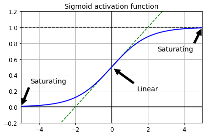

## Xavier와 He 초기화 기법
그들의 논문에서, Glorot과 Benigo는 이런 문제들을 상당히 완화시켜줄 방법을 제시했다. 예측을 내릴때는 순방향으로, 그래디언트를 역전파 시킬때에는 역방향으로 양방향 모두 적절히 신호가 흘러야만한다. 신호가 죽어서도 폭발적으로 증가해서 포화 상태가 되는 등 그 어떠한 것도 원하지 않는다. 신호가 적절히 흐르게하기 위해서, 이 논문의 역자들을 각각의 계층에서 계층의 입력의 변화량과 돌일한 출력 변화량을 가지고, 역방향에서 각각의 계층을 통과하기 전과 후가 같은 변화량을 가지는 기울기 값들이 필요했다. (수학적인 것에 좀 더 관심이 있다면 논문을 참고하자) 계층의 입력과 출력의 연결수가 같을지라도 보장을 할 수는 없지만, 실제 세계에서는 잘 작동한다고 증명된 좋은 절충점을 제시했다. 연결 가중치는 아래의 공식 11-1에서 묘사된대로 랜덤하게 초기화되어야한다는 것이며, n_input과 n_output은 초기화시킬 가중치를 가지고 있는 계층의 입력과 출력 연결의 수를 뜻한다. (*fan-in*, *fan-out*이라고도 한다) 이런 초기화 전략을 저자의 이름을 따서 Xavier(혹은 Glorot) 초기화 기법이라고 부르게된다.
###### 공식 11-1. Xavier 초기화 기법(로지스틱 활성화 함수를 사용할 때)
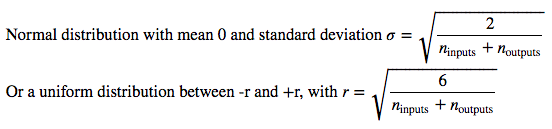

입력 연결의 수가 출력 연결의 수와 거의 같으면, 더 간단한 식을 얻는다. (예 : 나 ) Chapter 10에서 이 간소화된 전략을 사용했었다. Xavier 초기화 전략을 사용한다는 것은 학습 속도를 상당히 향상시켜줄 수 있으며, 이것이 딥러닝을 현재의 성공으로 이끌어준 기법들 중 하나이다. [몇가지 현재 논문들](http://goo.gl/VHP3pB)은 아래 보여지는 테이블에서 보이는 다양한 황성화함수에 대한 비슷한 전략을 제시해왔다. ReLU 활성화함수 (그리고 ELU 활성화함수를 포함한 ReLU의 파생함수들도 포함해서)에 대한 초기화 전략을 때때로 저자의 마지막 이름을 딴 "He 초기화"라고 한다. 
###### 표 11-1. 각각의 활성화 함수의 종류에 대한 초기화 파라미터들
 활성화함수 | 균일 분포 [-r,r] | 정규 분포
 :-----: | :------------: | :-----:
 로지스틱 |  | 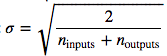
 하이퍼블릭 탄젠트 | 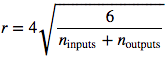 | 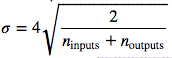
 ReLU | 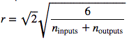 | 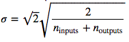

기본값으로, Chapter 10에서 소개되었던 `tf.layers.dense()`함수는 (균일분포로)Xavier 초기화를 사용한다. 이를 `variance_scaling_initializer()`함수를 다음과 같이 사용하면 He 초기화로 바꿀수도 있다.
```
he_init = tf.contrib.layers.variance_scaling_initializer()
hidden1 = tf.layers.dense(X, n_hidden1, activation=tf.nn.relu,
                          kernel_initializer=he_init, name="hidden1")
```
```
He 초기화 기법은 Xavier 초기화를 할 때 처럼 fan-in과 fan-iut 사이의 평균이 아닌 fan-in일 때만 고려를 한다.
"variance_scaling_initializaer()"함수의 기본값이지만, mode 인자를 "FAN_AVG"로 설정해서 바꾸어줄수도 있다.
```
## 포화되지않는 활성화함수
Glorot와 Benigo가 2010년에 발표한 논문에서 핵심중 하나는 기울기가 사라지거나 폭발적으로 증가하는문제는 활성화함수를 잘못선택한 것이 문제를 일으키는 이유중 일부라는 것이다. 대부분의 사람들이 대자연이 생물학적 뉴런에 있는 시그모이드 활성화 함수를 사용해왔었기에 사람들은 시그모이드 함수를 사용하는 것이 훌륭한 선택이라고 생각했다. 하지만 딥러닝에서 더 좋은 성능을 가진 다른 활성화 함수들이 등장하기 시작했고, 특히 ReLU 활성화함수가 그 중 하나인데, ReLU는 양의 값에 대해서는 포화상태를 이루지 않았기 때문이다. (또한 연산하기도 빠르기 때문이다)

불행하게도, ReLU 활성화 함수가 환벽한 함수는 아니다. 죽어가는 ReLU(*Dying ReLU*)라고 알려진 문제에 고통받고 있는데 죽어가는 ReLU문제란 학습중에 사실상 죽어버리는 것으로, 이는 그 신경망의 뉴런들들이 출력으로 0값만 계속 출력하는것을 의미한다. 이런 경우, 신경망에 있는 뉴런들중 반 정도가 죽어버리는 것을 볼 수 있을 것이다. 특히 학습률이 커다란 경우에 말이다. 학습중에 만약 뉴런에 들어오는 입력값들의 가중치 총합이 음의 수로 나오는 경우 그 가중치를 업데이트 하게되면 0을 출력하기 시작한다. 이것이 발생하면, 입력이 음의 수일 때 ReLU의 기울기 함수는 0이기 때문에 되살아날 경향이 없다.

이 문제를 해결하기 위해서는, ReLU의 변형 함수인 약간 새는 ReLU(*leaky ReLU*)를 사용하는 것이다. 이 함수는 아래의 그림에서 보이는 것처럼 `LeakyReLU_a(z) = max(ax,z)`로 정의된다. 하이퍼 파라미터 `a`는 이 함수가 얼마나 "새게" 할 것인지 정해주는데, z<0에 대해서 함수의 기울기를 설정해주는데, 보통 0.01로 설정해준다. 저 자그마한 기울기가 약간새는ReLU를 절대 죽지않게 해준다. 이것은 뉴런을 혼수상태로 만들어두는 것이나 마찬가지인 개념인데 결국에는 다시 깨어날 기회가 있다는 것이다. [최근 논문](https://goo.gl/B1xhKn)은 ReLU 활성화함수의 몇가지 변형 함수들을 비교해서 보여주는데 이 논문의 결론 중 하나가 약간 새는 형태의 변형 함수가 항상 기존의 엄격한 ReLU보다 성능이 훨씬 좋았다는 것이다. 사실, a=0.2(큰 값임)로 설정하는 것이 a=0.01(작은 값임)으로 설정하는 것보다 성능이 좋았다. 또한 확률적 새는 ReLU(*Randomized Leaky ReLU*:RReLU)도 평가를 하였는데, 저 함수는 학습중에 주어진 범위 내에서 a값을 랜덤으로 찾고 테스트하는 중에는 평균 값에 고정된다. 또한 꽤나 성능이 좋고, 정형화함수(Regularizer)같이 학습 데이터 세트를 과잉학습하는 것도 막아주는 것처럼 행동하기도한다. 마지막으로 그들은 파라메트릭 맄키 ReLU(*Parametric Leaky ReLU*: PReLU)도 평가하였는데, 이 함수는 하이퍼 파라미터가 되는 것 대신에 다른 파라미터들과 같이 역전파로 수정이 될 수 있도록 a를 파라미터로 바꾸어 학습중에 같이 학습될  수 있도록 한 것이다. 거대한 데아터 세트에 대해서는 ReLU보다 훨씬더 성능이 뛰어났지만, 크기가 자그마한 데이터 세트에 대해서는 학습 데이터 세트에 대해서 과잉학습할 위험을 가지고 있다. 
###### 그림 11-2. 약간 새는 모양의 ReLU
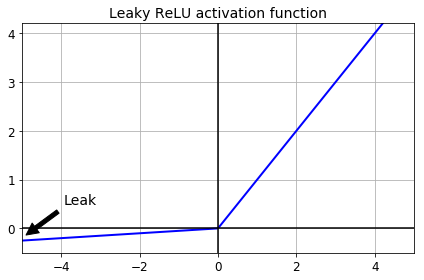

마지막으로 카장 중요한 것으로, Djork-Arne Clevert와 그의 동료들이 [2015년에 발표한 논문](httpL//goo.gl/Sdl2P7)은 그들이 모든 ReLU의 변형 함수에 대해서 한 실험에서 기하급수적 선형단위(*Exponential Linear Unit*:ELU)라는 새로운 활성화함수를 제시했다. 학습 시간은 감소하였으며, 테스트 데이터 세트에 대해서 신경망을 테스트해보아도 성능이 더 좋았다. 아래에 ELU함수 그래프와 ELU공식이 나와있다. 
###### 공식 11-2. ELU활성화 함수
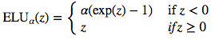
###### 그림 11-3. ELU활성화 함수
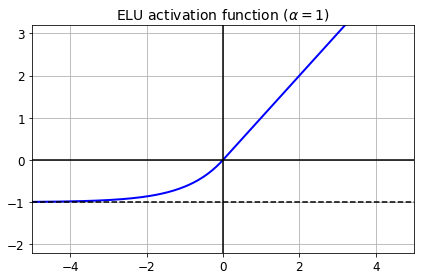

몇가지 큰 다른점을 빼고는 ReLU와 비슷한 점이 많다.
* 첫째로, z<0 일때도 음의 값을 취하는데, 이는 뉴런들의 출력의 평균치가 0에 더 가깝게 해준다. 이는 앞에서 말했던 기울기가 사라지는 문제도 완화시켜준다. 하이퍼 파라미터 a는 ELU함수가 z가 큰 음의 값일 때 수렴해나갈 값을 정의해준다. 보통은 1로 설정되지만 원한다면 어떠한 값도 사용할 수 있다.
* 두번째, z=0인 지점에서도 기울기가 0이 아닌데 이는 뉴런이 죽어가는 문제도 해결을 해준다.
* 세번째, z=0인 부분들도 포함해서 어느곳이든지 스무스하게 진행되는데, 이는 경사하강법의 속도를 증가시켜줄 수 있다. 그 어느곳에서도 요동을 칠만한 여지를 주지 않기 때문이다.

ELU 활성화 함수의 주된 결함은 함수가 기하급수적이기에 ReLU와 ReLU의 다른 변형함수들 보다 연산이 더 느리지만, 학습중에 수렴속도가 빠르다는 점에서 이러한 단점은 어느정도 상충이된다. 하지만 테스트할 때에는 ELU로 구성한 신ㄴ경망은 다른 ReLU들로 구성된 신경망보다 더 느릴 것이다.
```
그렇다면, 심층 신경망을 구현할 때 은닉 계층에 어떤 활성화함수를 사용해야할까? 우리가 갈 수 있는 길은 매우 다양하지만, 일반적으로 ELU >
leaky ReLU > ReLU > tanh > logistic 순으로 사용된다. 만약 실행 시간을 신경 써야한다면 ELU보다는 Leaky ReLU가 더 선호될 
것이다. 컴퓨터 자원이 여유가 있고 남는 시간이 있다면, 각기 다른 활성화함수들을 평가하기위해 교차검증법을 사용해보자. 특히 만약 신경망이 
과잉학습을 했다면 RReLU가, aksdir 거대한 데이터 세트가 있다면 PRELU가 괜핞을 것이다.
```
텐서플로우는 `elu()`함수를 제공해주어 신경망에 elu를 구현할 수 있게 해준다. `dense()`함수를 호출하면서 `activation`인자에다 설정을 해줄 수 있다.
```
hidden1 = tf.layers.dense(X, n_hidden1, activation=tf.nn.elu, name="hidden1")
```
텐서플로우는 미리 만들어진 Leaky ReLU가 없기 때문에 따로 구현해주어야하는데, 그래도 구현하기는 쉽다.
```
def leaky_relu(z, name=None):
    return tf.maximum(0.01 * z, z, name=name)

hidden1 = tf.layers.dense(X, n_hidden1, activation=leaky_relu, name="hidden1")
```
## 배치정규화(Batch Normalization)
비록 ReLU나 그 변형함수, 혹은 ELU와 He 초기화를 사용하는 것이 학습하면서 발생하는 기울기가 사리지거나 폭발적으로 증가하는 문제를 줄여줄지라도, 다시는 발생하지않을것이라는 보장이 없다.

Sergey Ioffe와 Christian Szegedy가 [2015년에 발표한 논문](https://goo.gl/gA4GSP)에서는 기울기가 사리지거나 폭발적으로 증가하는 문제, 좀 더 일반적으로 학습중에 이전 계층들의 파라미터들이 변해감에 따라 각각의 계층의 입력 값들에 대한 분산이 바뀌는 문제(저자들은 이를 *Internal Covariate Shift*)를 다루기 위한 배치 정규화(*Batch Normalization*:BN)이라고 부르는 기법을 제시했다. 

이 기법은 각각의 계층에 있는 활성화 함수 바로 앞에 추가하는 것으로 구성할 수 있으며, 간단히 입력값들을 0에 집중시켜주고 이를 정규화 계층당 새로운 두개의 차라미터를 사용해서 그 결과치를 스케일링하고 쉬프팅(Shifting)시켜준다. 다시말하면, 이 연산과정은 학습 모델이 각각의 계층에 대한 최적의 크기(Scale)와 입력값들의 평균치를 학습하게끔 하는 것이다. 

입력값들을 0을 중심으로 집중시켜주고 정규화하기위해서 알고리즘은 입력의 평균치와 표준분산을 측정할 필요가 있다. 현재의 미니배치에 있는 입력값들의 평균과 표준분산을 연산하는 것이다. (그래서 이름이 배치정규화이다) 전체 연산과정은 아래의 식들로 요약될 수 있다.
###### 공식 11-3. 배치 정규화 알고리즘
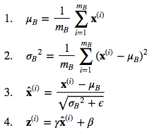

* **μ_B** : 전체 미니 배치 B에 대한 평균치
* **σ_B** : 전체 미니 배치 B에 대한 표준 분산치
* **m_B** : 미니 배치가 가지고 있는 인스턴스의 수
* **x̂^(i)** : 0을 중심으로 모아놓고 정규화시킨 입력값들
* **γ** : 계층에 대한 스케일링 파라미터
* **β** : 계층에 대한 쉬프팅 파라미터(오프셋)
* **ϵ** : 0으로 나누어지는 것을 피하기 위한 극히 작은 수 (보통 10^-5로 설정). 이를 *Smoothing term*이라고도 한다.
* **z^(i)** : BN연산 결과값 - 입력값이 스케일링되고 쉬프팅된 버전

테스트 단계에서는, 평균치와 표준분산을 연산할 미니 배치가 없기때문에 대신에 전체 학습 데이터세트의 평균과 표준 분산치를 사용한다. 이는 학습하는 동안에 이동평균을 사용하여 간단히 연산할 수 있다. 그래서 전체적으로, 각각의 배치 정규화가 적용되는 계층들은 총 4개의 파라미터 γ(스케일), β(오프셋), μ(평균), σ(표준분산)가 학습이 된다.

논문의 저자들은 이 기술이 그들이 실험했던 모든 심층신경이 상당히 개선되었다고 설명했다. 기울기가 사라지는 문제는 크게 감소했고 하이퍼블릭 탄젠트가 심지어 로지스틱 함수같은 포화를 하는 활성화 함수들에서도 잘 수행이 되었다. 신경망이 가중치 초기화에 덜 민감해지게 되었다. 그들은 학습율을 좀 더 크게 잡을 수 있고 학습속도가 상당히 향상되었다고 했다. 특히, 그들은 "최신 기술이 적용된 이미지 분류 모델에 적용해보았더니, 배치 정규화과 거의 14개의 학습 단계 만으로도 적용하지 않은 것과 같은 결과를 얻었으며, 기존의 것과 상당히 차이가 납니다. [...] 배치 정규화를 적용한 신경망들의 앙상블을 사용하여 ImageNet 분류 모델이 제공한 최고의 성능보다 더욱 향상시킬수 있다. 검증 데이터 세트 에러에 대해서는 4.9%정도의 향상 되었으며, 테스트 상으로는 4.8%에러치를 가지게 되었다." 라고 말했다. 마지막으로 아낌없이 주는 나무처럼, 배치 정규화는 다음 Chapter에서 다루게 될 Dropout 같은 정형화 알고리즘 역할도 수행해주어 정형화 사용의 필요성을 줄여주었다.

(비록 첫번째 은닉 계층이 정규화를 관리하는 덕분에 입력 데이터을 정규화를 해야할 필요성을 줄여주었지만) 하지만 배치 정규화는 모델에 연산복잡도를 올리게된다. 더 나아가 실행시간에 있어 패널티가 좀 있는데, 신경망이 각각의 계층에서 요구하는 추가적인 연산 때문에 예측연산이 좀 더 느려진다는 것이다. 그래서 예측을 빛의 속도처럼 빠르게 하기 위해서는 배치 정규화를 수행하기 전에 일반적인 ELU에 He 초기화를 사용해볼 수도 있다.
```
아마 경사하강법이 각각의 계층에 대해서 최적의 크기와 오프셋(offset)값들을 찾는 동안은 학습이 느려지는 것을 발견하겠지만,
한번 가속되기만 하면 상당히 좋은 값을 찾아줄 것이다.
```
### 텐서플로우로 배치 정규화 구현하기
텐서플로우는 입력데이터를 중심으로 모은 뒤에 정규화를 해주는 `tf.nn.batch_normalization()` 함수를 제공한다. 하지만 평균치와 표준분산을 우리가 직접 계산해주어야한다. (학습중에는 각각의 미니배치마다 해주고, 테스트를 할때에는 전체 데이터 세트에 대해서 해줄 필요가 있다) 그리고 이 값들을 함수의 파라미터로 입력해주고, 그리고 또한 스케일링과 오프셋 파라미터를 만드는 것에 대해서도 다루어주여야한다. (그리고 여기서 연산된 값들도 함수의 파라미터로 보내준다) 할수있다! 하지만 이것이 가장 편한 방법은 아니다. 대신에 `tf.layers.batch_normalization()`함수를 사용할 수 있으며, 이 함수는 아래의 코드에 있으며 이 함수가 다 알아서 해줄것이다.
```
import tensorflow as tf

n_inputs = 28 * 28
n_hidden1 = 300
n_hidden2 = 100
n_outputs = 10

X = tf.placeholder(tf.float32, shape=(None, n_inputs), name="X")

training = tf.placeholder_with_default(False, shape=(), name='training')

hidden1 = tf.layers.dense(X, n_hidden1, name="hidden1")
bn1 = tf.layers.batch_normalization(hidden1, training=training, momentum=0.9)
bn1_act = tf.nn.elu(bn1)

hidden2 = tf.layers.dense(bn1_act, n_hidden2, name="hidden2")
bn2 = tf.layers.batch_normalization(hidden2, training=training, momentum=0.9)
bn2_act = tf.nn.elu(bn2)

logits_before_bn = tf.layers.dense(bn2_act, n_outputs, name="outputs")
logits = tf.layers.batch_normalization(logits_before_bn, training=training,
                                       momentum=0.9)
```
이 코드에 대해서 천천히 살펴보자. 먼저 첫 줄은 우리가 `training` 플레이스홀더를 정의하기 전까지는 설명을 아끼겠다. 우리는 후에 학습중에 이를 `True`로 바꾸어 줄 것이지만 다른 상황에는 기본 값인 `false`로 설정되어 있을 것이다. `tf.layers.batch_normalization()` 함수를 현재 미니배치의 평균치와 표준분산을 사용할 것인지(학습중에), 아니면 전체 학습 데이터 전체의 평균과 분산을 사용할 것인지(테스트 중에) 정해주는 것이다. 

그리고 나서, 우리는 전가산(fully-connected)계층과 배치 정규화가 번갈아가며 나오게 한다. 전가산층은 chapter 10에서 했던 것처럼 `tf.layers.dense()`함수를 사용하여 만들었다. 우리가 전가산층에 대해서 활성화 함수를 명시해주지 않았는데, 배치 정규화 계층 다음에 활성화함수를 적용할 것이기 때문이다. 우리는  `training`과 `momentum`을 설정해서 `tf.layers.batch_normalization()`를 정의해주었다. 배치 정규화 알고리즘은 지수함수형 붕괴(*exponential decay*)를 이동평균을 연산하기 위해서 사용한다. 이는 왜 `Momemtum` 파라미터를 요구하는지 보여준다. 새로운 값 _**v**_ 애 대해서 이동평균 _**v̂**_ 를 아래의 공식으로 업데이트하게된다.

    v̂ ← v̂ × momentum + v × (1 − momentum)

모멘텀으로 설정하기 좋은 값은 1에 가까운 값들로 설정하는 것이다. 예를 들면 0.9나 0.99, 0.999이다. (만약 데이터 세트가 엄청 크다면 9를 많이 붙여주고, 데이터 세트가 작다면 9도 적게 붙여보자)

같은 배치 정규화 코드가 계속해서 반복되어 코드가 꽤나 반복적이라는 것을 발견했을 것이다. 이런 반복을 피하기 위해서, 파이썬이 제공하는 표준 모델 중 하나인 `functools`라는 모듈에 있는 `patial()`이라는 함수를 사용하는 것이다. 이는 함수에 일부 파라미터에 대해서 기본값을 설정해줄 수 있게 해준다. 이전의 코드에 있는 신경망 계층을 다음과 같이 정의해줄 수도 있다
```
from functools import partial

my_batch_norm_layer = partial(tf.layers.batch_normalization,
                              training=training, momentum=0.9)

hidden1 = tf.layers.dense(X, n_hidden1, name="hidden1")
bn1 = my_batch_norm_layer(hidden1)
bn1_act = tf.nn.elu(bn1)
hidden2 = tf.layers.dense(bn1_act, n_hidden2, name="hidden2")
bn2 = my_batch_norm_layer(hidden2)
bn2_act = tf.nn.elu(bn2)
logits_before_bn = tf.layers.dense(bn2_act, n_outputs, name="outputs")
logits = my_batch_norm_layer(logits_before_bn)
```
이전의 예시보다 지금의 코드가 뭔가 더 많아보이지만, 계층의 수가 많아지고, 설정할 활성화 함수와 초기화 기법, 정형화 함수 등등이 늘어가면, 이런 방법이 좀 더 합리적인 방법일 것이다.

구성단계의 나머지들은 Chapter10과 비슷하다. 손실함수를 정의해주고, 최적화 함수도 만들고, 손실함수치가 최소화되도록 하라하며, 평가 함수도 작성해주고, 변수 초기화를 해주고, `Saver`도 만들어주고, 등등을 수행해준다.

실행 단계에서도 비슷하게 진행되는데, 두가지 다른점이 있다. 첫번째는 학습중에 `Batch_Normalization()`계층에 의존하는 연산들을 실행시길때마다 `Training`인자를 `True`로 설정해주어야한다. 두번째는 `Batch_Normalization()`함수는 이동 평균을 업데이트 하기 위해 학습중 각각 스탭마다 평가를 해야만 하는 몇가지 연산들이 있다.(이동평균이 학습데이터 세트의 평균과 표준 분산을 연산하는데 필요한 것들을 재현해줌(*Recall*)) 이런 연산들을 자동으로 `UPDATE_OPS`집합에 추가해두기에, 우리가 해야할 것은 그 집합에서 연산 리스트를 가져와서 각각의 학습 반복 1회마다 이를 실행시켜주기만하면 된다.
```
extra_update_ops = tf.get_collection(tf.GraphKeys.UPDATE_OPS)

with tf.Session() as sess:
    init.run()
    for epoch in range(n_epochs):
        for iteration in range(mnist.train.num_examples // batch_size):
            X_batch, y_batch = mnist.train.next_batch(batch_size)
            sess.run([training_op, extra_update_ops],
                     feed_dict={training: True, X: X_batch, y: y_batch})
        accuracy_val = accuracy.eval(feed_dict={X: mnist.test.images,
                                                y: mnist.test.labels})
        print(epoch, "Test accuracy:", accuracy_val)

    save_path = saver.save(sess, "./my_model_final.ckpt")
```
이 두개의 은닉계층으로만 구성된 짧은 예시에서 배치 정규화가 그렇게 긍정적인 효과를 가져오지는 못했지만, 더 깊은 신경망에 대해서는 아주 커다란 차이점을 보여준다.
이 두개의 은닉계층으로만 구성된 짧은 예시에서 배치 정규화가 그렇게 긍정적인 효과를 가져오지는 못했지만, 더 깊은 신경망에 대해서는 아주 커다란 차이점을 보여준다.
## 기울기 오려내기 (Gradient Clipping)
기울기가 폭발적으로 증가하는 문제를 줄이기 위한 방법은 역전파 과정중 기울기 값을 오려내서 주어진 기준점을 초과하지 않게하는 것이다. (이는 Chapter 14에 있는 회귀신경망(*Recurrent Neural Network*)에 아주 유용하다) 이를 기울기 오려내기([*Gradient Clipping*](http://goo.gl/dRDAaf))라고한다. 일반적으로, 사람들은 현재 배치 정규화를 선호하지만, 여전히 기울기 오려내기가 무엇인지 그리고 어떻게 구현하는지 알면 유용할 것이다.

텐서플로우에서 최적화 함수에 있는 minimize()`함수는 기울기를 연산하고 그 기울기를 적용하는 것 모두 수행해주기에, 대신에 최적화 함수의 `compute_gradient()` 함수를 먼저 호출해주고, 마지막에 최적화 함수의 `apply_gradient()`함수를 사용해서 오려낸 기울기를 적용하는 연산을 만들어준다.
```
threshold = 1.0

optimizer = tf.train.GradientDescentOptimizer(learning_rate)
grads_and_vars = optimizer.compute_gradients(loss)
capped_gvs = [(tf.clip_by_value(grad, -threshold, threshold), var)
              for grad, var in grads_and_vars]
training_op = optimizer.apply_gradients(capped_gvs)
```
그리고 보통 각각의 학습 스탭마다 `training_op`을 실행시켜준다. 이는 기울기를 연산해서 -1.0에서 1.0 사이로 기울기를 잘라주고 그 값을 적용시켜준다. 이 기준점은 우리가 조절할 수 있는 하이퍼 파라미터이다.
# 미리 학습되어있던 계층들 재사용하기
맨 처음부터 일반적으로 매우 커다란 심층 신경망을 학습 시키는 것을 좋은 생각이 아니다. 대신에, 항상 우리가 할일과 비슷한 것들을 미리 달성해놓은 이미 존재하는 신경망을 찾아보는 것이 좋고, 그 신경망의 하위 계층들을 재사용하자. 이를 학습전이(*transfer learning*)라고 한다. 이는 학습 속도를 상당히 향상시켜줄 것이며, 학습 데이터도 덜 요구할 것이다.

예를들어 우리가 동물, 식물, 자동차, 그리고 일상적인 물건들을 포함한 100가지 정도의 카테고리를 분류하도록 학습된 심층 신경망을 가지고 있다고 가정해보자. 우리는 이제 특정 차종을 분류하는 심층신경망을 학습 시키기를 원한다고 하자. 이는 매우 쉬우며, 그래서 이미 학습된 신경망의 일부를 재사용헤보자.(아래그림 참고)
###### 그림 11-4. 미리 학습되어있던 계층들 재사용하기
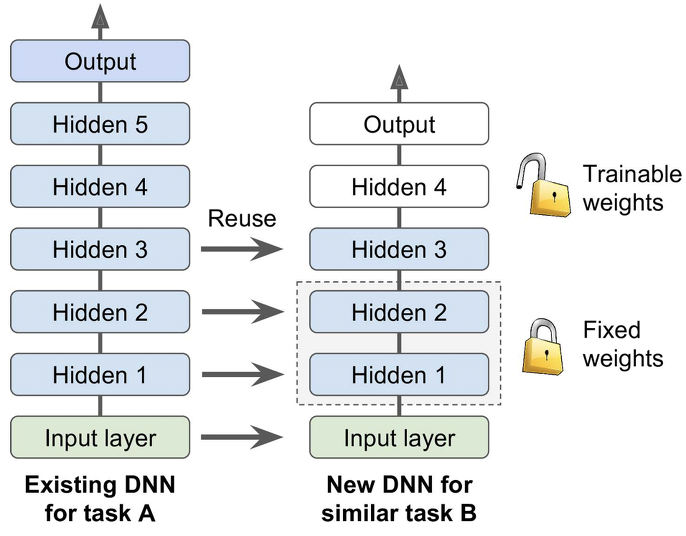
```
만약에 새로운 기능에 대한 입력 사진이 기존의 기능에서 사용했던 것과 입력 크기가 서로 다르다면, 전처리 단계에 기존의 모델에 맞는 사이즈로
재조정하는 기능을 추가해두자. 좀 더 일반적으로 학습전이는 하위 계층에 있는 입력 사이즈와 비슷할때만 효과가 있다.
```
## 텐서플로우 모델 재사용하기
만약 기존의 모델이 텐서플로우로 학습되었다면, 쉽게 불러와서 새로운 기능에 대해서 학습을 시킬 수 있다. Chapter 9에서 이야기했던 것처럼, 연산 그래프를 기본 그래프로 호출해주는 `import_meta_graph()` 함수를 사용해보자. 이는 우리가 나중에 모델의 상태를 불러오는데 사용할 수 있는 `Saver`로 반환해준다.
    
    saver = tf.train.import_meta_graph("./my_model_final.ckpt.meta")

그리고 나서 우리는 학습에 필요한 연산과 텐서들을에 대해서 익숙해져야만 한다. 그러므로 그래프의 `get_operation_by_name()`과 `get_tensor_by_name()` 함수를 사용해보자. 텐서의 이름은 `:0`과 같은 결과를 출력해줄 것이다. (`:1`는 두번째 결과값,`:2`는 3번째 결과값임을 나타냄)
```
X = tf.get_default_graph().get_tensor_by_name("X:0")
y = tf.get_default_graph().get_tensor_by_name("y:0")

accuracy = tf.get_default_graph().get_tensor_by_name("eval/accuracy:0")

training_op = tf.get_default_graph().get_operation_by_name("GradientDescent")
```
만약 학습된 모델이 문서화가 잘 되어있지 않다면, 우리가 필요한 연산의 이름을 찾기위해 그래프를 살펴봐야만 할 것이다. 이런 경우, 텐서보드를 사용해 그래프를 살펴보거나, 그래프의 모든 연산들을 리스트로 만들어주는 `get_operation`함수를 사용해야한다. 
```
for op in tf.get_default_graph().get_operations():
    print(op.name)
```
만약 여러분들이 기존 모델의 저자라면 연산에 해당하는 확실한 이름을 주거나 이들을 문서화하여 여러분들의 모델을 재용할 사람들이 이해하기 쉽게 해주자. 또다른 접근법은 사람들이 익숙해지길 원하는 모든 중요한 연산들을 포함한 집합을 만들어주는 것이다.
```
for op in (X, y, accuracy, training_op):
    tf.add_to_collection("my_important_ops", op)
```
이방법을 통하면 여러분들의 모델을 재사용할 사람들이 다음과 같이 간단하게 작성하여 사용할 수 있을 것이다.
```
X, y, accuracy, training_op = tf.get_collection("my_important_ops")
```
그리고 `Saver`를 새용해서 모델을 복구시켜주고 우리가 가진 데이터 세트를 사용해서 학습을 계속 시킬수 있다.
```
with tf.Session() as sess:
    saver.restore(sess, "./my_model_final.ckpt")
    [...] # 우리의 데이터 세트로 모델을 학습시켜보기
```
대체적으로 이전에 학습된 신경망이 파이썬으로 구현되었다면 `import_meta_graph()`로 손쉽게 사용할 수 있다.

일반적으로 기존의 모델의 일부, 전형적으로 하위 계층들만을 재사용하고 싶은 것이다. 만약 `import_meta_graph()`를 사용해 그래프를 복구해온다면, 우리가 신경쓰고 싶지않은 계층들도 그냥 무시하고 가져오게된다. 예를들어 그림 11-4에서 보여지는 것처럼, 긴존에 학습된 계층(Hidden 3) 위에 새로운 계층(Hidden 4랑 output)을 쌓을 수 있다. 그렇다면 새로운 출력 계층에 대한 손실을 연산해줄 필요가 있으며, 저 손실을 최소화하는 최적화 함수를 만들어준다. 

만약 이전에 학습된 그래프가 파이썬 코드로 되어있다면, 필요한 부분만 사용하고 나머지는 쳐내기만하면 된다. 하지만 이러한 경우에는 이미 학습된 모델을 불러오기 위해 `Saver`가 필요할 것이고, 새로운 모델을 저장할 또다른 `Saver`가 더 필요할 것이다.(어떤 변수를 불러올 것인지 명시해주어야 함. 아니면 텐서플로우는 매치가 안된다고 에러를 띄울 것임) 예시로 아래의 코드는 은닉 계층 1,2,3만을 복구시켜주는 코드이다.
```
reuse_vars = tf.get_collection(tf.GraphKeys.GLOBAL_VARIABLES,
                               scope="hidden[123]") # 일반적인 표현 방법
reuse_vars_dict = dict([(var.op.name, var) for var in reuse_vars])
restore_saver = tf.train.Saver(reuse_vars_dict) # 은닉 계층 1,2,3

init = tf.global_variables_initializer()
saver = tf.train.Saver()

with tf.Session() as sess:
    init.run()
    restore_saver.restore(sess, "./my_model_final.ckpt")
    [...] 모델 학습시키기
    save_path = saver.save(sess, "./my_new_model_final.ckpt")
```
기존 모델의 은닉 계층 1번부터 3번까지 복사하여 새로운 모델을 만들어준다. 그리고 일반적인 표현방법으로 `hidden[123]`이라고 하고 여기에 은닉 계층 1,2,3,번에 있는 모든 변수의 리스트를 가져오고, 다음으로, 기존 모델에 있던 변수들의 이름을 새로운 모델에 있는 변수들의 이름으로 맵핑해주는 dictionary를 생성해준다. (일반적으로 그 이름들을 정확하게 일치를 시켜서 진행을 함) 그리고나서 이 변수들만을 복구시켜줄 `Saver`를 생성해준다. 또한 모든 변수들을 초기화 해주는 연산(이전것, 새것 모두)도 만들어주고, 새롭게 만든 모델학습 상태를 저장해줄 또다른 `Saver`를 하나 더 생성해준다. 그렇게 세션을 실행해주고, 모델안에 있는 변수들을 모두 초기화 시켜준다. 그리고 기존의 모델의 은닉계층 1,2,3번의 변수값들을 복구시켜준다. 마지막으로 새로운 기능에 대해서 학습을 할 것이고, 그 결과를 저장할 것이다.
```
구현해야할 기능이 비슷할수록, 더 많은 계층들을 재사용하고 싶을 것이다. 매우 비슷한 기능에 대해서는
모든 계층들을 그대로 복사해와서 마지막 출력계층만 바꾸어보는것도 나쁘지 않을 것이다.
```
## 다른 프레임워크에있는 모델 재사용하기
만약 모델이 다른 프레임워크를 통해 학습이 된 것이라면, 모델의 파라미터들을 일일이 손수 불러와야만 한다. 그리고 그렇게 파라미터들을 적절한 변수들에게 할당해주어야한다. 이 작업은 상당히 거대해질수도 있는데, 예를들어, 아래의 코드는 다른 프레임워크를 사용해 학습한 모델의 첫번째 은닉 계층의 가중치와 편향치를 어떻게 복사해오는지 보여준다.
```
original_w = [[1., 2., 3.], [4., 5., 6.]] # 다른 프레임워크에서 가중치 가져오기
original_b = [7., 8., 9.]                 # 다른 프레임워크에서 편향치 가져오기

X = tf.placeholder(tf.float32, shape=(None, n_inputs), name="X")
hidden1 = tf.layers.dense(X, n_hidden1, activation=tf.nn.relu, name="hidden1")
# [...] 학습모델구현

# hidden1 변수들에 대한 할당 노드들에 대해서 이해하기
graph = tf.get_default_graph()
assign_kernel = graph.get_operation_by_name("hidden1/kernel/Assign")
assign_bias = graph.get_operation_by_name("hidden1/bias/Assign")
init_kernel = assign_kernel.inputs[1]
init_bias = assign_bias.inputs[1]

init = tf.global_variables_initializer()

with tf.Session() as sess:
    sess.run(init, feed_dict={init_kernel: original_w, init_bias: original_b})
    # [...] 새로운 기능에 대해서 모델 학습하기
    print(hidden1.eval(feed_dict={X: [[10.0, 11.0]]}))  # not shown in the book
```
위 구현 코드에서, 우리는 먼저 다른 프레임 워크에서 학습된 모델을 불러온다. (여기서는 보이지 않음) 그리고 이를 우리가 재사용하길 원하는 모델의 파라미터로 추출해준다. 그다음에, 평소대로 텐서플로우 모델을 구현해준다. 그리고 나서 기법적인 부분이다. 모든 텐서플로우 변수들은 변수들을 초기ㅏ화해주는데 사용하는 연관된 할당 연산을 가지고 있다. 우리는 이제 이런 할당 연산에 대해서 이해해야한다. (변수로 같은 이름을 가지며 "/Assign"이라는 것도 덧붙여줌) 또한 각각의 할당 연산의 두번째 입력값에 대해서도 이해해야한다. 할당연산 같은 경우, 두번째 입력값은 변수에 할당될 값에 상응하는 값이며, 그래서 이경우에는 변수의 초기화 값을 입력해준다. 세션을 시작하면 보통의 초기화 연산자가 실행되지만, 이번에는 우리가 재사용하고자하는 변수에 넣고싶은 값을 입력해준다. 대체적으로, 새로운 할당 연산과 플레이스 홀더를 만들어주고, 초기화후에 변수의 값으로 세팅하는데 사용한다. 하지만 우리가 필요로하는 모든 것들이 이미 있는데 왜 새로운 노드를 만들어야할까?
## 하위 계층들 얼리기
미리 학습이 완료된 심층신경망에 있는 하위계층들은 위에어 언급했던 두가지의 이미지 분류 기능 모두에게 유용한 하위 레벨의 특징들을 사진에서 감지하는 것을 학습하는 경향이 있다. 그래서 이 계층들을 그대로 사용할 수 있는 것이다. 이것이 새로운 심층 신경망을 학습할 때 계층들의 가중치들을 얼리는(freeze) 것에 대한 좋은 아이디어이다. 만약 하위 계층들의 가중치들이 고정되어있다면, 더 높은 계층들의 가중치들은 학습하기 편해질 것이다. 학습중에 하위 계층들을 얼리기 위한 방법은 최적화 함수에게 하위 계층들의 변수들을 제외하고 학습할 변수의 리스트를 따로 제공하는 것이다. 
```
train_vars = tf.get_collection(tf.GraphKeys.TRAINABLE_VARIABLES,
                               scope="hidden[34]|outputs")
training_op = optimizer.minimize(loss, var_list=train_vars)
```
첫번째 줄은 은닉계층 3과 4와 출력계층에 있는 학습해야할 모든 변수에 대한 리스트를 가져온다. 이는 은닉 계층 1번과 2번은 그대로 두는 것이다. 그리고나서 우리는 이렇게 제한을 시켜둔 학습해야할 변수들의 리스트를 최적화 함수의 `minimize()` 함수에 입력해주어야한다. 이렇게 1번과 2번 은닉계층이 얼려지는 것이다. 이들은 학습동안에 변하지 않게된다.(이를 종종 얼린 계층(*frozen layer*)이라고도 함)

또다른 선택사항은 그래프에 `stop_gradient`를 추가해주는 것이다. 그렇게 하면 그 하위 계층들은 모두 얼려질 것이다.
```
with tf.name_scope("dnn"):
    hidden1 = tf.layers.dense(X, n_hidden1, activation=tf.nn.relu,
                              name="hidden1") # reused frozen
    hidden2 = tf.layers.dense(hidden1, n_hidden2, activation=tf.nn.relu,
                              name="hidden2") # reused frozen
    hidden2_stop = tf.stop_gradient(hidden2)
    hidden3 = tf.layers.dense(hidden2_stop, n_hidden3, activation=tf.nn.relu,
                              name="hidden3") # reused, not frozen
    hidden4 = tf.layers.dense(hidden3, n_hidden4, activation=tf.nn.relu,
                              name="hidden4") # new!
    logits = tf.layers.dense(hidden4, n_outputs, name="outputs") # new!
```
## 얼린 계층들 캐시로 저장하기
얼려진 계층들은 변하지 않기 때문에, 각각의 학습 인스턴스에 대해서 가장 높이 있는 얼려진 계층의 결과를 캐시로 저장하는 것이 가능하다. 학습은 전체 데이터에 대해서 오랜시간동안 진행되기때문에, 학습 인스턴스 당 얼린 계층을 한번 지나기 때문에 속도가 상당히 빨라질 것이다. 예를들어 (충분한 RAM을 가지고 있다고 가정하고)먼저 학습데이터 전체를 하위 계층에 통과시켜주고, 학습 인스턴스의 배치를 만드는 것 대신에 은닉계층의 결과값에 대한 배치를 만들어서 학습 연산에 입력해주는 것이다.
```
import numpy as np

n_batches = mnist.train.num_examples // batch_size

with tf.Session() as sess:
    init.run()
    restore_saver.restore(sess, "./my_model_final.ckpt")
    
    h2_cache = sess.run(hidden2, feed_dict={X: mnist.train.images})

    for epoch in range(n_epochs):
        shuffled_idx = np.random.permutation(mnist.train.num_examples)
        hidden2_batches = np.array_split(h2_cache[shuffled_idx], n_batches)
        y_batches = np.array_split(mnist.train.labels[shuffled_idx], n_batches)
        for hidden2_batch, y_batch in zip(hidden2_batches, y_batches):
            sess.run(training_op, feed_dict={hidden2:hidden2_batch, y:y_batch})

    save_path = saver.save(sess, "./my_new_model_final.ckpt")
```
학습 루프의 마지막 라인은 앞에서 정의된 학습 연산을 (은닉 계층 1과 2는 건들지 않으면서) 실행시켜주고, 두번째 계층의 결과값을 입력해준다. 2번째 은닉계층의 결과를 텐서플로우에게 주었기 때문에, 이에 대해서 에러 평가를 하지는 않을 것이다. 
## 상위 계층 대체, 삭제, 조절하기
기존의 계층의 출력 계층은 보통 새로운 기능에 대해서 젼혀 도움이되지 않기 때문에 대체되며, 심지어 새로운 기능에 대한 결과 출력수도 맞지 않다. 

유사하게도, 기존 신경망 모델의 상위 은닉 계층들은 하위 계층보다 쓸모가 없는데, 새로운 기능에 유용한 고레벨의 특징값들이 기존의 기능에서 쓸모있던 것보다 상당히 다르기 때문이다. 그래서 우리는 사용해야할 계층의 수를 찾아야한다.

먼저 복사한 모든 계층들을 얼려보고, 모델을 학습시켜 본 뒤에, 어떻게 수행을 하는지 보자. 그리고 나서 상위에 있는 계층들중 하나나 두개의 은닉계층을 다시 풀어주고, 역전파가 이 풀린 계층들을 업데이트 시킬수 있게 해주고 그후에 성능이 향상되었느지 보자. 학습 데이터를 많이 줄수록, 계층들을 더 많이 풀어줄 수가 있다.

만약 여전히 좋은 성능을 얻지 못하고 학습데이터의 양도 적다면, 최상위에 있는 계층들을 몇개 버려보고 남아있는 모든 은닉 계층들을 다시 얼려보자. 사용할 계층들의 수를 정할때까지 이를 밥복해보자. 만약 학습데이터가 많이 있다면, 최상위 계층들을 버리는 것대신에 대채를 해볼수도 있을 것이다. 그리고 좀 더 많은 은닉 계층들을 붙여볼 수 있을 것이다.

## 학습 모델 동물원
우리는 우리가 다루어야할 기능과 비슷한 기능을 해주는 학습된 신경망 모델을 어디서 찾아볼 수 있을까? 먼저 살펴볼 곳은 분명히 우리 자신만의 모델에 대한 카탈로그이다. 이는 모든 학습 모델을 저장해야하는 좋은 이유이며, 이를 정리하여 후에 나중에 쉽게 찾아볼 수 있도록 한다. 또다른 사항은 학습 모델 동물원(*model zoo*)에서 찾아보는 것이다. 수많은 사람들이 다양한 기능으로 기계학습 모델을 학습시켜두었으며, 친절하게도 이미 학습시킨 모델을 대중에게 공개해두었다. 

텐서플로우는 텐서플로우만의 [학습모델 동물원](https://github.com/tensorflow/models/)이 있다. 전형적으로 코드와 미리 학습을 시켜둔 모델 그리고 인기있는 데이터 세트를 포함해서 VGG, Inception, ResNet(Chapter 13과 *models/slim* 디렉토리를 참고할 수 있음)를 가지고 있다.

또 다른 유명한 학습모델 동물원은 [Caffe의 학습 모델 동물원](https://goo.gl/XI02X3)이다. 마찬가지로 다양한 데이터 세트로 학습시킨 수많은 컴퓨터 비젼 모델 (예를 들면, LeNet, AlexNet, ZFNet ,GoogLeNet, VGGNet, inception)을 가지고 있다. Saumito Dasgupta가 [Caffe모델을 텐서플로우 모델로 바꾸어 주는 변환함수](https://github.com/ethereon/caffe-tensorflow)를 만들어 두었다.

## 비지도 사전학습
레이블이 매겨진 학습데이터가 많지 않은데 복잡한 기능에 대해서 다루고 싶지만 비슷한 기능을 해주는 학습된 모델을 찾을 수 없다고 가정해보자. 그렇다고 희망을 잃지는 말자. 먼저 당연히 레이블이 매겨진 학습 데이터를 더 찾아보아야하지만 만약 너무 어렵고 기회비용이 너무 많이 든다면, 아래 그림에서 보여지는 것처럼 비지도 사전학습(*Unsupervised pretraining*)을 수행할 수 있다. 즉, 만약 레이블이 매겨진 데이터가 너무 적다면, 제한 볼츠만 머신(*Restricted Boltsmann machines*)나 오토인코더(*autoencoder*)같은 비지도 특징 탐색 알고리즘을 사용해 가장 하위에 있는 계층부터 시작해 올라가면서 계층을 하나씩 학습을 시켜볼 수 있다. 각각의 계층들은 이전에 학습된 계층들의 출력에 대해서 학습된다.(모든 계층들은 학습을 하지 못하게 얼린것들은 제외를 시켜줌) 이런 방법으로 모든 계층들의 학습이 완료된다면, 지도학습(예로 역전파도 포함하여)을 이용해 신경망의 하이퍼 파라미터를 조율할 수 있다.

이런 작업은 꽤 길고 거대한 작업이지만, 보통 이 방법은 잘 작동한다. 사실 Geoffrey Hinton과 그의 팀이 2006년에 사용을 했던 방법이며 이는 신경망의 부활과 딥러닝의 성공을 이끌었다. 2010년까지, 비지도 사전학습(전형적으로 RPM사용)은 심층 신경망에게 기준이였으며, 기울기가 사라지는 문제가 해결되고 난 뒤에 역전파을 사용해서 심층 신경망을 학습시키는 방법으로 더 자주 사용되었다. 하지만 비지도 사전학습은(오늘날에는 전형적으로 RPM보다는 오토인코더를 사용함) 여전히 레이블된 학습데이터는 적지만 양은 많고 재사용할 수 잇는 모델이 없들 때 복잡한 문제를 해결하기 위한 좋은 방법들 중 하나이다.
###### 그림 11-5. 비지도 사전학습
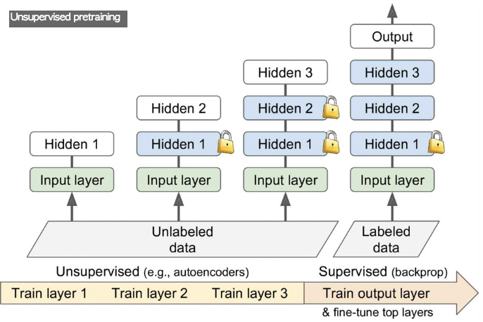
## 보조 기능에 대한 사전학습
마지막 사항으로는 레이블된 학습 데이터 세트를 쉽게 얻거나 만들수 있게 해주는 보조기능에 대해서 기존의 신경망을 학습 시키는 것이고, 실제 기능에 대해서 그 신경망의 하위 계층을 사용해서 훈련하는 것이다. 기존의 하위 신경망의 하위계층은 우리가 새로 만들 신경망에 사용이 가능한 특징 감지를 학습할 것이다.

예를들어, 만약 얼굴을 인식하는 시스템을 구축하고 싶은데, 몇몇 개인들의 각각의 사진을 몇장밖에 가지고 있지 못하다면, 분명히 분류모델을 학습 하기에는 충분하지는 못하다. 각 사람들의 수백장의 사진을 모으는 것은 현실적이지 못할 것이다. 하지만, 인터넷상에 있는 임의의 사람들에 대한 사진을 엄청나게 수집을 할수 있고 첫번째 계층이 모은 사진들중에 같은 사람인지 아닌지 정도만 판별해주도록 학습시키는 것이다. 이런 신경망은 얼굴에 대해 학습할 때 도움이 될만한 특징들을 학습할 것이며 그러므로 이 모델의 하위 계층을 사용하는 것은 조그마한 데이터 세트를 이용해서 괜찮은 얼굴 분류 모델을 만들어줄 수 있다.

이는 종종 레이블이 매겨져있지 않은 학습 데이터 예제를 모으는것보다 비용이 들지만 그것을 레이블 매기는 것보다는 덜 비싼 것이다. 이런 상황에서 일반적인 기법은 모든 학습 데이터에 대해서 레이블을 “Good”으로 메기는 것이다. 그리고 좋은 데이터 세트를 변질 시킴으로써 새로운 데이터 세트를 얻고, 이렇게 변질시킨 인스턴스를 "Bad"라고 레이블링을 한다. 그리고 첫번째 계층에게 이 각각의 인스턴스들을 "Good"과 "Bad"로 학습을 시켜준다. 예를들면 "Good"이라고 매겨진 수백만개의 문장들을 다운로드하고 임의로 각각의 문장들의 단어중 몇개를 바꿔준뒤에 이렇게 처리한 인스턴스를 "Bad"라고 매겨주는 것이다. 만약 신경망이 "The dog sleeps"가 좋은 문장이고, "The dog they"라는 문장을 나쁜 문장임을 말해줄 수 있다면, 어느정도 꽤 언어에 대해서 알고 있다고 볼 수 있다. 이렇게 학습시킨 신경망의 하위 계층들을 재사용하는 것은 언어를 처리하는 수많은 기능들을 만드는데 도움이될 것이다.

또 다른 접근법은 각각의 학습 인스턴스에 대해서 점수를 출력하도록 기존의 신경망을 학습시키고 좋은 인스턴스의 점수가 나쁜 인스턴스의 점수보다 어느정도 차이가 나도록 보장하는 손실 함수치를 사용하는 것이다. 이를 최대차이학습(*Max margin learning*)이라고 한다.
# 더 빠른 최적화 함수
매우 커다란 심층 신경망을 학습 시키는 것은 엄청나게 느릴것이다. 우리는 학습 속도를 늘리기 위해 4가지의 방법을 살펴보았으며 더 나은 솔루션에 접근했다. 연결 가중치를 에 적용할만한 좋은 초기화기법들, 좋은 활성화함수 사용하기, 배치 정규화 사용하기, 사전에 학습된 신경망의 일부를 재사용하기가 바로 그것들이다. 또다른 속도를 엄청나게 상향시킬만한 방법은 기존의 경사하강법 최적화함수보다 더 빠른 최적화 함수를 사용하는 것이다. 이 섹션에서는 유명한 것들을 몇가지 소개할 것이다. 
## 탄성 최적화 (Momentum Opimization)
미끄러운 표면을 살살 내려가는 볼링공을 상상해보자. 처음에는 천천히 시작하겠지만 결국 종단 속도에 도달할 때까지 빠르게 탄성을 받게될 것이다. 이것이 1964년에 Boris Polyak이 [제안한 탄성최적화(*momentum optimization*)](https://goo.gl/FlSE8c)에 가장 간단한 아이디어이다. 대조적으로 일반적인 경사하강법은 간단히 정해진 작은 단계가 기울기에 따라 점점 감소하기에 바닥으로 가까워지는데 더 많은 시간이 소모된다. 

경사하강법이 가중치 θ를 손실함수 J(θ)의 기울기에 학습률 η로 곱한 것(*η∇θJ(θ)*)으로 빼준것이다. 즉 공식은 `θ← θ - η∇θJ(θ)`이다. 이는 초기의 기울기 값이 몇이였는지에 대해서는 신경쓰지는 않는다. 만약 지역 기울기가 매우 작다면 경사하강법은 매우 느리게 갈것이다.

탄성 최적화는 이전 기울기가 무엇인지에 대해서 신경을 써준다. 각각의 반복 횟수마다 (학습률 η이 곱해지는) 탄성 벡터(*momentum vector*)를 _**m**_ 로 지역 기울기를 빼준다. 그리고 이 탄성 벡터를 가중치에 더해주는 것으로 가중치를 업데이트 해준다. 이 식은 아래에 나와있다. 어느정도의 마찰력 메커니즘을 적용해보고 모멘텀이 너무 커지는 것을 방지하기위해 이 알고리즘은 새로운 파라미터 β를 사용하는데 이를 모멘텀(momentum)이라고하며,  모멘텀은 0(마찰력 높음)에서 1(마찰력 낮음)값 사이로 설정해주어야만 한다. 전형적인 모멘텀 값은 0.9이다.
###### 공식 11-4. 탄성 알고리즘
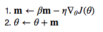

민액 기울기기 상수로 남아있게 된다면 종단 속도(가중치 업데이터의 최대 크기)는 로 학습률 η를 곱한 기울기와 같다. 예를들어 β=0.9라면 종단 속도는 기울기에 학습률을 곱한 것에 10배 정도 크기를 가지므로 탄성 최적화는 경사 하강법 보다 10배이상 빨라지게 될 것이다! 이는 탄성 최적화 알고리즘이 고원 형태에서 경사 하강법보다 더 빠르게 탈출할 수 있게 해준다. 전형적으로 우리는 Chapter4에서 입력값들의 스케일이 너무 차이가 나면 손실 함수치가 그림 4-7에서 보여지는 것과 같이 길게 늘어질 것이라는 것을 보았다. 경사 하강법은 가파른 경사를 가진 곳에서는 빠르게 내려가지만 계곡으로 내려가는데 시간이 엄청 오래걸린다. 대조적으로 탄성 최적화는 계곡의 바닥으로 점점 더 빠르게 최적점을 만날때 까지 내려간다. 배치 정규화를 사용하지 않는 심층 신경망에서 상위 계층들은 종종 매우 다른 크기로 입력값을 가지게 될 것이므로, 탄섣ㅇ 최적화를 사용하는 것이 도움이 많이된다.
```
모멘텀 때문에, 최적화 함수들이 조금 오버슈트되고 되돌아오고 다시 오버슈트하며 최소점에서 안정화되기전까지 이를 계속
반복할지도 모른다. 이는 이 시스템에 마찰력을 어느정도 주는 것이 왜 좋은지 잘 보여준다. 이런 반복성을 제거해주어
더 빠르게 수렴할 수 있게 해준다.
```
텐서플로우에서 탄성 최적화는 쉽게 구현할 수 있다. 그냥 `GradientDescentOptimizer`를 `MomentumOptimizer`로 바꾸어 주기만하면 된다.
```
optimizer = tf.train.MomentumOptimizer(learning_rate=learning_rate,
                                       momentum=0.9)
```
탄성 최적화의 결함은 조율해야할 하이퍼 파라미터가 하나가 더 추가되는 것이다. 하지만 모멘텀 값을 0.9로 설정하는 것이 실제로도 잘 작동하고 거의 항상 경사하강법보다는 빠르다. 
## 네스트로브 가속화 기울기 (Nestrov Accelerated Gradient)
1983년 Yurii Nesterov가 제안한 [탄성 최적화의 작은 변종기법](https://goo.gl/V011vD)이 거의 항상 기존의 탄성 최적화보다 빨랐다. 네스트로브 탄성 최적화 혹은 네스트로브 가속화 기울기(*Nestrov Momentum Optimization* or *Nestrov Accelerated Gradient*:NAG)라고 하는 것의 기본 아이디어는 지역적인 위치 뿐만 아니라 모멘텀의 조금 향해 있는 방향에 대한 손실함수의 기울기를 구하는 것이다.(아래 공식을 참고하라) 기존의 탄성 최적화와 다른점은 기울기가 θ에서가 아니라  θ+β**m** 에 대해서 측정이 된다는 것이다.
###### 공식 11-5. 네스트로브 가속화 기울기 알고리즘
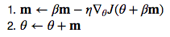

이 작은 조정사항은 일반적으로 탄성 벡터가 올바른 방향으로 향하게되기 때문에 잘 작동하여 아래의 그림에서 보여지는 것처럼 기존 위치에 대한 기울기를 사용하는 것보다 어떤 방향을 향하는 것에 대한 기울기를 사용하는 것이 조금 더 정확해질 것이다. (∇1은 시작지점 θ에서 측정된 손실함수의 기울기 값을 나타내며, ∇2는 θ+β**m**에 있는 점에 대한 기울기를 나타낸다.) 보다시피, 네스트로브는 결국엔 최적점에 좀 더 가깝게 가게된다. 그 후에 이런 작은 개선사항들이 더해지고, NAG는 정형적인 탄성 최적화보다 상당히 더 빨라지게 될 것이다. 더 나아가 모멘텀이 계곡을 가로지르게 가중치를 밀어주었을 때, ∇1은 계곡을 더 가로지를 수 있게 밀어주지만, 반면에 ∇2는 계곡의 바닥방향으로 밀어준다. 이렇게 이랬다 저랬다 올라가고 내려가는 것을 줄려주는데 도움을 줌으로써 수렴의 속도가 더욱 빨라진다.

거의 항상 정형적인 탄성 최적화에 비교하면 NAG의 학습 속도가 더 빠르다. 이를 사용하기 위해서는 간단하게 `MomentumOptimization`을 정의해줄때, `use_Nesterov=True`라고 설정해주면 된다.
```
optimizer = tf.train.MomentumOptimizer(learning_rate=learning_rate,
                                       momentum=0.9, use_nesterov=True)
```
###### 그림 11-6. 정형적인 탄성 최적화 알고리즘과 네스트로브 탄성 최적화 비교
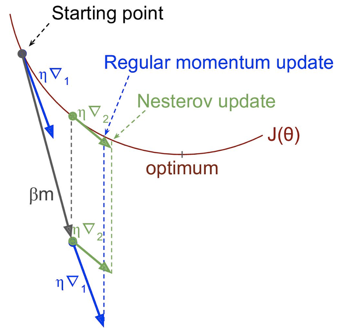
## AdaGrad
길게 늘어진 접시 문제를 다시 생각해보자. 경사 하강법은 가장 낮은 경사도를 가진 곳에서는 빠르게 내려가기 시작하며, 계곡의 바닥부분에서는 느리게 가게된다. 안약에 알고리즘이 좀 더 전역 최적점으로 향하도록 올바른 방향을 초기에 발견한다면 좋을 것이다. 

[AdaGrad 알고리즘](http://goo.gl/4Tyd4j)는 가장 가파른 차원들에 따라 기울기 벡터의 크기를 줄이는 것으로 이를 가능케했다.(아래의 공식을 참고)
###### 공식 11-6. AdaGrad 알고리즘
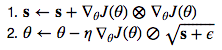

첫번쩨 단계는 벡터 **s**로 기울기의 제곱값을 축적시키는 것이다. (⨂표현은 요소별 곱셈을 나타냄) 이렇게 벡터화된 형태는 각각의 벡터 **s**의 요소 s_i에 대해서s_i ← s_i + (∂J(θ)/∂θi)^2를 연산하는 것과 같다. 다른말로 각각의 s_i는 파라미터 θ_i에 대해서 손실함수의 편도함수의 제곱을 축적한다. 만약 손실함수가 i번째 차원에 따라서 가파르다면 s_i는 학습이 진행될 수록 더욱 더 커지게 될 것이다.

두번째 단계는 거의 경사하강법과 유사하지만, 하나의 커다란 차이점이 있다. 기울기 벡터는 √(s+ϵ)라는 요소에 의해 그 크기가 줄어든다.(⊘기호는 요소별 나눗셈이며, ϵ는 0으로 나뉘어지는 것을 피하기 위한 식으로써 전형적으로 10^-10으로 설정된다.) 이렇게 벡터화된 형태는 모든 파라미터 θ_i에 대해서 (동시다발적으로) θ_i ← θ_i − η∂J(θ)/∂θ_i/√s_i+ϵ를 연산하는 것과 같다.

짧게 말해서 이 알고리즘은 학습률을 감소시키지만, 완만한 경사의 차원에 대해서 보다 가파은 차원에 대해서 매우 더 빠르다. 이를 적응학습률(*adaptive learning rate*)이라고도 한다. 아래의 그림에 나와있는 것처럼, 결과로 나오는 업데이트치들을 좀 더 전역 최적점에 향할수 있도록 도와준다. 추가적인 이점은 학습률 하이퍼파라미터 η를 덜 조율해주어도 된다는 것이다.
###### 그림 11-7. AdaGrad와 경사하강법 비교
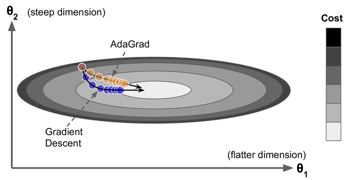

AdaGrad는 종종 간단한 이차적인 문에 대해서 수행을 잘 하지만, 불행하게도 종종 신경망을 학습시킬때 너무 빠르게 멈춘다는 것이다. 학습률이 크기를 갈수록 줄여나가면서 전역 최적점에 도달하기전에 전체적으로 알고리즘이 멈추게되는 것이다. 그래서 텐서플로우에서 `AdagradOptimizer`를 제공해주기는 하지만 심층신경망을 사용할 때에는 사용하지 않는 것이 좋다.(선형 회귀 같이 좀 더 간단한 것에 대해서는 효율적일지도 모른다)
## RMSProp
비록 AdaGrad가 너무 빠르게 내려가 결국엔 절대 전역최적점에 수렴하지 못했지만, RMSProp 알고리즘은 (학습 시작부터 전체 그래디언트를 사용하는 것과는 반대로)가장 최근의 학습 반복횟수들로부터만의 기울기들만 축적함으로써 이를 고쳤다. 첫번째 단계에서 매우 기하급수적인 감소를 사용한다. (아래 식 참고)
###### 공식 11-7. RMSProp 알고리즘
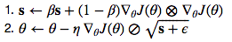

감소율(*Decay rate*) β는 전형적으로 0.9로 설정이 된다. 그렇다. 다시 새로운 하이퍼 파라미터가 생겼지만, 이는 기본값이 작동을 잘 하기 때문에 전혀 조율할 필요가 없을 것이다.

예상했던대로, 텐서플로우가 `RMSPropOptimizer`클래스를 제공해준다.
```
optimizer = tf.train.RMSPropOptimizer(learning_rate=learning_rate,
                                      momentum=0.9, decay=0.9, epsilon=1e-10)
```
매우 간단한 문제를 제외하곤 이 최적화 함수는 거의 항상 AdaGrad보다 훨씬 더 효과가 있으며, 사실, Adam 최적화가 등장하기 전까지는 수많은 연구에서 가장 선호되던 최적화 알고리즘이였다.
## Adam 최적화 (Adam Optimization)
[Adam(*Adaptive moment estimation*)](https://goo.gl/Un8Axa)은 RMSProp와 탄성 최적화의 아이디어가 합쳐진 형태로, 탄성 최적화처럼 과거 기울기의 기하급수적으로 감소하는 평균(exponentially decay average)을 파악하면서, RMSProp처럼 과거 제곱 기울기 값의 기하급수적으로 감소하는 평균도 파악한다.(아래공식참고)
###### 공식 11-8. Adam 알고리즘
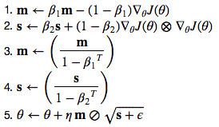
* _**t**_ 는 반복횟수의 수를 의미한다. (1부터 시작)

1번과 2번 5번을 보면, Adam은 탄성 최적화와 RMSProp 양쪽 모두와 매우 유사하다는 것을 알 수 있다. 단 하나의 차이점은 1번이 기하급수적으로 감소하는 합보다 기하급수적으로 감소하는 평균을 연산한다는 것이지만, 실제로 이 식들은 상수 인자를 제외하면 유사하다. 3번과 4번은 어느정도 기법적인 사항들에서 유사하다. **m**과 **s**는 모두 0으로 초기화되며, 학습시작에는 0으로 편향치를 가지게 될 것이고, 그래서 이 두개의 식은 **m**과 **s**를 학습 초반에 속도를 올리는데 도움을 준다.

모멘텀 감소 하이퍼 파라미터 β_1은 전형적으로 0.9로 초기화되며 크기조절(Scaling) 감소 하이퍼파라미터 β_2는 전형적으로 0.999로 초기화된다. 앞서 ϵ는 보통 10^-8같이 매우 작은 수로 초기화된다. 텐서플로우의 `AdamOptimizer` 클래스에 이렇게 기본값들로 설정되어 있으며 그래서 다음과 같이 아주 간단하게 사용을 할 수 있다.
```
optimizer = tf.train.AdamOptimizer(learning_rate=learning_rate)
```
사실 Adam은 (AdaGrad나 RMSProp같은)적응학습률알고리즘이기에, 학습률 하이퍼 파라미터η를 덜 조율해주어도 된다. 종종 기본값으로 η=0.001으로 사용하기도 한다.
```
이책은 초기에 Adam 최적화를 사용하는 것을 추천했는데 일반적으로 다른 기법들보다 더 빠르고 좋은 것으로 생각했기 때문이다.
하지만 2017년에 발표된 논문에 의하면 적응 최적화 기법들이 일부 데이터 세트에선 일반화를 현저히 못하는 솔루션을 유도해낼 수
있다는 것이다. 그래서 현재는 탄성 최적화나 네스트로브 가속화 기울기 기법들을 추천한다.
```
모든 최적화 기법들은 지금까지 일차 편도함수(*first-order partial derivatives*)(함수행렬식(*jacobians*))에 불과했다. 최적화는 말그대로 이차 편도함수(*second-order partial derivatives*)(*the Hessians*)에 기반하여 놀라운 알고리즘들을 포함하고 잇다. 불행하게도 이런 알고리즘들은 심층 신경망에 적용하기가 매우 어렵다. 심층 신경망은 전형적으로 1만개정도의 파라미터를 가지기 때문에 이차 최적화 알고리즘은 종종 메모리 용량을 초과하며 심지어 가능하더라도 헤센을 연산하는 것은 너무 느리다.
```
희소 모델 학습 시키기 (Training Sparse Models)


```
## 학습률 스케줄링
좋은 학습률을 찾기란 매우 힘들다. 만약 너무 높게 잡으면 학습은 분산될 것이고,(Chapter4에서 다루었음) 그렇다고 학습률을 너무 낮게 잡으면 최적점에 수렴이야 하겠지만 시간이 오래걸릴 것이다. 만약 조금 높게 잡는다면 처음에는 매우 빠르게 진행되다가 결국엔 최적점 주위에만 머무르게 되어 절대 도달하지 못할 것이다.(AdaGrad나 RMSProp 그리고 Adam 같은 적응 학습률 최적화를 사용할지라도 정착하는데는 시간이 좀 걸린다) 만약 연산자원이 한정되어있다면, 아래 그림에서 보이는 것처럼 차선의 최적 솔루션을 생산해면서 적당히 수렴되기전에 학습을 멈추는 것이다.
###### 그림 11-8. 다양한 학습률 η에 대한 학습곡선들
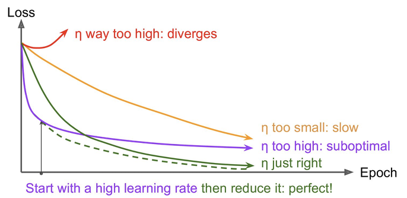

다양한 학습률로 학습 곡선을 비교해봄으로써 어느정도의 주기횟수동안 몇번 정도 신경망을 학습시키는 것으로 꽤 좋은 학습률을 찾을수 있다. 이상적인 학습률은 빠르게 학습할 것이고, 좋은 솔루션으로 수렴될 것이다.

하지만 변하지 않는 학습률보다 더 잘할 것이다. 만약 높은 학습률로 시작해서 한번줄이고 한번 멈추는 방식을 택하면 기존의 최적의 변하지 않는 학습률로 하는 것보다 더 빠르게 좋은 솔루션을 찾을 수  학습중에 학습률을 줄이기 위한 수많은 전략들이 존재한다. 이를 학습 스케줄링(*learning Scheduling*)이라고 하며, 가장 일반적인 것들은 다음과 같다.

* 미리 나누어진 학습률(*Predetermined Piecewise constant learning rate*) 
  * 예를들어 학습률을 처음에 η_0=0.1라고 설정하고, 50주기 후에는 η_1=0.001로 설정하는 것이다. 비록 이 솔루션이 잘 작동할지라도, 이들을 사용하고자 한다면 종종 올바른 학습률을 알아내는데 노력이 필요로한다.
* 성능 스케쥴링(*Performance scheduling*) 
  * 마치 초기 중단처럼 모든 N 단계씩 마다 검증 에러치를 측정해서 에러가 떨어지는것을 멈출때의 λ로 학습률을 줄여나가는 것이다.
* 기하급수적 스케쥴링(*Exponential scheduling*) 
  * 학습률을 반복 횟우의 숫자의 함수로 설정하는 것이다. t:η(t)=(η_0)(10)^(-t/r)의 식을 취하며 아주 효과적이지만, η_0와 r를 조율해주어야한다. 학습률은 매 10의 r인수 횟수 단계에서 떨어지게된다.
* 파워 스케쥴링(*Pawer scheduling*) 
  * η(t)=(η_0)(1+t/r)^-c로 학습률을 설정해주는 것이다 하이퍼 파라미터 c는 전형적으로 1로 설정이 된다. 이는 기하급수적 스케줄링과 비슷하지만, 학습률이 좀 더 느리게 떨어진다.
  
[2013년도에 Andrew Senior과 그의 동료들이 제안한 논문](http://goo.gl/Hu6Zyq)에서 음성 인식을 하기 위해서 모멘텀 최적화를 사용한 심층  신경망을 학습 시키면서 가장 인기있는 일부 학습 스케줄러들에대한 성능을 평가해보았다. 저자는 다음과 같이 결론을 내렸다. 설정에서, 모든 성능 스케줄링과 기하급수적 스케줄링 모두 잘 수헹하였지만, 기하급수적 스케줄링이 더 끌리게되었다. 그 이유는 구현하기가 더 간단하며, 조율하기도 쉽고, 최적의 솔루션보다 조금 더 빠르게 수렴해서이다. 

텐서플로우로 학습 스케줄을 구현하는 것은 꽤나 쉽다.
```
initial_learning_rate = 0.1
decay_steps = 10000
decay_rate = 1/10
global_step = tf.Variable(0, trainable=False, name="global_step")
learning_rate = tf.train.exponential_decay(initial_learning_rate, global_step,
                                           decay_steps, decay_rate)
optimizer = tf.train.MomentumOptimizer(learning_rate, momentum=0.9)
training_op = optimizer.minimize(loss, global_step=global_step)
```
하이퍼 파라미터 값을 설정한 후에, 우리는 학습이 되지 않는 변수 `Global_step`(0으로 초기화)를 현재 학습 반복 횟수을 파악하기 위해서 만들어준다. 그리고나서 텐서플로우의 `exponetial_decay()`함수를 사용해서 기하급수적 감소 학습률을(η_0=0.1로, r=10000으로) 정의해준다. 그 후에 최적화 함수(이번 예시에서는 `MomentumOptimizer`)를 이 감소 학습률을 사용하여 만들어준다. 마지막으로 최적화 함수의 `minimize()` 함수를 호출해서 학습 연산을 만들어준다.

AdaGrad,RMSProp 그리고 Adam 최적화는 자동으로 학습중에 학습률을 감소시켜주기 때문에, 추가적인 학습 스케줄러르 추가해줄 필요가 없다 다른 최적화 알고리즘들에 대해서는 기하급수적 스케줄링이나 성능스케줄링을 사용하는것이 수렴하는데 있어 속도를 상당히 향상시켜줄 수 있다.
# 정형화(Regularization)를 통한 과잉학습 피하기
심층 신경망은 전형적으로 수만개의 파라미터, 때로는 심지어 수백만개의 파라미터를 가지고 있다. 수많은 파라미터들로 신경망의 자유도가 매우 높아 아주 다양한 여러종류의 복잡한 문제들을 해결해줄 수 있다. 하지만 이런 엄청난 유연성이 또한 학습 데이터 세트에 대해서 과잉학습하기 쉽다는 것을 말해주기도 한다. 

수백만개의 파라미터로, 전체 동물원을 학습시킬수 있다. 이번 섹션에서는 우리는 신경망에서 인기있는 몇가지 정형화 기법을 알아보고 이를 텐서플로우로 어떻게 구현하는지 살펴볼 것이다. 

## 초기 중단 (Early Stopping)
학습 데이터 세트에 대한 과잉학습을 피하기 위해서, 한 훌륭한 방법은 (Chapter 4에서 소개가 되었던)초기 중단이다. 검증 데이터 세트에 대한 성능이 떨어질때에 그냥 멈추는 것이다.

텐서플로우로 이를 구현하는 한가지 방법은 정기적인 간격마다 검증 데이터 세트에 대해서 모델을 평가해보고 가장 훌륭한 상태(물론 이전 상태보다도 좋아야함)를 저장해준다.  가장 마지막 승자의 상태를 저장하기 때문에 학습 단계의 수를 세고 특정 제한 횟수에 도달하면 학습을 중단시켜주도록 한다. 그리고나서 그 승자 상태를 복구시켜주는 것이다.

비록 초기 중단이 실제로도 아주 잘 작동할지라도, 다른 정형화 기법들을 결한한 것으로 기존의 신경망을 뛰어넘을 수 있는 것을 얻을 수가 있다.
## ℓ1, ℓ2 정형화(Regularization)
Chapter 4에서 간단한 선형모델로 해보았던것처럼, 신경망 연결 가중치에게 제한을 주는데 ℓ1, ℓ2 정형화를 사용할 수 있다.(하지만 전형적으로 편향치에는 그렇지 않는다)

텐서플로우를 사용해서 하는 방법은 간단하게 우리가 사용하는 손실함수에 적절한 정형화를 더해주는 것이다. 예를들어 가중치 **W1**를 가지는 은닉계층이 하나에 가중치 **W2**를 가지는출력계층 하나가 있다고 가정하면, 다음과 같이 ℓ1정형화를 사용할 수 잇다.
```
[...] # 신경망 구성 단계
W1 = tf.get_default_graph().get_tensor_by_name("hidden1/kernel:0")
W2 = tf.get_default_graph().get_tensor_by_name("outputs/kernel:0")

scale = 0.001 # l1 regularization hyperparameter

with tf.name_scope("loss"):
    xentropy = tf.nn.sparse_softmax_cross_entropy_with_logits(labels=y,
                                                              logits=logits)
    base_loss = tf.reduce_mean(xentropy, name="avg_xentropy")
    reg_losses = tf.reduce_sum(tf.abs(W1)) + tf.reduce_sum(tf.abs(W2))
    loss = tf.add(base_loss, scale * reg_losses, name="loss")
```
하지만 만약 계층이 많이있다면 이런 접근법이 편하지는 않을 것이다. 다행히도 텐서플로우가 괜찮은 옵션을 가지고 있다. `get_variables()`나 `tf.layers.dense()`같이 변수들을 만드는 많은 함수들은 `*_regualizer`라는 인자를 각각의 만들어진 변수에다가 붙여준다.(예 : `Kernel_regularizer`) 인자로써 가중치들을 받아 그에 상응하는 정형화손실치를 반환해주는 그 어떠한 함수들을 통과시킬수 있다. `l1_regularizer()`와 `l2_regularizer()`, `l1_l2_regularizer()`함수들은 이런 함수들을 반환해준다. 다음의 코드는 이런 것들을 모두 다 담아놓은 것이다.
```
my_dense_layer = partial(
    tf.layers.dense, activation=tf.nn.relu,
    kernel_regularizer=tf.contrib.layers.l1_regularizer(scale))

with tf.name_scope("dnn"):
    hidden1 = my_dense_layer(X, n_hidden1, name="hidden1")
    hidden2 = my_dense_layer(hidden1, n_hidden2, name="hidden2")
    logits = my_dense_layer(hidden2, n_outputs, activation=None,
                            name="outputs")
```
이 코드는 2개의 은닉계층과 하나의 출력계층으로 이루어진 신경망을 만들고, 또한 각각의 계층들의 가중치에 상응하는 l1 졍형화 손실치를 연산하기위해 그래프에다가 노드를 추가해준다. 텐서플로우는 자동으로 모든 정형화 손실치를 담고있는 특별한 집합으로 이런 노드들을 추가해준다. 그냥 전체 손실에 쓰일 정형화 손실치를 다음과같이 추가만해주면 된다.
```
reg_losses = tf.get_collection(tf.GraphKeys.REGULARIZATION_LOSSES)
loss = tf.add_n([base_loss] + reg_losses, name="loss")
```
```
전체 손실 값에 정형화 손실값도 추가해주는 것을 잊지말자. 아니면 업데이트 과정중에 무시될 것이다.
```
## 드랍아웃 (Dropout)


###### 그림 11-9. 드랍아웃 정형화
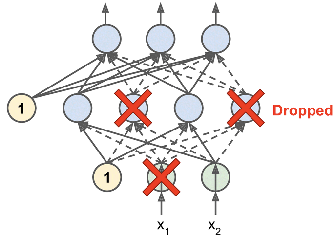


## 최대 정규값 정형화

## 데이터 불리기 (Data Augmentation)
마지막 정형화 기버은 이미 존재하는 학습 인스턴스로 부터 새로운 학습 인스턴스 생성하는 것, 즉 인공적으로 학습데이터 세트의 크기를 키우는 데이터 불리기이다. 이는 정형화 기법을 하는 것처럼 과잉학습을 줄여줄 수 있다. 이 기법은 실제 학습 데이터를 만들어내는 것이다. 이상적으로 인간은 어떤 인스턴스가 생성되고 안되는지를 말해줄 수 없아야한다. 더 나아가 그냥 하얀색 잡음을 넣어주는건 도움이 안된다. 학습할만 하도록 데이터를 불려주어야한다.


###### 그림 11-10. 이미 존재하는 학습 인스턴스로 부터 새로운 학습 인스턴스 생성하기
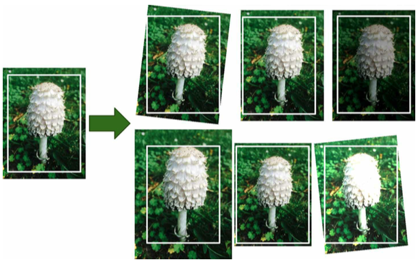


# 실용적 지침사항들
이번 Chapter에서 우리는 넓은 범위의 기술들을 다루었고, 어떤 것을 사용해야하는지 궁금할 것이다. 아래의 설정표가 좀 도움이 될 것이다.
###### 표 11-2. 기본 심층 신경망 설정
**초기화** | He Initailization
:------: | :---------------:
**활성화함수** | ELU
**정규화** | Batch Normalization
**정형화** | Dropout
**최적화함수** | Nestrov Accelerated Gradient
**학습률 스케줄링** | None

당연히 비슷한 문제를 푸는 것을 찾으면 사전학습된 신경망의 일부를 재사용해보아야한다.

이 기본 설정들은 학습하는데 필요할 것이다.
* 만약 좋은 학습률을 찾을 수 없다면,(수렴속도가 매우 느려서 학습률을 올렸더니 이제 수렴이 너무 빨라서 신경망의 정확도가 전역 최저점에 도달하지 못하는 상황과 같다면) 기하급수적 감소 같은 학습률 스케줄러를 추가해볼 수 있다.
* 학습 데이터 세트가 너무 작다면 , 데이터를 더 키워볼 수도 있다.
* 만약 희소 모델이 필요하다면, 섞는데 l1 정형화를 추가할 수 있다. (그리고 선택적으로 학습후에 적은 가중치에서 0을 빼내게됨) 만약 더 희소한 모델이 필요하다면, l1 정형화에다가 Adam최적화 대신에 FTML을 사용할 수 있다.
* 번개처럼 빠른 속도의 모델이 필요하다면, 배치 정규화는 빼고 회소 모델의 도움도 없이 ELU를 Leaky-ReLU로 바꾸어 보자.

이런 가이드 라인과 함깨라면, 매우 깊은 심층 신경망을 학습시킬 준비가 되었다. 만약 지금 사용하고 있는 기계가 한대라면 학습이 끝나는데 기다리는게 하루가될지 몇달이될지 모른다. 다음 Chapter에서는 수많은 서버와 GPU들 상에서 단일 학습모델을 실행시키고 학습시킬수 있도록 분산환경 텐서플로우를 다루어볼 것이다.


**[뒤로 돌아가기](../index.md)**

**[위로 올라가기]()**
