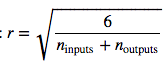

=============**미완성**=============
======


Chapter 11. 심층 신경망 학습시키기
=========

Chapter 10에서 인공 신경망에 대해서 알아보았고, 인공신경망을 직접 만들어 학습도 시켜보았다. 하지만 그 신경망은 은닉계층이 2개뿐인 매우 깊이가 얕은 구조였다. 고해상도 이미지에서 수백가지의 물건을 감지해주는 것과같이 아주 복잡한 문제를 해결해야한다면 어떨까? (말하자면) 아마 각 층마다 수백개의 뉴런을 포함하면서 수십만개의 연결선들을 가지는 10개의 계층 정도를 쌓은 좀 더 깊은 심층 신경망을 학습하여 사용하고 싶을 것이다. 이것은 간단히 산책하는 것마냥 쉬운일은 아니다.
* 먼저 심층신경망에 영향을 끼치고 매우 학습을 시키기가 어렵도록 하는 기울기가 사라지는 문제(*vanising gradient*) (혹은 관련된 또다른 문제인 그래디언트가 폭발적으로 증가하는 현상(*Exploding gradient*))을 해결해주어야 한다.
* 두번째로 이런 거대한 신경망에 대해서는 학습이 매우 느리다.
* 세번째, 수천만의 파라미터를 자기고 있는 모델을 학습 데이터 세트에 대해서 과잉학습을 할 위험이있다.

이번 Chapter에서는 우리는 이런 각각의 문제들을 직접 경험해볼 것이며, 문제들을 풀기 위한 기술들에 대하여 살펴볼 것이다. 우리는 먼저 기울기가 사라지거나 폭발적으로 증가하는 문제에 대해서 살펴보고 이 문제에 대한 가장 인기있는 해결방법을 살펴볼 것이다. 그 후에 일반적인 경사하강법과 비교하여 거대한 모델을 학습시키는 속도가 놀라울 수준으로 빠르게 해주는 몇가지 최적화 함수들도 살펴볼 것이다. 마지막으로 거대한 신경망에 대한 몇가지 괜찮은 정형화(regularization) 기술들도 살펴볼 것이다.

# 기울기가 사라지거나 폭발적으로 증가하는 문제
Chapter 10에서 다루었듯이, 역전파(backpropagation) 알고리즘은 출력 계층에서 입력계층으로 내려가면서 에러 미분치를 전파하는 식으로 작동한다. 한번 알고리즘이 신경명에 있는 각각의 파라미터들에 대해서 손실 함수치에 대한 기울기를 계산하면, 경사 하강법 단계로 각각의 파라미터를 업데이트 하는데 이러한 기울기 값들을 사용한다. 

불행하게도, 기울기는 종종 알고리즘이 하위 계층으로 내려가면서 그 값이 점점 작아진다는 것이다. 결국에는 경사 하강법은 하위에 있는 연결 가중치들은 실제로 바뀌지 않게되며, 학습은 절대로 좋은 솔루션에 도달할 수 없게된다. 이를 기울기가 사라지는 문제(*Vanishing gradient*)라고한다. 일부 경우에서는, 반대인 경우도 있는데, 기울기가 점점 커지게 되고 그래서 많은 계층들이 유별나게 커다란 가중치를 업데이트하게 되고, 알고리즘은 발산하게된다. 이를 기울기가 폭발적으로 증가는 문제(*Exploding gradient*)문제라고 하며, 이는 회귀 신경망(*Recurrent Neural Network*)에서 자주 목격되는 문제이기도 하다.(Chapter 14 참고) 좀 더 일반적으로, 심층 신경망을 불안정한 기울기값들에 대해서 고통을 받게돠고, 각각의 계층들이 서로 다른 속도로 학습을 하게 될 것이다.

비록 불핸한 행동들이 꽤 오랫동안 경험에 기반하여 관측되어왔지만,(이런 문제들 때문에 심층 신경망이 오랫동안 버려져있던 이유중 하나이다) 2010년에 와서 이런 문제에 대한 이해를 할 수 있게 되었다. Xavier Glorot과 Yoshua Benigo가 작성한 "Understanding the Difficulty of Training Deep Forward Networks"라는 제목의 [논문](https://goo.gl/1rhAef)에서는 그 당시에 가장 인기 있던 가중치 초기화 기법인 평균 0과 표준분산 1로하는 정규분포를 사용한 이름 그대로의 랜덤 초기화와 로지스틱 시그모이드 활성화 함수의 조합을 포함하여 몇가지 의심스러운 점을 발견했다. 짧게 말하면, 그들은 위의 초기화 기법과 활성화 함수로 각각의 계층들의 출력에 대한 변화량이 입력 값의 변화량보다 더 크다는 것을 보여주었다. 신경망을 실행시켜 쭉 진행시켜보면, 활성화 함수들이 최상위 계층에서 포화 상태가 될 때까지 각각의 계층의 변화량이 계속해서 증가하게된다. 이는 실제로 로지스틱 함수가 평균값으로 0이 아닌 0.5를 가지는 점으로 인해 상황이 더 나빠지게 한다. (하이퍼블릭 탄젠트 함수는 평균값으로 0을 가지는데 이는 심층 신경망에서 로지스틱 함수보다는 좀 더 나은 결과를 보여준다)

아래 그림에 나와있는 로지스틱 활성화 함수를 보면, 입력이 양의 방향이든 음의 방향이든 커질수록, 함수는 0과 1로 포화되게 되며, 기울기는 갈수록 0에 수렴되게 된다. 그러므로 역전파를 하게된다면, 신경망을 역으로 전파할 기울기가 없고, 아주 약간의 기울기가 존재하던 것들 마저도 역전파가 최상위 계층에서 내려오면서 전파 하면서 점점 희석되어 결국에는 없어기제게되어 최종적으로는 남는 그래디언트는 없어지게된다. 
###### 그림 11-1. 로지스틱 활성화 함수 포화 상태


## Xavier와 He 초기화 기법
그들의 논문에서, Glorot과 Benigo는 이런 문제들을 상당히 완화시켜줄 방법을 제시했다. 예측을 내릴때는 순방향으로, 그래디언트를 역전파 시킬때에는 역방향으로 양방향 모두 적절히 신호가 흘러야만한다. 신호가 죽어서도 폭발적으로 증가해서 포화 상태가 되는 등 그 어떠한 것도 원하지 않는다. 신호가 적절히 흐르게하기 위해서, 이 논문의 역자들을 각각의 계층에서 계층의 입력의 변화량과 돌일한 출력 변화량을 가지고, 역방향에서 각각의 계층을 통과하기 전과 후가 같은 변화량을 가지는 기울기 값들이 필요했다. (수학적인 것에 좀 더 관심이 있다면 논문을 참고하자) 계층의 입력과 출력의 연결수가 같을지라도 보장을 할 수는 없지만, 실제 세계에서는 잘 작동한다고 증명된 좋은 절충점을 제시했다. 연결 가중치는 아래의 공식 11-1에서 묘사된대로 랜덤하게 초기화되어야한다는 것이며, n_input과 n_output은 초기화시킬 가중치를 가지고 있는 계층의 입력과 출력 연결의 수를 뜻한다. (*fan-in*, *fan-out*이라고도 한다) 이런 초기화 전략을 저자의 이름을 따서 Xavier(혹은 Glorot) 초기화 기법이라고 부르게된다.
###### 공식 11-1. Xavier 초기화 기법(로지스틱 활성화 함수를 사용할 때)


입력 연결의 수가 출력 연결의 수와 거의 같으면, 더 간단한 식을 얻는다. (예 : 나 ) Chapter 10에서 이 간소화된 전략을 사용했었다. Xavier 초기화 전략을 사용한다는 것은 학습 속도를 상당히 향상시켜줄 수 있으며, 이것이 딥러닝을 현재의 성공으로 이끌어준 기법들 중 하나이다. [몇가지 현재 논문들](http://goo.gl/VHP3pB)은 아래 보여지는 테이블에서 보이는 다양한 황성화함수에 대한 비슷한 전략을 제시해왔다. ReLU 활성화함수 (그리고 ELU 활성화함수를 포함한 ReLU의 파생함수들도 포함해서)에 대한 초기화 전략을 때때로 저자의 마지막 이름을 딴 "He 초기화"라고 한다. 
###### 표 11-1. 각각의 활성화 함수의 종류에 대한 초기화 파라미터들
 활성화함수 | 균일 분포 [-r,r] | 정규 분포
 :-----: | :------------: | :-----:
 로지스틱 |  | 
 하이퍼블릭 탄젠트 |  | 
 ReLU |  | 

기본값으로, Chapter 10에서 소개되었던 `tf.layers.dense()`함수는 (균일분포로)Xavier 초기화를 사용한다. 이를 `variance_scaling_initializer()`함수를 다음과 같이 사용하면 He 초기화로 바꿀수도 있다.
```
he_init = tf.contrib.layers.variance_scaling_initializer()
hidden1 = tf.layers.dense(X, n_hidden1, activation=tf.nn.relu,
                          kernel_initializer=he_init, name="hidden1")
```
```
He 초기화 기법은 Xavier 초기화를 할 때 처럼 fan-in과 fan-iut 사이의 평균이 아닌 fan-in일 때만 고려를 한다.
"variance_scaling_initializaer()"함수의 기본값이지만, mode 인자를 "FAN_AVG"로 설정해서 바꾸어줄수도 있다.
```
## 포화되지않는 활성화함수
Glorot와 Benigo가 2010년에 발표한 논문에서 핵심중 하나는 기울기가 사라지거나 폭발적으로 증가하는문제는 활성화함수를 잘못선택한 것이 문제를 일으키는 이유중 일부라는 것이다. 대부분의 사람들이 대자연이 생물학적 뉴런에 있는 시그모이드 활성화 함수를 사용해왔었기에 사람들은 시그모이드 함수를 사용하는 것이 훌륭한 선택이라고 생각했다. 하지만 딥러닝에서 더 좋은 성능을 가진 다른 활성화 함수들이 등장하기 시작했고, 특히 ReLU 활성화함수가 그 중 하나인데, ReLU는 양의 값에 대해서는 포화상태를 이루지 않았기 때문이다. (또한 연산하기도 빠르기 때문이다)

불행하게도, ReLU 활성화 함수가 환벽한 함수는 아니다. 죽어가는 ReLU(*Dying ReLU*)라고 알려진 문제에 고통받고 있는데 죽어가는 ReLU문제란 학습중에 사실상 죽어버리는 것으로, 이는 그 신경망의 뉴런들들이 출력으로 0값만 계속 출력하는것을 의미한다. 이런 경우, 신경망에 있는 뉴런들중 반 정도가 죽어버리는 것을 볼 수 있을 것이다. 특히 학습률이 커다란 경우에 말이다. 학습중에 만약 뉴런에 들어오는 입력값들의 가중치 총합이 음의 수로 나오는 경우 그 가중치를 업데이트 하게되면 0을 출력하기 시작한다. 이것이 발생하면, 입력이 음의 수일 때 ReLU의 기울기 함수는 0이기 때문에 되살아날 경향이 없다.

이 문제를 해결하기 위해서는, ReLU의 변형 함수인 약간 새는 ReLU(*leaky ReLU*)를 사용하는 것이다. 이 함수는 아래의 그림에서 보이는 것처럼 `LeakyReLU_a(z) = max(ax,z)`로 정의된다. 하이퍼 파라미터 `a`는 이 함수가 얼마나 "새게" 할 것인지 정해주는데, z<0에 대해서 함수의 기울기를 설정해주는데, 보통 0.01로 설정해준다. 저 자그마한 기울기가 약간새는ReLU를 절대 죽지않게 해준다. 이것은 뉴런을 혼수상태로 만들어두는 것이나 마찬가지인 개념인데 결국에는 다시 깨어날 기회가 있다는 것이다. [최근 논문](https://goo.gl/B1xhKn)은 ReLU 활성화함수의 몇가지 변형 함수들을 비교해서 보여주는데 이 논문의 결론 중 하나가 약간 새는 형태의 변형 함수가 항상 기존의 엄격한 ReLU보다 성능이 훨씬 좋았다는 것이다. 사실, a=0.2(큰 값임)로 설정하는 것이 a=0.01(작은 값임)으로 설정하는 것보다 성능이 좋았다. 또한 확률적 새는 ReLU(*Randomized Leaky ReLU*:RReLU)도 평가를 하였는데, 저 함수는 학습중에 주어진 범위 내에서 a값을 랜덤으로 찾고 테스트하는 중에는 평균 값에 고정된다. 또한 꽤나 성능이 좋고, 정형화함수(Regularizer)같이 학습 데이터 세트를 과잉학습하는 것도 막아주는 것처럼 행동하기도한다. 마지막으로 그들은 파라메트릭 맄키 ReLU(*Parametric Leaky ReLU*: PReLU)도 평가하였는데, 이 함수는 하이퍼 파라미터가 되는 것 대신에 다른 파라미터들과 같이 역전파로 수정이 될 수 있도록 a를 파라미터로 바꾸어 학습중에 같이 학습될  수 있도록 한 것이다. 거대한 데아터 세트에 대해서는 ReLU보다 훨씬더 성능이 뛰어났지만, 크기가 자그마한 데이터 세트에 대해서는 학습 데이터 세트에 대해서 과잉학습할 위험을 가지고 있다. 
###### 그림 11-2. 약간 새는 모양의 ReLU


마지막으로 카장 중요한 것으로, Djork-Arne Clevert와 그의 동료들이 [2015년에 발표한 논문](httpL//goo.gl/Sdl2P7)은 그들이 모든 ReLU의 변형 함수에 대해서 한 실험에서 기하급수적 선형단위(*Exponential Linear Unit*:ELU)라는 새로운 활성화함수를 제시했다. 학습 시간은 감소하였으며, 테스트 데이터 세트에 대해서 신경망을 테스트해보아도 성능이 더 좋았다. 아래에 ELU함수 그래프와 ELU공식이 나와있다. 
###### 공식 11-2. ELU활성화 함수

###### 그림 11-3. ELU활성화 함수


몇가지 큰 다른점을 빼고는 ReLU와 비슷한 점이 많다.
* 첫째로, z<0 일때도 음의 값을 취하는데, 이는 뉴런들의 출력의 평균치가 0에 더 가깝게 해준다. 이는 앞에서 말했던 기울기가 사라지는 문제도 완화시켜준다. 하이퍼 파라미터 a는 ELU함수가 z가 큰 음의 값일 때 수렴해나갈 값을 정의해준다. 보통은 1로 설정되지만 원한다면 어떠한 값도 사용할 수 있다.
* 두번째, z=0인 지점에서도 기울기가 0이 아닌데 이는 뉴런이 죽어가는 문제도 해결을 해준다.
* 세번째, z=0인 부분들도 포함해서 어느곳이든지 스무스하게 진행되는데, 이는 경사하강법의 속도를 증가시켜줄 수 있다. 그 어느곳에서도 요동을 칠만한 여지를 주지 않기 때문이다.

ELU 활성화 함수의 주된 결함은 함수가 기하급수적이기에 ReLU와 ReLU의 다른 변형함수들 보다 연산이 더 느리지만, 학습중에 수렴속도가 빠르다는 점에서 이러한 단점은 어느정도 상충이된다. 하지만 테스트할 때에는 ELU로 구성한 신ㄴ경망은 다른 ReLU들로 구성된 신경망보다 더 느릴 것이다.
```
그렇다면, 심층 신경망을 구현할 때 은닉 계층에 어떤 활성화함수를 사용해야할까? 우리가 갈 수 있는 길은 매우 다양하지만, 일반적으로 ELU >
leaky ReLU > ReLU > tanh > logistic 순으로 사용된다. 만약 실행 시간을 신경 써야한다면 ELU보다는 Leaky ReLU가 더 선호될 
것이다. 컴퓨터 자원이 여유가 있고 남는 시간이 있다면, 각기 다른 활성화함수들을 평가하기위해 교차검증법을 사용해보자. 특히 만약 신경망이 
과잉학습을 했다면 RReLU가, aksdir 거대한 데이터 세트가 있다면 PRELU가 괜핞을 것이다.
```
텐서플로우는 `elu()`함수를 제공해주어 신경망에 elu를 구현할 수 있게 해준다. `dense()`함수를 호출하면서 `activation`인자에다 설정을 해줄 수 있다.
```
hidden1 = tf.layers.dense(X, n_hidden1, activation=tf.nn.elu, name="hidden1")
```
텐서플로우는 미리 만들어진 Leaky ReLU가 없기 때문에 따로 구현해주어야하는데, 그래도 구현하기는 쉽다.
```
def leaky_relu(z, name=None):
    return tf.maximum(0.01 * z, z, name=name)

hidden1 = tf.layers.dense(X, n_hidden1, activation=leaky_relu, name="hidden1")
```
## 배치정규화(Batch Normalization)
비록 ReLU나 그 변형함수, 혹은 ELU와 He 초기화를 사용하는 것이 학습하면서 발생하는 기울기가 사리지거나 폭발적으로 증가하는 문제를 줄여줄지라도, 다시는 발생하지않을것이라는 보장이 없다.

Sergey Ioffe와 Christian Szegedy가 [2015년에 발표한 논문](https://goo.gl/gA4GSP)에서는 기울기가 사리지거나 폭발적으로 증가하는 문제, 좀 더 일반적으로 학습중에 이전 계층들의 파라미터들이 변해감에 따라 각각의 계층의 입력 값들에 대한 분산이 바뀌는 문제(저자들은 이를 *Internal Covariate Shift*)를 다루기 위한 배치 정규화(*Batch Normalization*:BN)이라고 부르는 기법을 제시했다. 

이 기법은 각각의 계층에 있는 활성화 함수 바로 앞에 추가하는 것으로 구성할 수 있으며, 간단히 입력값들을 0에 집중시켜주고 이를 정규화 계층당 새로운 두개의 차라미터를 사용해서 그 결과치를 스케일링하고 쉬프팅(Shifting)시켜준다. 다시말하면, 이 연산과정은 학습 모델이 각각의 계층에 대한 최적의 크기(Scale)와 입력값들의 평균치를 학습하게끔 하는 것이다. 

입력값들을 0을 중심으로 집중시켜주고 정규화하기위해서 알고리즘은 입력의 평균치와 표준분산을 측정할 필요가 있다. 현재의 미니배치에 있는 입력값들의 평균과 표준분산을 연산하는 것이다. (그래서 이름이 배치정규화이다) 전체 연산과정은 아래의 식들로 요약될 수 있다.
###### 공식 11-3. 배치 정규화 알고리즘


* **μ_B** : 전체 미니 배치 B에 대한 평균치
* **σ_B** : 전체 미니 배치 B에 대한 표준 분산치
* **m_B** : 미니 배치가 가지고 있는 인스턴스의 수
* **x̂^(i)** : 0을 중심으로 모아놓고 정규화시킨 입력값들
* **γ** : 계층에 대한 스케일링 파라미터
* **β** : 계층에 대한 쉬프팅 파라미터(오프셋)
* **ϵ** : 0으로 나누어지는 것을 피하기 위한 극히 작은 수 (보통 10^-5로 설정). 이를 *Smoothing term*이라고도 한다.
* **z^(i)** : BN연산 결과값 - 입력값이 스케일링되고 쉬프팅된 버전

테스트 단계에서는, 평균치와 표준분산을 연산할 미니 배치가 없기때문에 대신에 전체 학습 데이터세트의 평균과 표준 분산치를 사용한다. 이는 학습하는 동안에 이동평균을 사용하여 간단히 연산할 수 있다. 그래서 전체적으로, 각각의 배치 정규화가 적용되는 계층들은 총 4개의 파라미터 γ(스케일), β(오프셋), μ(평균), σ(표준분산)가 학습이 된다.

논문의 저자들은 이 기술이 그들이 실험했던 모든 심층신경이 상당히 개선되었다고 설명했다. 기울기가 사라지는 문제는 크게 감소했고 하이퍼블릭 탄젠트가 심지어 로지스틱 함수같은 포화를 하는 활성화 함수들에서도 잘 수행이 되었다. 
```
아마 경사하강법이 각각의 계층에 대해서 최적의 크기와 오프셋(offset)값들을 찾는 동안은 학습이 느려지는 것을 발견하겠지만,
한번 가속되기만 하면 상당히 좋은 값을 찾아줄 것이다.
```
### 텐서플로우로 배치 정규화 구현하기


# 이전에 학습되어있던 계층들 재사용하기


## 다른 프레임워크에있는 모델 재사용하기


## 하위 계층들 얼리기


## 럴린 계층들 캐싱하기


## 상위 계층 대체, 삭제, 조절하기


## 학습 모델 동물원


## 비지도 사전학습


## 보조 기능에 대한 사전학습


# 더 빨라진 최적화 함수들

## 모멘텀 최적화 (Momentum Opimization)

## 네스트로브 가속화 기울기 (Nestrov Acceletated Gradient)

## AdaGrad

## RMSProp

## 에이담 최적화 (Adam Optimization)

## 학습률 스케줄링

# 정형화를 통한 과잉학습 피하기
비록ㅎ

## 초기 중단

## l1, l2 

## 드랍아웃 (Dropout)

## 최대 정규값 정형화

## 데이터 확대 (Data Augmentation)

# 실용적 지침사항들

**[뒤로 돌아가기](../index.md)**

**[위로 올라가기]()**
