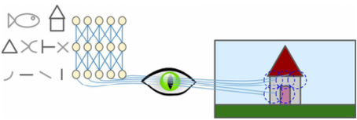
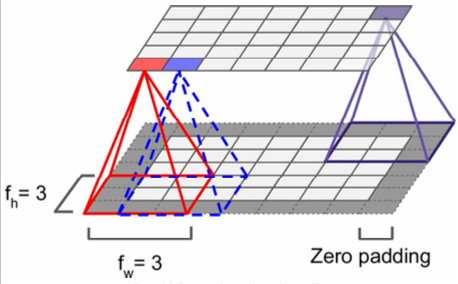
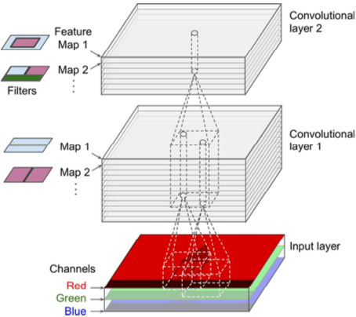
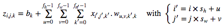
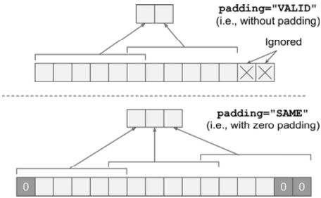
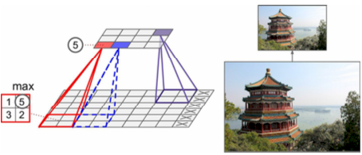

============**미완성**=============
======


Chapter 13. 컨볼루션 신경망
=========
IBM의 Deep Blue 슈퍼컴퓨터가 1996 당시에 체스 세계 챔피언 Garry Kasparov 꺾었지만, 최근 까지, 컴퓨터들은 강아지를 탐지하거나 말한 단어를 인식하는 사소한 것같은 일을 수행할 수가 없었다. 그런데 우리 인간들을 별다른 노력없이 이런 일들을 할 수 있는 것인가? 답은 우리의 뇌속의 이에 특화된 시각, 청각, 그 외 다른 감각 기관이 의식의 영역 밖, 즉 크게 이를 의식하지않기 때문이다. 우리의 의식에 정보가 도달할때면, 이미 고차원 특징들로 구성된 정보들을 인지할 수 있게된다. 예를들어, 사진속의 귀여운 강아지를 보면, 우리가 원하지 않아도 강아지를 보게될 것이고, 귀여움을 느끼게 될 것이다. 왜 귀엽게 인식을 하는지에 대해서도 설명을 할 수가 없다. 그냥 그렇게 느끼는 것이다. 그러므로 우리는 우리의 객관적인 경험을 믿을 수가 없다. 지각은 전혀 사소한 것이 아니며 어떻게 감각기관이 움직이는지 이해를 해야할 필요가 있다.

컨볼루션 신경망(*Convolution Neural Network*:CNN)은 뇌의 시각피질 연구에서 등장하였고, 1980년대 이래로 이미지 인식에서 사용되고 있다. 최근 몇년동안 컴퓨터 연산 자원의 발전 덕분에, 대량의 학습 데이터를 사용할 수 있었고, 심층망을 학습 시키는데 Chapter 11에서 소개가 되었던 기법들도 사용할 수 있게되었으며, CNN은 일부 복잡한 시각적 처리업무에 대해서 인간을 뛰어넘어보이기 까지했다. CNN은 이미지 검색 서비스, 자동주행차, 자동 비디오 판독 시스템, 등등 그 이상 것들에 사용된다. 더 나아가 CNN은 시각적 인지 분야에만 제한되어 있는 것이 아니다. 또한 음성인식이나 자연어처리(*Natural Language Processing*:NLP)와 같은 분야에서도 성공을 거두었다. 하ㅣ만, 지금은 시각적 응용분야에만 집중해볼 것이다.

이번 Chapter에서는 CNN의 등장과, 이를 구성하는 방법 그리고 텐서플로우를 사용해서는 어떻게 구현하는지 살펴볼 것이고, 몇가지 일부 아주 유명한 CNN 구조를 살펴볼 것이다.
# 시각피질의 구조
David H. Hubel과 Torsten Wiesel은 [1958년](http://goo.gl/VLxXf9)과 [1959년](http://goo.gl/OYuF?UZ)에 고양이에 대해서 (일부는 [원숭이에 대해서](http://goo.gl/95F7QH)) 실험들을 수행했으며, 이는 시각 피직의 구조에 대한 아주 중요한 통찰력을 제공해주었다. 그들은 시각 피질에 있는 수많은 뉴런들이 작은 지역수용영역을 가지고 있으며, 시각영역의 제한된 구역에 있는 시각적 자극에 반응한다는 것이다. 아래의 그림에서 5개 뉴런의 지역수용영역 이 대쉬선으로 된 원으로 보여진다. 각기 다른 수용 영역은 서로 다른 영역과 일부 겹쳐있다. 더 나아가 저자들은 몇몇 뉴런들은 이미지에서 수평선에 반응을 하고, 반면다 른 뉴런들은 서로 다른 방향을들 가지는 선들에 반응한다는 것을 보여주었다. (두개의 누런이 같은 수용역역을 가질지라도, 다른 선방향을 인지한다) 또한 일부 뉴런들은 더 큰 수용영역을 가지며 하위 레벨의 패턴으로 이루어진 더 복잡한 패턴들을 인지한다. 이런 관찰들은 이웃하는 하위 레벨의 뉴런들의 출력이 더 높은 차원의 뉴런들에 기반이 된다는 아이디어를 주었다. (그림 13-1에서, 각각의 뉴런들은 이전 계층에 있는 뉴런들 중에서 일부 뉴런들과만 연결이 되어있음을 확인하자) 이러한 강력한 구조는 시각 영역의 어떤 구역이라도 모든 종류의 복잡한 패턴을 인식할 수 있다.
###### 그림 13-1. 시각피질에서의 지역적 수용영역


이러한 시각피질의 연구는 1980년에 소개된 신인식기(*neocognitron*)에 영감을 주었으며 이는 점점 발전하여 우리가 지금 컨볼루션 신경망이라고 부르는 것으로까지 발전했다. 가장 중요한 논문은 1998년 Yann LeCun, Leon Bottou, Yoshua Bengio Patrick Haffner가 제출한 [논문](http://goo.gl/A347S4)인데, 이 논문이 그 유명한 손으로 작성한 숫자들을 인식해주는 LeNet-5 구조를 소개하였다. 이 구조의 일부는 우리가 이미 알고 있는 전가산층(Fully connected)계층과 시그모이드 활성화함수 같은 블럭들로 만들어져 있지만, 또한 새로운 블럭 두개를 소개한다.이제 그 두개의 블럭을 살펴보자.
```
왜 이미지 분류에서 정형적인 심층 신경망을 전가산층으로 만들지 않는 것일까? 불행하게도 비록 MNIST같이 작은 이미지에 대해서는 잘
작동하겠지만 커다란 데이터 세트에 대해서는 그렇지 못한데, 예를들면 100x100 크기의 이미지는 총 1만개의 픽셀값을 가지는데 
만약 첫번째 계층이 1000개의 뉴런을 가진다면 약 천만개의 연결 이 생성된다는 것을 의미하며 이는 오직 한개의 계층 사이에서만이다.
CNN이 연결된 계층들을 나누어 사용함으로써 이 문제를 해결하였다. 
```
# 컨볼루션 계층 (Convolution layer)
CNN의 가장 중요한 블록은 당연히 컨볼루션 꼐층이다. 첫번째 컨볼루션 계층에 있는 뉴런들은 이전 Chapter에서 다루었던 것처럼 입력 이미지에 있는 모든 단일 픽셀들이 연결되어있지않고, 그림 13-2처럼 수용영역에 있는 픽셀들끼리 연결이 되어있는 형식이다. 차례차례 첫번째 계층의 작은 사각형으로 처리되어 두번째 컨볼루션 계층에 있는 각각의 뉴런들과 연결된다. 이런 구조는 신경망이 첫번째 은닉 계층에서 하위 레벨의 특징들에 대해서 집중할 수 있게해주고, 이렇게 처리된 값들이 다음 계층에 더 높은 레벨의 특징값들을 모아주며 이런 작업들이 이루어진다. 이런 계층적 구조는 이미지 인식에 대해서 아주 잘 작동한다.
###### 그림 13-2. 사각형의 지역수용영역으로 이루어진 CNN 계층들

```
지금까지 우리가 보았던 모든 다중 계층 신경망들은 뉴런들이 긴 줄처럼 배치되어 있었고, 신경망에 입력하기전에 입력 이미지를 
1차원으로 쭉 길게 늘려서 사용했다. 이제 각각의 계층들은 2차원으로 표현될 것이며, 상응하는 입력과 뉴런들이 서로 매치시키기
쉽도록 한다.
```
주어진 계층의 i행 j열에 위치한 뉴런은 `i`부터 `i + f_h - 1`까지의 행, `j`부터 `j + f_w - 1`까지의 열에 위치한 이전 계층의 뉴런들의 결과값이며, f_h와 f_w는 수용영역의 높이와 넓이를 나타낸다. 아래의 그림을 참고하라. 이전계층과 현재 계층이 서로 같은 높이와 넓이를 가지기 위해서는 아래 보여지는 그림 처럼 주위에 0값을 추가하는 것이다. 이것이 바로 Zero-Padding이라는 것이다.
###### 그림 13-3. Zero-Padding 계층 사이의 연결


또한 아래 그림에서 보여지는 것처럼 큰 입력 크기를 받아서 이보다 더 작은 크기의 출력으로 내는 것도 가능하다. 두개의 연이은 수용영역 사이의 거리를 스트라이드(*stride*)라고 한다. 아래의 그림에서 (Zero-Padding를 적용한)5x7 입력 계층은 3x4 계층과 연결되어 있는데 스트라이드2에 수용영역 크기는 3x3을 사용하였다. (이 예제에서는 양방향의 크기가 동일하지만 꼭 그렇게 만들어줄 필요는 없음) 상위 계층의 i번째 행과 j번째 열에 있는 뉴런은 `i x s_h`부터 `i x s_h + f_h - 1`까지의 향, `j x s_h + f_h - 1`열에 위치한 뉴런들의 결과값으로, s_h와 s_w는 스트라이드의 가로 세로를 의미한다.
###### 그림 13-4. 스트라이드 2를 사용한 차원수 줄이기.

## 필터 (Filters)
뉴런의 가중치는 수용영역의 크기인 작은 그림으로써 나타낸다. 예를들어 아래의 그림은 두가지의 가능한 가중치들의 모음을 보여주며, 이를 필터(*Filters*, 혹은 컨볼루션 커널:*convolution kernels*)라고 한다. 첫번째 것은 검정색 사각형 가운데 하얀색 수직선이 그어저있고(7x7행렬에서 가운데 중앙 열들만 제외하고 모두 0값이고, 중앙 열 값들은 1임), 이러한  가중치들을 사용한 뉴런들은 증앙 수직선을 제외하고 수용영역에 있는 모든 값들을 무시한다. 두번째 필터는 검은색 사각형에 가운데 수직으로 하얀석이 있다. 다시 이런 가중치들을 사용한 뉴런들은 중앙의 수직선을 제외하고는 수용영역에 있는 모든 값이 무시될 것이다. 

이제 계층에 있는 모든 뉴런들이 같은 수평선 필터(그리고 동일한 편향치)를 사용할 것이고, 아래 그림에서 보여지는 밑의 이미지를 입력으로 신경망에 입력해주게 될 것이며, 계층은 위에서 왼쪽 이미지를 결과로써 출력을 해줄 것이다. 수직 흰선이 가운데 값을 강화시켜주고 나머지 값들을 희미하게, 즉 약하게 만들어주는 것임을 알아두자. 비슷하게, 위의 오른쪽 이미지는 모든 뉴런들이 수직선 필터를 사용하면 나오는 결과이며 마찬가지로 가운데 수평 값들을 강화시켜주고 그 이외의 값들은 약하게 만들어주는 것이다. 그러므로 같은 필터를 사용하는 계층의 모든 뉴런들은 특징맵(*feature map*)을 만들어 낼 것이며, 이는 이미지에서 필터와 가장 유사한 구역을 강조해준다. 학습중에, CNN은 원하는 기능에 대해서 가장 쓸모있는 필터들을 찾아내고, 더 복잡한 패턴으로 조합하도록 필터를 학습시킬 것이다.
###### 그림 13-5. 두개의 특징맵을 얻기 위해 두가지의 다른 필터를 적용

## 다중 특징 맵 쌓기 (Stacking Multiple Feature Maps)
지금까지는 단순하게, 우리는 얇은 2차원 계층으로써 컨볼루션 계층들을 표현해왔다. 하지만 실제로는 같은 사이즈의 특징맵들로 구성이 되어있는 것이므로 더 정확하게는 아래의 그림처럼 보여지는 것같이 정확하게는 3차원으로 나타내진다. 한개의 특징맵으로, 모든 뉴런들은 같은 파라미터(가중치와 편향치)를 서로 공유하지만, 다른 특징맵들은 서로 다른 파라미터들을 가지고 있을 것이다. 뉴런의 수용영역은 앞에서 말했던것과 같이 같은 크기를 가지지만, 이전 계층의 특징맵들 전부를 아우른다. 짧게 말하면, 컨볼루션 계층은 동시에 다중 특징맵을 입력으로 적용하고 입력에서 어디든지 다중 특징값들을 찾아내는 능력을 가지고 있다.
```
특징맵에 있는 모든 뉴런들이 같은 파라미터를 공유한다는 사실은 모델에 있는 파라미터들의 수를 줄여주기는 하지만 제일 중요한 것은
한 곳에서 패턴을 인식하기 시작하면 그 물체가 다른곳에 있더라도 인식을 할 수 있다는 것을 의미한다. 대조적으로 일반적은 심층
신경망은 특징이 발견된 그 장소에 그 특징값이 있어야만 인식을 하게된다는 것이다.
```
더 나아가, 입력 이미지들은 또한 다중의 서브 계층들로 구성이 되어있다. 컬러 채널당 하나씩 있다. 즉 일반적으로 3가지의 서브계층을 가지는데, 많이 알고있는 RGB가 바로 그것이다. 흑백 이미지는 단일 채널밖에 존재하지 않지만, 일부 이미지들은 그보다 더 많은 채널수를 가지고 있기도 하다. 예를들어 위성사진이 있다.

###### 그림 13-6. 3개의 채널을 가진 이미지와 다중 특징맵들을 만들어내는 컨볼루션 계층


특별하게, 주어진 컨볼루션 계층 "l"의 특징맵 "k"에 대해서 i행 j열에 위치한 뉴런은 이전 계층 "l-1"의 `i x s_h`부터 `i x s_h + f_h -1`까지의 행과 `j x s_w`부터 `j x s_w + f_w -1`까지의 열에 있는 모든 뉴런을 연산하여 얻은 값이다. 모든 뉴런의 행과 열의 수는 동일하지만 서로 다른 특징 맵들이 이전 계층에 있는 정확히 같은 뉴런과 연결되어 있다. 

공식 13-1은 하나의 커다란 수학공식으로 위의 설명을 요약해줄 수 있다. 이는 컨볼루션 계층에서 주어진 뉴런들의 출력을 어떻게 연산하는 지를 보여준다. 서로 다른 인덱스들 때문에 좀 못생겨보이지만 모든 입력의 가중치가 적용된 합과 편향치들을 한번에 연산을 수행해준다.
###### 공식 13-1. 컨볼루션 계층의 뉴런들의 출력을 연산해주는 공식

* **z_i,j,k**는 컨볼루션 계층 "l"의 특징맵 "k"에 있는 i행, j열에 있는 뉴런의 출력을 의미한다.
* 앞에서 설명했다시피, **s_h**와 **s_w**는 스트라이드의 수직과 수평을 말하고, **f_h**와 **f_w**는 수용영역의 높이와 넓이를 말하며, **f_n'** 는 이전 계층 "l-1"에 있는 특징 맵의 수를 의미한다. 
* **x_i',j',k'** 는 이전 계층"l-1"의 특징맵 k'에 i'행 j'열에 위치한 뉴런의 출력을 의미한다.
* **b_k**는 계층 l에 있는 특징맵 k의 편향치 식을 뜻한다. 특징맵 k의 전체 밝기를 조절해주는 손잡이처럼 생각할 수 있다. 
* **w_u,v,k',k**는 u행 v열에 위치한 입력값과 계층 l의 특징맵 k에 있는 어떤 노드 사이의 연결 가중치를 나타낸다.
## 텐서플로우로 구현하기 
텐서플로우에서는 각가의 입력이미지가 전형적으로 `shape[height, width, channels]`의 3차원 텐서로 표현된다. 미니 배치는 `shape[mini-batch size, height, width, channels]`의 4차원 텐서로 표현된다. 컨볼루션 계층의 가중치들은 4차원 텐서 `[f_h, f_w, f_n', f_n]`으로 나타낸다. 컨볼루션 계층의 편향치 식은 간단하게 1차원 텐서 `shape[f_n]`으로 나타낸다.

간단한 예시를 한번 보자. 다음의 코드는 Scikit-Learn의 `load_sample_images()`라는 함수를 사용하여 두 개의 샘플 이미지를 불러온다. 그리고 나서 두개의 7x7 크기에 중앙 수평으로 흰색인 필터 하나와 중앙 수직으로 흰색인 필터 총 두개를 생성해준다. 그리고 텐서플로우의 (스트라이드 2에 Zero-padding)`tf.nn.conv2d()`함수를 사용하여 만들어진 컨볼루션 계층을 이용해서 양쪽 이미지에 이를 적용시켜준다. 마지막으로 특징맵을 보기 위해 plot해준다. (아래 그림 참고)
```
import numpy as np
from sklearn.datasets import load_sample_images

# Load sample images
china = load_sample_image("china.jpg")
flower = load_sample_image("flower.jpg")
dataset = np.array([china, flower], dtype=np.float32)
batch_size, height, width, channels = dataset.shape

# Create 2 filters
filters = np.zeros(shape=(7, 7, channels, 2), dtype=np.float32)
filters[:, 3, :, 0] = 1  # vertical line
filters[3, :, :, 1] = 1  # horizontal line

# Create a graph with input X plus a convolutional layer applying the 2 filters
X = tf.placeholder(tf.float32, shape=(None, height, width, channels))
convolution = tf.nn.conv2d(X, filters, strides=[1,2,2,1], padding="SAME")

with tf.Session() as sess:
    output = sess.run(convolution, feed_dict={X: dataset})

plt.imshow(output[0, :, :, 1], cmap="gray") # plot 1st image's 2nd feature map
plt.show()
```
이 코드의 대부분은 설명할 필요도 없지만, `tf.nn.conv2d()`함수는 어느정도 설명을 할 필요가 있다.
* `X`는 입력 데이터로, 앞에서 설명했던 것처럼 4차원 텐서로 이루어진 미니 배치이다.
* `filters`는 적용할 필터를 말한다 (마찬가지로 4차원 텐서이다.)
* `stride`는 1차원 배열에 네 개의 원소를 가지고 있으며 두번째와 세번째 요소는 각각 스트라이드의 높이와 넓이(s_h와 s_w)를 의미하며, 첫번째와 네번째의 원소값은 무조건 상수 1이 들어가야만 한다. 
* `padding`은 `"VALID"`혹은 `"SAME"` 둘 중 하나여야만 한다.
  * `"VALID"`를 사용하면 컨볼루션 계층은 Zero-padding을 사용하지 않으며 그림 13-7에서 보이는 것처럼 스트라이드에 따라서 입력 이미지의 아래와 오른쪽에 있는 일부 행과 열이 무시될지도 모른다. 간단하게 하기위해 여기서는 수평선 차원으로 보여주고 있지만, 당연히 같은 논리가 수직 차원들에게도 동일하게 적용이된다.
  * `"SAME"`를 사용하면 컨볼루션 계층은 필요하다면 Zero-padding을 사용할 것이다. 이런 경우, 출력 뉴런의 수가 스트라이드로 나누어 지는 입력 뉴런의 수와 동일하다. 그리고 0들은 입력값 주위에 추가될 것이다.
###### 그림 13-7. 패딩 옵션 - 입력 넓이: 13, 필터 넓이:6 스트라이드:5


이 예시에서, 우리는 손 수 직접 필터를 만들어주었지만 진짜 CNN은 학습알고리즘이 자동으로 최적의 필터를 찾아내도록 한다. 텐서플로우는 `tf.layer.conv2d()`함수를 가지고 있으며, 이 함수는 필터 변수(`kernel`이라고 함)를 만들어 랜덤적으로 초기화 해준다. 또한 편향치 변수(`bias`이라고 함)를 만들고 이를 0값들로 초기화시켜준다. 예를들어 다음의 코드는 2x2 스트라이드를 사용하여 두개의 7x7 특징 맵으로 컨볼루션을 계층에따라 입력 플레이스 홀더를 만들어주고(이 함수는 오직 수직과 수평 스트라이드만을 명시해준다), 그리고 "SAME"패딩을 사용한다. 
```
X = tf.placeholder(shape=(None, height, width, channels), dtype=tf.float32)
conv = tf.layers.conv2d(X, filters=2, kernel_size=7, strides=[2,2],
                        padding="SAME")
```
불행하게도 컨볼루션 꼐층은 하이퍼 파라미터가 꽤 많다. 그래서 우리는 필터의 수와 그 필터의 높이와 넓이, 스트라이드, 그리고 padding의 타입을 정해주어야만 한다. 늘 그렇듯이, 우리는 괜찮은 하이퍼 파라미터 값을 찾기 위해서 교차검증법을 사용할 수 있지만 시간을 아주 많이 소모할 것이다.
## 메모리 요구치
CNN에서 발생하는 또다른 문제점은 컨볼루션 계층이 특히 학습중에 어마어마한 크기의 렘을 요구한다. 이는 역전파 과정의 역방향 과정이 순방향과정중에 연산된 중간 값을 모두 요구하기 때문이다.

예를들어, 스트라이드 1에 SAME 패딩을 사용하고, 150x100 크기의 특징맵 200개를 출력해주는 5x5 필터를 가진 컨볼루션 계층을 고려해보자. 만약 입력 이미지가 RGB이미지에 150x100이라면, 파라미터의 수는 (5 x 5 x 3 + 1) x 200 = 15200개가 존재하는데, 이는 전가산층에 비하면 작은 수이기는 하다. 하지만, 각각의 200개의 특징맵은 150x100개의 뉴런을 가지고 있으며, 이러한 각각의 뉴런들은 5x5x3=75개의 가중치가 적용된 것들의 합을 연산해주어야 한다. 즉 전체 2억2500만번의 float 곱셈 연산이 필요하다. 전가산층만큼 아주 나쁜 수준은 아니지만, 여전히 극도로 연산량이 높다. 더 나아가 만약 특징맵이 32bit짜리로 표현한다면, 컨볼루션 계층의 출력은 200x150x100x32=9600만 비트를 요구하게 된다. 
# 풀링 계층 (Pooling Layer)

###### 그림 13-8. 맥스 풀링 (Max Pooling)계층(2x2 풀링 커널, 스트라이드 2, 패딩 없음)

# CNN 구조

**[뒤로 돌아가기](../index.md)**

**[위로 올라가기]()**
