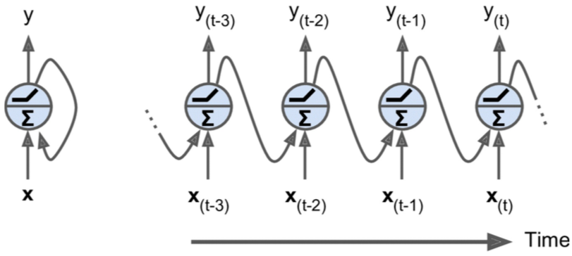

============**미완성**=============
======


Chapter 14. 순환 신경망
=========
야구선수 타자가 공을 쳤다. 공의 경로를 예상하면서 즉시 달리기 시작할 것이다. 그리고 그 공을 추적하면서 행동을 하여 결국엔 잡게될 것이다. (엄청난 박수갈채를 받으면서말이다) 미래를 예측해보는 것은 우리가 항상 하고잇는 것이다. 친구의 말이 끝나기 전에 무엇을 말할지 어느정도 예측하는 것처럼  이번 Chapter에서는 미래를 예측할 수 있는 신경망 종류로 순환신경망(*recurrent neural networks*: RNN)에 대해서 다루어볼 것이다. 주식가격과 같은 시계열 데이터를 분석할 수 있어, 언제 사고 팔아야하는지 말해줄 수 있다. 자율주행자동차에서도, 차의 경로를 예상할 수 있으며, 사고를 피하는데 도움이 된다. 더 일반적으로, 그들은 우리가 앞에서 말했던 모든 신경망들은 고정된 크기의 입력을 받는 것에 비해 이 신경망은 길이가 정해져있지않은 연속적인 데이터를 받아올 수 있다. 예를들어서 입력으로 문장, 문서나 오디오 샘플을 입력으로 받아올 수  있으며, 자동번역이나 음성을 문자로, 혹은 감정분석같은 자연어처리 시스템을 만들 수 있다.

더 나아가 순환신경망의 예상하는 능력은 또한 놀라울 정도의 창의성 능력을 가지고 있다. 신경망이 구글의 [마게타(Mageta) 프로젝트로 만들어진 것](https://goo.gl/IxIL1V)과 같이 음정을 작곡할 수 있다. 비슷하게 RNN은 [문장을 만들어낼 수 있고](http://goo.gl/onkPNd), [이미지캡션](http://goo.gl/Nwx7kh) 등등을 할 수 있다. 결과는 아직 셰익스피어나, 모차르트만큼은 아니더라도, 몇년뒤에는 어떻게 될 지 모르는 일이다.

이번 Chapter에서는 기본 RNN의 기반이 되는 개념에 대해 살펴보고, RNN을 사용하면서 발생하는 문제점, 그리고 이에 대해 널리 사용되고 있는 솔루션인 LSTM과 GRU cell에 대해서 살펴볼 것이다. 이렇게, 항상 그랬던 것처럼, 텐서플로우를 사용하여 RNN을 어떻게 구현하는지 볼 것이고 마지막에는 기계 번역 시스템의 구조에 대해서도 살펴볼 것이다.

# 순환 뉴런 (Recurrnt Neuron)
지금까지, 우리는 거의 순방향 신경망을 살펴보았고 활성의 흐름은 입력 계층에서 출력 계층으로만 나아가는 형식의 오직 하나의 방향으로만 나아간다. (일부 다른형식도 있기는 하다. 부록 E를 살펴보아라) 순환신경망은 역방향으로 가르치는 연결을 가지고 있다는 점만 빼면 순방향 신경망과 매우 비슷해보인다. 간단한 가능한 RNN을 살펴보자. 아래에서 왼쪽 그림과 같이, 입력을 받아 출력을 하고 그 출력을 다시 가져와 그 뉴런의 입력으로 다시 넣어주는 형식으로 구현이 되어있다. 매번 시간 스탭 _**t**_(*Frame*이라고도 함)마다 이 순환 뉴런은 이전 시간 스탭 **y_(t)** 로부터 자기 자신의 출력을 입력 **x_(t)** 로 받아 들인다. 우리는 아래 오른쪽 그림처럼 시간에 따른 망으로 표현할 수 있다. 이를 시간에 따른 망 풀어해치기 (*unrolling the network through time*)이라고 한다.
###### 그림 14-1. 순환 뉴런(왼쪽), 시간으로 풀어해치기(오른쪽)


우리는 순환 뉴런 계층을 간단히 만들 수 있는데, 아래 그림처럼 각각의 시간 스탭 _**t**_ 마다 모든 뉴런은 입력 벡터 **x_(t)** 과 이전 시간 스탭의 출력 벡터 **y_(t-1)** 를 받는다. 입력과 출력 모두 지금은 벡터임을 알아두자. 단일 뉴런만이 있었다면 출력은 스칼라였다.
###### 그림 14-2. 순환 뉴런들의 계층(왼쪽), 시간으로 풀어헤치기(오른쪽)


각각의 순환 뉴런들은 두개의 가중치 집합을 가지고 있다. 하나는 입력 **x_(t)** 에 대한 가중치값들, 다른하나는 이전 시간 스탭 **y_(t-1)** 에 대한 출력 가중치 값들이 바로 그 것이다. 한번 가중치 벡터들 **w_x**와 **w_y**를 사용해보자. 단일 순환 뉴런 하나대신 전체 순환 계층을 고려한다면 두개의 가중치 행렬로 **W_x**와 **W_y**로 모든 벡터를 표현해줄 수 있다. 전체 순환 계층에 대한 출력은 아래 공식에서 보여지는 것처럼 우리가 생각했던 것처럼 연산을 한다.
###### 공식 14-1. 단일 인스턴스에 대한 순환 계층의 출력값


순방향 신경망에 대해서 그랬던 것처럼 또한 입력 행렬 **X_(t)** 에 시간 스탭 _**t**_ 마다 모든 입력값들을 배치해줌으로써 전체 미니 배치를 한번에 순환 계층의 출력을 연산할 수 있다. 
###### 공식 14-2. 미니 배치에 있는 모든 인스턴스에 대한 순환 뉴런 계층의 출력값


* **Y_(t)** 는 미니 배치의 각각의 인스턴스에 대해서 시간 스탭 _**t**_ 에서 계층의 출력을 담고 있는 `m x n_neurons`행렬이다. (m은 미니 배치 내 인스턴스 수를 가르키고, n__neuron은 뉴런의 수이다)
* **X_(t)** 는 모든 인스턴스에 대한 입력값을 담고 있는 `m x n_inputs`행렬이다. (n_inputs는 입력 특징값의 수이다)
* **W_x**는 현재 시간 스탭의 입력에 대한 연결 가중치를 가지는 `n_inputs x n_neurons` 행렬이다.
* **W_y**는 이전 시간 스탭의 출력에 대한 연결 가중치를 가지는 `n_neurons x n_ inputs` 행렬이다.
* **b**는 각각 뉴런들의 편향치를 가지는 크기 `n_neurons`의 벡터이다.
* 가중치 행렬 **W_x**과 **W_y**는 종종 단일 가중치 행렬 **W**의 크기 `(n_inputs + n_neurons) x n_neurons`로 수직적으로 연결되어진다(위 공식의 두번째 줄을 보자)
* [**X_(t)** **Y_(t-1)**]표시는 행렬 **X_(t)** 와 **Y_(t-1)** 의 수직적인 연결을 표시하는 것이다.

**Y_(t)** 는 **X_(t)** 과 **Y_(t-1)** 에 대한 함수를 이며, 이는 **X_(t-1)** 과 **Y_(t-2)** 에 대한 함수를 이며, 또 **X_(t-2)** 과 **Y_(t-3)** 에 대한 함수를 이며 이런식으로 쭉 나아가는 함수이다. 이는 시간 t=0 (**X_(0)**, **X_(1)**, **X_(2)**, ... ,**X_(t)**)로 모든 입력에 대한 함수  **Y_(t)** 를 최종적으로 만들어낸다. 그래서 첫번째 시간 스탭 t=0에선 이전의 결과값이 없는데, 전영적으로 0이 대신해서 그 값들을 채워주게 된다.
## 메모리 셀 (Memory Cell)
시간 스탭 t에서 순환뉴런의 출력은 이전 시간 스탭의 모든 입력값들을 받아오는 함수이기에, 이 친구가 메모리 형태 같은 것을 하나 가지고 있다고 말할 수 있다. 시간 스텝에서 상태를 저장하는 신경망의 일부를 메모리 셀이라고 부른다. (간단하게 Cell이라고도 함) 단일 순환 뉴런이나 순환뉴런의 계층은 매우 기본적인 셀이지만 이 Chapter의 후반에서는 우린 더 복잡하고 강력한 형태의 셀을 보게될 것이다.

일반적으로 시간 스탭 _**t**_ 에서 **h_(t)**(h는 은닉"hidden"을 의미)를 받는 셀의 상태는 지금의 시간 스탭의 입력값과 이전 시간 스탭에대한 함수: **h_(t)** = f(**h_(t-1)**, **x_(t)**)이다. **y_(t)** 로부터 받는 스탭 _**t**_ 에서 입력값은 또한 현재 입력값들과 이전 상태에 대한 함수로 이루어져 있다. 우리가 언급한 기본 셀 같은 경우, 출력은 상태와 같지만, 아래 그림에서 보여지는 것처럼 더 복잡한 셀은 항상 이런 경우에 맞다고 할 수 없다. 
###### 그림 14-3. 셀의 은닉 상태와 이에 대한 출력은 아마 다를 것이다.

## 입력과 출력의 연속
그림 14-4 위의 왼쪽에 있는 그림에서 RNN은 동시에 연속적인 입력값을 받아 연속적인 출력값을 내는다. 예를들어 이러한 타입의 신경망은 주식 가격 같은 시계영을 예측하는데 아주아주 유용하다. 최근 N일수의 가격을 입력하면 N-1일전부터 내일까지의 결과로 하루 이동한 값으로 출력을 낼 것이다. 

대체적으로, 우리는 연속적인 입력을 넣고 마지막 값을 제외하고는 모두 무시할 수 있다. 그림에서 위의 오른쪽에 있는 것이 이를 모식화한 것인데다른말로, 이를 Sequence to Vector라고 한다. 예를들어, 영화리뷰로 적힌 글을 신경망에 입력을 해주면 신경망은 감상 점수를 출력해줄 것이다.

역으로 첫번째 시간 스탭에서 단일 입력만을 신경망에 입력해주고 나머지 다른 시간 스탭에서는 입력을 0으로 입력해주고 출력을 연속적인 값으로 얻는 방법도 있는데 이를 Vector to Sequence라고 하며 그림의 아래 왼쪽에 그려져있다. 예를들면 이미지를 입력해주면 이미지에 무엇이 있는지 출력해주는 이미지캡션에서 사용이되고는 한다.

마지막으로 Sequence to Vector를 인코더라고 부를 수 있고 Vector to Sequence를 디코더라고 부를수도 있으며 이를 함께 붙여 사용을 할 수도 있다. 예를들면 문장을 하나의 언어에서 다른 언어로 번역해주는데에 사용을 할 수가 있는데, 먼저 어떤 언어로 이루어진 문장을 신경망에 입력을 해주고, 인코더는 이 문장을 단일 벡터 표현으로 변환할 것이고 디코더는 벡터를 다른 언어의 문장으로 디코딩해줄 것이다. 이 이단모델을 Encoder-Decoder라고 하며 단일 Sequence to Sequence RNN 모델에서 하는 것보다 번역을 더욱 더 잘해준다. 문장의 마지막 단어는 번역에서의 첫번째 단어에 영향을 끼칠 수 있기 때문에, 번역하기 전에 전체 문장을 들을 필요가 있음을 기억해두자.
###### 그림 14-4. Seq to seq(위에서 왼쪽), Seq to vector(위에서 오른쪽), vector to Seq(아래서 왼쪽), delayed Seq to Seq(아래서 오른쪽)


이제 코딩을 해 볼 시간이다!
# 텐서플로우 기본 RNN
먼저 RNN이 내막에서 어떻게 수행되는지 잘 이해하기 위해서 어떠한 텐서플로우의 RNN 함수를 사용하지 않고 매우 간단한 RNN 모델을 구현해보자. 우리는 먼저 tanh 활성화함수를 사용해서 (그림 14-2처럼) 5개의 순환 뉴런을 가진 계층으로 구성된 RNN을 구현해볼 것이다. 그리고 크기 3의 입력 벡터를 매 시간 스탭마다 받아서 두번의 타임 스탭을 실행시켜볼 것이다. 다음의 코드는 이 RNN을 만들고 2번의 시간을 풀어낼 것이다. 
```
n_inputs = 3
n_neurons = 5

X0 = tf.placeholder(tf.float32, [None, n_inputs])
X1 = tf.placeholder(tf.float32, [None, n_inputs])

Wx = tf.Variable(tf.random_normal(shape=[n_inputs, n_neurons],dtype=tf.float32))
Wy = tf.Variable(tf.random_normal(shape=[n_neurons,n_neurons],dtype=tf.float32))
b = tf.Variable(tf.zeros([1, n_neurons], dtype=tf.float32))

Y0 = tf.tanh(tf.matmul(X0, Wx) + b)
Y1 = tf.tanh(tf.matmul(Y0, Wy) + tf.matmul(X1, Wx) + b)

init = tf.global_variables_initializer()
```
이 신경망은 조금 꼬여있는 계층을 2개 가진 순방향 신경망 같이 생겼다. 먼저 같은 가중치와 편향치를 양쪽 계층 모두 적용해주고 그다음에 각각의 계층에 입력값들을 입력해주고 각각의 으로부터 출력을 얻어온다. 이 모델을 실행하기 위해서는 두 시간 스탭 모두 입력값을 입력해주어야한다.
```
import numpy as np

X0_batch = np.array([[0, 1, 2], [3, 4, 5], [6, 7, 8], [9, 0, 1]]) # t = 0
X1_batch = np.array([[9, 8, 7], [0, 0, 0], [6, 5, 4], [3, 2, 1]]) # t = 1

with tf.Session() as sess:
    init.run()
    Y0_val, Y1_val = sess.run([Y0, Y1], feed_dict={X0: X0_batch, X1: X1_batch})
```
미니 배는 4개의 인스턴스를 가지고 있으며 각각의 인스턴스는 정확히 2개의 값으로 구성된 연속적 입력값을 가진다. 마지막에 `Y0_val`과 `Y1_val`는 미니 배치의 모든 인스턴스와 모든 뉴런들에 대해서 두 개의 시간 스텝 모두에서 신경망의 출력이 나오는 곳이다.
```
>>> print(Y0_val)
[[-0.0664006   0.96257669  0.68105793  0.70918542 -0.89821601]
 [ 0.9977755  -0.71978903 -0.99657607  0.96739239 -0.99989718]
 [ 0.99999774 -0.99898803 -0.99999893  0.99677622 -0.99999988]
 [ 1.         -1.         -1.         -0.99818915  0.99950868]]
>>> print(Y1_val)
[[ 1.         -1.         -1.          0.40200251 -0.99999982]
 [-0.12210421  0.62805271  0.96718431 -0.99371219 -0.25839362]
 [ 0.99999827 -0.9999994  -0.9999975  -0.85943311 -0.99998808]
 [ 0.99928284 -0.99999815 -0.99990582  0.98579627 -0.92205757]]
```
그렇게 아주 어렵지도 않지만 당연히 만약 100번의 시간 스탭으로 RNN이 실행시킨다면 그래프는 꽤 커질  이제 텐서플로우의 RNN 함수를 사용해서 이와 같은 모델을 어떻게 만들 수 있는 지 살펴보자.
## 정적 시간기반 해체 (Static Urolling Through Time)
`static_rnn()`함수는 연쇄적으로 셀을 연결시킨 RNN 신경망을 풀어주는 함수이다. 다음의 코드는 이전의 것과 정확하게 같은 모델을 만들어준다.
```
X0 = tf.placeholder(tf.float32, [None, n_inputs])
X1 = tf.placeholder(tf.float32, [None, n_inputs])

basic_cell = tf.contrib.rnn.BasicRNNCell(num_units=n_neurons)
output_seqs, states = tf.contrib.rnn.static_rnn(basic_cell, [X0, X1],
                                                dtype=tf.float32)
Y0, Y1 = output_seqs
```
먼저 우리는 이전처럼 입력 플레이스 홀더를 만들어준다. 그리고 나서 `BasicRNNCell`을 만들어주는데 이는 RNN이 풀어지도록 만들기 위해 셀을 복사본을 만들어주는 공장처럼 생각할 수 있다. 그리고 이제 셀 공장과 입력 텐서를 주면서 `static_rnn()`을 호출해주고, 입력의 자료형을 적어준다.(이것은 초기 상태 행력을 만드는데 사용이 됨) `static_rnn()`함수는 셀 공장의 `__call__()`함수를 입력당 한번씩 호출하여 가중치와 편향치를 공유하는 (5개의 순환 뉴런을 가진 계층을 각각 포함하면서), 두개의 셀 복사본을 만들어내고 우리가 앞에서 했던 것처럼 이들을 연결시켜줄 것이다. `static_rnn()`함수는 두개의 객체를 반환하는데, 하나는 각 시간 스탭마다 출력 텐서를 저장해놓은 파이썬 리스트이고, 다른 하나는 신경망의 마지막 상태를 가진 텐서를 가진다.

만약 50번의 시간 스탭을 밟는다면, 50개의 플레이스 홀더와 50개의 출력 텐서를 정의해야만 한다는 것이 매웅 불편할 것이다. 더 나아가 실행시에 우리는 50개의 플레이스 홀더를 입력해주어야하고 50개의 출력을 조종해야한다. 이를 이제 간소화해보자. 다음의 코드는 다시 한 번 같은 모양의 RNN를 구현하지만, 이번에는 `[ None, n_steps, n_inputs ]` 형태의 단일 입력 플레이스 홀더를 사용할 것이다. 첫번째 차원은 미니 배치 사이즈를 의미한다. 그리고 나서 각각의 시간 스탭에 대해서 연속된 입력값의 리스트를 출력한다. **X_seqs**는 `[ None, n_inputs]`형태의 `n_steps`텐서에 대한 파이썬 리스트이며, 여기서 다시 첫번째 차원은 미니배치 사이즈를 의미한다. 이를 하기 위해서, 우리는 먼저 첫번째와 두번째 차원을 `transpose()`함수를 사용해서 이 둘을 서로 바꾸어준다. 그리고 `unstack()`함수를 사용하여 첫번째 차원에 따라 텐서의 파이썬 리스트를 출력해준다. 그 다음의 두줄은 이전의 것과 같고, 마지막으로 우리는 모든 출력 텐서들을 `stack()`함수를 이용해서 이를 단일 텐서로 합병해주고, `[ None, n_steps, n_inputs ]`형태로 마지막 출력 텐서를 얻기 위해서 첫번째와 두번째 차원을 서로 바꾸어준다. 
```
X = tf.placeholder(tf.float32, [None, n_steps, n_inputs])
X_seqs = tf.unstack(tf.transpose(X, perm=[1, 0, 2]))

basic_cell = tf.contrib.rnn.BasicRNNCell(num_units=n_neurons)
output_seqs, states = tf.contrib.rnn.static_rnn(basic_cell, X_seqs,
                                                dtype=tf.float32)
outputs = tf.transpose(tf.stack(output_seqs), perm=[1, 0, 2])
```
이제 우리는 모든 미니 배치 연속값들을 포함하는 단일 텐서를 입력해주어 신경망을 돌려볼 수 있다.
```
X_batch = np.array([
        # t = 0      t = 1 
        [[0, 1, 2], [9, 8, 7]], # instance 1
        [[3, 4, 5], [0, 0, 0]], # instance 2
        [[6, 7, 8], [6, 5, 4]], # instance 3
        [[9, 0, 1], [3, 2, 1]], # instance 4
    ])

with tf.Session() as sess:
    init.run()
    outputs_val = outputs.eval(feed_dict={X: X_batch})
```
그리고 모든 인스턴스와 모든 시간 스탭, 그리고 모든 뉴런들에 대해서 단일의 `outputs_val`텐서를 얻게된다.
```
>>> print(outputs_val)
[[[-0.45652324 -0.68064123  0.40938237  0.63104504 -0.45732826]
  [-0.94288003 -0.99988687  0.94055814  0.99999851 -0.9999997 ]]

 [[-0.80015349 -0.99218267  0.78177971  0.9971031  -0.99646091]
  [-0.63711601  0.11300932  0.5798437   0.43105593 -0.63716984]]

 [[-0.93605185 -0.99983788  0.93088669  0.99998152 -0.99998295]
  [-0.9165386  -0.99456042  0.89605415  0.99987197 -0.99997509]]

 [[ 0.99273688 -0.99819332 -0.55543643  0.9989031  -0.9953323 ]
  [-0.02746334 -0.73191994  0.7827872   0.95256817 -0.97817713]]]
```
하지만 이러한 접근법은 여전히 시간스탭당 하나의 셀을 포함하는 그래프를 만들어주어야한다. 만약 50개의 시간 스탭이 존재한다면, 그래프는 꽤나 이상하게 나올 것이다. 이는 반복문을 사용하지 않고 프로그램을 작성하는 것과 비슷하다. (마치 Y0=f(0, X0);  Y1=f(Y0, X1); ... 같이 하나하나 작성하는 것같음) 이러한 거대한 그래프에서는 역전파 과정을 하면서 메모리가 모자라는 현상(특히 GPU카드가 제한적일 때)이 발생하게 될 것인데, 순방향동안 얻은 모든 텐서 값들을 저장해야만 역방향 과정중에 그래디언트를 연산할 수 있기 때문이다.

다행히도 괜찮은 해법이 있다. 바로 `dynamic_rnn()`을 사용하는 것이다.

## 동적 시간기반 해체 (Dynamic Urolling Through Time)
`dynamic_rnn()` 함수는 시간 스탭의 적절한 수로 셀을 돌리기 위해 `while_loop()` 함수를 사용하며, 메모리가 부족한 현상을 피하기 위해서 역전파 동안에는 GPU의 메모리를 CPU의 메모리로 바꾸어주도록 하기 위해서는 `swap_memory=True`라고 설정할 수 있다. 편리하게도 매 스탭마다 모든 입력값들을 단일 텐서(`[ None, n_steps, n_inputs ]`)로 받아들인다. stack, unstack, transpose같은 함수를 사용할 필요가 없다. 다음의 코드는 `dynamic_rnn()`을 사용해서 이전에 만들었던 것과 같은 RNN을 만든다.
```
X = tf.placeholder(tf.float32, [None, n_steps, n_inputs])

basic_cell = tf.contrib.rnn.BasicRNNCell(num_units=n_neurons)
outputs, states = tf.nn.dynamic_rnn(basic_cell, X, dtype=tf.float32)
```
```
역전파 과정중에 "while_loop()" 연산이 적절한 마법을 부릴 것이다. 전방향 과정중에 각각의 반복에 대해서 텐서를 저장하여
역방향 과정중에 그래디언트를 연산하는데 사용할 수 있게 해준다.
```
## 길이가 변하는 연속적인 입력값 다루기
우리는 여태 고정된 크기의 연속적인 입력값 정도만을 사용해왔다. 만약 연속적인 입력값의 길이가 (문장처럼) 가변적이라면 어떨까? 이러한ㅁ 경우 우리는 `dynamic_rnn()` 혹은 `static_rnn()` 함수를 호출할 때 `sequence_length`인자를 설정해주어야한다. 각각의 인스턴스에 대해서 연속적인 입력값의 길이를 명시해주는 1차원 텐서여야 한다. 
```
seq_length = tf.placeholder(tf.int32, [None])
[...]
outputs, states = tf.nn.dynamic_rnn(basic_cell, X, dtype=tf.float32,
                                    sequence_length=seq_length)
```

예를 들어, 두번째 연속적인 입력 값이 두개가 아닌 하나의 입력값만을 가지고 있다면 입력 텐서 X의 크기에 맞추기 위해서 영벡터로 크기를 맞추어주어야한다. 
```
X_batch = np.array([
        # step 0     step 1
        [[0, 1, 2], [9, 8, 7]], # instance 1
        [[3, 4, 5], [0, 0, 0]], # instance 2 (padded with zero vectors)
        [[6, 7, 8], [6, 5, 4]], # instance 3
        [[9, 0, 1], [3, 2, 1]], # instance 4
    ])
seq_length_batch = np.array([2, 1, 2, 2])
```
당연히 이제 플레이스홀더 `X`와 `seq_length`에 값을 넣어주어야한다.
```
with tf.Session() as sess:
    init.run()
    outputs_val, states_val = sess.run(
        [outputs, states], feed_dict={X: X_batch, seq_length: seq_length_batch})
```
이제 RNN은 모든 시간 스탭 과거 연속 입력의 길이에 대한 영벡터를 출력한다. 
```
>>> print(outputs_val)
[[[ 0.73155707  0.34835717  0.50581998 -0.22882833 -0.44022718]
  [-0.61832315  0.99999994  0.86584806  0.97933769  0.9902246 ]]  # final state

 [[ 0.8438704   0.99697548  0.84789461  0.4303219   0.09275495]  # final state
  [ 0.          0.          0.          0.          0.        ]]  # Zero Vector

 [[ 0.91159219  0.99999052  0.95954454  0.81892216  0.57740247]
  [-0.77545464  0.99987745  0.97847283  0.73172009  0.888776  ]]  # final state

 [[-0.99952269  0.99977839  0.59744656  0.99309695  0.99847412]
  [-0.62120003  0.54000849  0.96938425  0.19893228  0.1944804 ]]]  # final state
```
더 나아가, `states`텐서는 영벡터를 제외한 각각 셀에 대한 최종 상태를 저장하고 있다.
```
>>> print(states_val)
[[-0.61832315  0.99999994  0.86584806  0.97933769  0.9902246 ]  # t = 1
 [ 0.8438704   0.99697548  0.84789461  0.4303219   0.09275495]  # t = 0 !!!
 [-0.77545464  0.99987745  0.97847283  0.73172009  0.888776  ]  # t = 1
 [-0.62120003  0.54000849  0.96938425  0.19893228  0.1944804 ]]  # t = 1
```
## 길이가 변하는 연속적 출력값 다루기

연속적인 출력값이 길이가 자주 변한다면 어떨까? 미리 각각의 Sequence의 길이가 얼마인지 알고있다면, 앞에서 언급했던 `sequence_length`인자를 설정해주어야한다. 하지만 불행하게도 일반적으로 이는 가능하지가 않다. 예를들어 번역된 문장의 길이가 일반적으로 입력받은 문장의 길이와 다르다. 이러한 경우 가장 일반적인 해법은 EOS (*End of Sequence*)토큰이라고 불리는 특별한 출력을 정의하는 것이다. 이는 이 Chapter 후반에 가서 자세히 다루도록 하겠다.
# RNN 학습 시키기

RNN을 학습시키기 위해서는 우리가 했던 것처럼 시간에 따라 풀어헤치고 전형적인 역전파를 사용하는 것이다. (아래그림 참고) 이러한 전략을 시간기반역전파(*Backpropagation through time: BPTT*)라고 한다.
###### 그림 14-5. 시간기반역전파(*Backpropagation through time*)


이전의 역전파처럼, 먼저 풀어헤친 신경망을 순방향으로 진행을 시켜준 뒤에, 연속 출력값이 손실함수(t_min과 t_max는 시간 스탭의 처음과 마지막 출력, 무시된 출력값은 제외)를 사용해서 평가를 진행하고, 손실함수의 기울기 값은 풀어헤친 신경망에 역방향으로 전파되게 된다.

## Sequence 분류모델 학습시키기


**[뒤로 돌아가기](../index.md)**

**[위로 올라가기]()**
