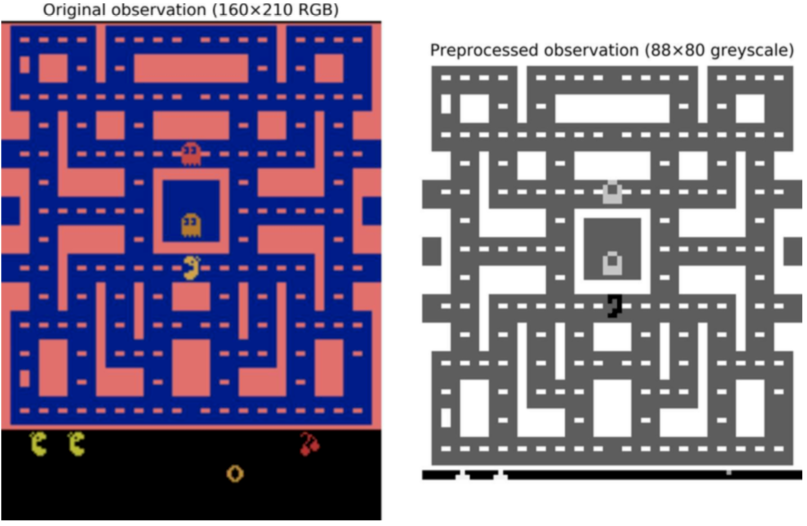

Chapter 16. 강화학습
=======

# 보상에 최적화하기 위한 학습

###### 그림 16-1. 강화학습 예시 - (a):걸어다니는 로봇 ,(b):팩맨 , (c):바둑 , (d):온도 조절 장치 , (e):자동거래

# 정책 탐색 (Policy Search)

###### 그림 16-2. 신경망 정책을 사용한 강화학습

###### 그림 16-3. 정책 공간(Policy space)에서의 4개의 점과 에이전트의 상응하는 행동

# Open AI Gym 소개

###### 그림 16-4. 막대 세우기

# 신경망 정책들

###### 그림 16-5. 신경망 정책

# 행동 평가 : 신뢰할당문제

###### 그림 16-6. 인하된 보상

# 정책 그래디언트

# 말코브 의사결정 과정 (markov decision process)
###### 그림 16-7. 말코브 체인 예시


###### 그림 16-8. 말코브 의사결정 과정


###### 공식 16-1. 벨만 최적성 공식


###### 공식 16-2. 수치반복 알고리즘(Value Iteration algorithm)


###### 공식 16-3. Q 값 반복 알고리즘


# 일시적 차이 학습과 Q학습 (Q-learning)

###### 공식 16-4. 일시적 차이 학습 알고리즘(TD Learning Algorithm)


###### 공식 16-5. Q학습 알고리즘


## 설명 정책들

###### 공식 16-6. 설명함수를 사용한 Q학습


## 근사 Q 학습

# 심층 Q-학습 (Deep Q-Learning)을 사용한 팩맨 플레이 학습
우리는 아타리 환경을 사용해 진행을 할 것이기 때문에, 먼저 Open AI gym의 아타리 의존성 파일들을 설치해야한다. 우리가 팩맨을 실행시키고 싶은 다른 OpenAI gym 환경에 대해서도 의존성 파일들을 설치해줄 것이다. MacOS에서는, [Homebrew](http://brew.sh/)가 설치되어있다고 가정하며, 아래의 코드를 실행시키면 된다.
```
$ brew install cmake boost boost-python sdl2 swig wget
```
우분투에서는 다음의 코드를 입력해주면 된다. (만약 파이썬 2버전 계열을 사용하고 있다면 ,`python3`를 `python`로 바꾸어 사용하자)
```
$ sudo apt-get install -y python3-numpy python3-dev cmake zlib1g-dev libjpeg-dev\
    xvfb libav-tools xorg-dev python3-opengl libboost-all-dev libsdl2-dev swig
```
그리고 나서 추가적으로 필요한 파이썬 모듈을 다운로드 해준다
```
$ pip3 install --upgrade 'gym[all]'
```
이렇게 모든게 설치가 잘 되었다면, 팩맨환경을 만들 수 있게 된다.
```
>>> env = gym.make("MsPacman-v0")
>>> obs = env.reset()
>>> obs.shape
(210, 160, 3)
>>> env.action_space
Discrete(9)
```
보다시피, 9가지의 행동 선택이 있으며 이는 조이스틱의 9가지 가능한 위치(위, 아래, 오른쪽, 왼쪽, 중앙, 위에서 오른쪽 등등)와 상응하며 관찰은 아타리 스크린에 스크린샷을 찍은 것을 사용하며(아래 그림 오른쪽), 3D NumPy 배열로 표시된다. 이러한 이미지들은 사이즈가 크기에, 88 X 80 사이즈로 이미지 크기를 줄이고 흑백영상으로 변환해주고 이미지를 Crop하는 자그마한 전처리 함수를 생성할 것이다. 이는 DQN이 요구하는 연산량을 크게 줄여주며 학습 속도를 향상시켜줄 수 있다.
```
mspacman_color = 210 + 164 + 74

def preprocess_observation(obs):
    img = obs[1:176:2, ::2] # crop and downsize
    img = img.sum(axis=2) # to greyscale
    img[img==mspacman_color] = 0 # Improve contrast
    img = (img // 3 - 128).astype(np.int8) # normalize from -128 to 127
    return img.reshape(88, 80, 1)
```
이에 대한 결과는 그림 16-9에서 볼 수 있다.
###### 그림 16-9. 마이크로소프트 팩맥. 오리지널(왼쪽), 전처리후(오른쪽)


그 다음으로, DQN을 만들어보자. 입력으로는 상태 행동쌍`(s,a)`을 받, 이에 상응하는 Q 값`Q(s,a)`의 평가치를 결과값으로 출력한다. 하지만 행동은 나뉘어져있어 상태 "
s"만을 입력으로 받는 신경망을 사용하는 것이 더 편하다. DQN은 3개의 컨볼루션 계층으로 구현되며, 그 위에는 두개의 전가산층이 붙게되고, 마지막에는 출력계층이 붙게된다. (아래 그림 참고)
###### 그림 16-10. 팩맨 플레이 학습 Deep Q-Network


보다시피, 우리가 사용할 학습 알고리즘은 같은 구조를 가진(하지만 파라미터는 서로 다른) 두개의 DQN을 요구한다. (행동자)하나는 학습중에 팩맨을 플레이하는데 사용될 것이고, (비평자)다른 하나는 행동자를 지켜보고, 행동자의 시행착오로부터 학습을 진행할 것이다. 규칙적인 간격마다 비평자를 복사해 행동자로 사용할 것이다. 두개의 DQN이 필요하기 때문에, 우리는 이를 구현해줄 `q_network()`함수를 구현할 것이다.
```
input_height = 88
input_width = 80
input_channels = 1
conv_n_maps = [32, 64, 64]
conv_kernel_sizes = [(8,8), (4,4), (3,3)]
conv_strides = [4, 2, 1]
conv_paddings = ["SAME"] * 3 
conv_activation = [tf.nn.relu] * 3
n_hidden_in = 64 * 11 * 10  # conv3 has 64 maps of 11x10 each
n_hidden = 512
hidden_activation = tf.nn.relu
n_outputs = env.action_space.n  # 9 discrete actions are available
initializer = tf.contrib.layers.variance_scaling_initializer()

def q_network(X_state, name):
    prev_layer = X_state / 128.0 # scale pixel intensities to the [-1.0, 1.0] range.
    with tf.variable_scope(name) as scope:
        for n_maps, kernel_size, strides, padding, activation in zip(
                conv_n_maps, conv_kernel_sizes, conv_strides,
                conv_paddings, conv_activation):
            prev_layer = tf.layers.conv2d(
                prev_layer, filters=n_maps, kernel_size=kernel_size,
                strides=strides, padding=padding, activation=activation,
                kernel_initializer=initializer)
        last_conv_layer_flat = tf.reshape(prev_layer, shape=[-1, n_hidden_in])
        hidden = tf.layers.dense(last_conv_layer_flat, n_hidden,
                                 activation=hidden_activation,
                                 kernel_initializer=initializer)
        outputs = tf.layers.dense(hidden, n_outputs,
                                  kernel_initializer=initializer)
    trainable_vars = tf.get_collection(tf.GraphKeys.TRAINABLE_VARIABLES,
                                       scope=scope.name)
    trainable_vars_by_name = {var.name[len(scope.name):]: var
                              for var in trainable_vars}
    return outputs, trainable_vars_by_name
```
이 코드의 첫번째 부분은 DQN 구조의 하이퍼 파라미터를 정의한 것이다. 그리고 `q_network()`함수가 입력으로 환경의 상태 `X_state`를 받고, 변수 스코프의 이름을 받아서 DQN을 생성한다. 우리는 여기서 환경의 상태를 나타내는 관찰사항이 하나밖에 없다. 여기에 숨겨진 상태가 거의 없기 때문이다. 

`trainable_vars_by_name` 딕셔너리는 DQN의 모든 학습가능한 변수들을 모아둔다. 이는 비평용 DQN에서 행동용 DQN으로 복사하는 순간에 유용할 것이다. 딕셔너리의 핵심은 스코프의 이름에 상응하는 접두사 부분을 보여주는 변수의 이름이다. 이는 다음과 같이 보일 것이다.
```
>>> trainable_vars_by_name
{'/conv2d/bias:0': <tf.Variable 'q_networks/online/conv2d/bias:0' shape=(32,) dtype=float32_ref>,
 '/conv2d/kernel:0': <tf.Variable 'q_networks/online/conv2d/kernel:0' shape=(8, 8, 1, 32) dtype=float32_ref>,
 '/conv2d_1/bias:0': <tf.Variable 'q_networks/online/conv2d_1/bias:0' shape=(64,) dtype=float32_ref>,
 '/conv2d_1/kernel:0': <tf.Variable 'q_networks/online/conv2d_1/kernel:0' shape=(4, 4, 32, 64) dtype=float32_ref>,
 '/conv2d_2/bias:0': <tf.Variable 'q_networks/online/conv2d_2/bias:0' shape=(64,) dtype=float32_ref>,
 '/conv2d_2/kernel:0': <tf.Variable 'q_networks/online/conv2d_2/kernel:0' shape=(3, 3, 64, 64) dtype=float32_ref>,
 '/dense/bias:0': <tf.Variable 'q_networks/online/dense/bias:0' shape=(512,) dtype=float32_ref>,
 '/dense/kernel:0': <tf.Variable 'q_networks/online/dense/kernel:0' shape=(7040, 512) dtype=float32_ref>,
 '/dense_1/bias:0': <tf.Variable 'q_networks/online/dense_1/bias:0' shape=(9,) dtype=float32_ref>,
 '/dense_1/kernel:0': <tf.Variable 'q_networks/online/dense_1/kernel:0' shape=(512, 9) dtype=float32_ref>}
```
이제 입력 플레이스 홀더와 두개의 DQN, 그리고 비평용 DQN에서 행동용 DQN으로 복사해주는 연산을 만들어주자.
```
X_state = tf.placeholder(tf.float32, shape=[None, input_height, input_width,
                                            input_channels])
online_q_values, online_vars = q_network(X_state, name="q_networks/online")
target_q_values, target_vars = q_network(X_state, name="q_networks/target")

copy_ops = [target_var.assign(online_vars[var_name])
            for var_name, target_var in target_vars.items()]
copy_online_to_target = tf.group(*copy_ops)
```
잠시 뒤로 물러나보자. 우리는 이제 입력으로 (전처리된 관찰자료 같은) 환경 상태를 받고 받은 상태에서 각각의 가능한 행동에 대해서 측정된 Q값을 출력하는 능력을 가진 두 개의 DQN을 가지고 있다. 더해서, 우리는 비평 DQN에서 행동DQN으로 모든 학습 가능한 변수들을 복사해주는 `copy_critic_to_actor`라고 하는 연산함수를 가진다. 단일로 편안한 연산함수로 모든 할당 연산들을 한 그룹으로 묶기 위해서 텐서플로우의 tf.group() 함수를 사용한다. 

행동 DQN은 (초기엔 매우 나쁘게) 팩맨을 플레이하는데 사용된다. 앞에서 다루었다시피, 전체적으로 충분히 게임을 탐색해보기를 원하기때문에, 일반적으로 *ε-greedy policy*를 사용하거나 다른 탐색 전략을 사용한다.

그렇다면, 비평용 DQN은 어떨까? 어떻게 게임을 하는 방법을 배우는 것일까? 짧게 답하자면 게임 경험을 통한 행동자에 의해 평가된 Q값과 예측된 Q값이 맞도록 학습을 진행한다. 특히 행동자가 플레이할 동안, 리플레이 메모리(*replay memory*)라는 곳에 게임을 하면서 얻은 경험을 저장할 것이다. 각각의 메모리는 5-튜플(상태:*state*, 행동:*action*, 다음상태:*next state*, 보상:*reward*, 지속:*continue*)이 될 것이며, "지속:*continue*)"은 0.0이면 게임오버라는 뜻이고, 1.0은 그 이외의 상태를 말한다. 다음으로 정해진 간격마다 리플레이 메모리로부터 메모리들의 배치를 샘플로 만들어, 이러한 메모리 배치들로부터 Q값을 측정할 것이다. 마지막으로, 일반적인 지도학습 기술을 사용해서 이러한 Q값을 예측하는 비평용 DQN을 학습시킬 것이다. 매 몇회씩의 학습 반복(정해진 간격)에 따라 비평용 DQN을 행동용 DQN으로 복사할 것이다. 이제 되었다! 아래 공식은 비평용 DQN을 학습하는데 사용되는 손실 함수이다.
###### 공식 16-7. Deep Q-Learning 손실함수


* _**s^(i), a^(i), r^(i), s′^(i)**_: 각각 리플레이 메모리에서 샘플로 만들어진 상태, 행동, 보상, i번째 메모리의 다음 상태를 의미한다.  
* _**m**_: 메모리 배치 사이즈
* _**θ_critic, θ_actor**_: 비평자와 행동자의 파라미터
* _**Q(s^(i),a^(i),θ_critic)**_: i번째 메모리화된 상태 행동의 Q값에 대한 비평용 DQN
* _**Q(s′^(i),a′,θ_actor)**_: 행동 a′를 선택하면 다음 상태 s′^(i)로부터 기대될 수 있는 Q값에 대한 행동용 DQN의 예측값
* _**y^(i)**_: i번째 메모리에 대한 목표 Q값치. 행동자가 실제로 측정한 보상과 같으며, 게다가 어떤 미래 보상이
* _**J(θ_critic)**_: 비평 DQN에서 학습하는데 쓰이는 손실함수이다. 보다시피 행동용 DQN이 측정한 목표 Q값 y^(i)와 이러한 Q값에 대한 비평용 DQN의 예측치들 사이에 대한 평균제곱근차(*Mean Square Error*)를 사용한다.
```
리플레이 메모리는 선택사항이지만, 강하게 추천한다. 이것없이는 서로 매우 연관있는 연이은 경험들을 사용해서 비편 DQN을 시킬 것이다.
이는 수많은 편향치들을 만들어 낼 것이고 학습 알고리즘이 수렴하는데 오래걸리게할 것이다. 리플레이 메모리를 사용함으로써
학습 알고리즘에 입력되는 메모리들이 서로 꽤 연관되지 않을 수 있도록 해줄 수 있다.
```
비평용 DQN을 만들어보자. 먼저 메모리 배치에서 각각의 상태 행동에 대한 예측된 Q값을 연산해줄 수 있어야한다. DQN은 모든 가능한 행동에 대해서 하나의 Q값을 출력하기에, 우리는 이러한 메모리에서 실제로 선택된 행동에 상응하는 Q값만을 가지고 있어야한다. 이를 위해서 우리는 행동들을 one-hot 벡터로 변환할 것이고, 이를 Q값으로 곱해줄 것이다. 메모리화된 행동에 상응되는 것들을 제외하곤 모든 Q값을 0으로 출력해줄 것이다. 그리고나서 각각의 메모리에 대해서 바람직한 Q값 예측치만을 얻기위해서 첫번째 축을 모두 더해준다.
```
X_action = tf.placeholder(tf.int32, shape=[None])
q_value = tf.reduce_sum(online_q_values * tf.one_hot(X_action, n_outputs),
                        axis=1, keep_dims=True)
```
이제 목표 Q값이 플레이스 홀더를 통해 입력된다 가정하고 학습 연산을 추가해보자. 또한 `global_step`이라는 학습되지 않는 변수를 만든다. 최적화함수의 `minimizer()` 연산은 이를 증가하는데 신경을 써줄 것이다. 더해서 우리는 보통 `init`연산과 `Saver`를 만든다.
```
y = tf.placeholder(tf.float32, shape=[None, 1])
cost=tf.reduce_mean(tf.square(y - q_value))
global_step = tf.Variable(0, trainable=False, name='global_step')
optimizer = tf.train.MomentumOptimizer(learning_rate, momentum, use_nesterov=True)
training_op = optimizer.minimize(loss, global_step=global_step)

init = tf.global_variables_initializer()
saver = tf.train.Saver()
```
여기까지가 구현 단계이다. 실행 단계로 넘어가기전에, 우리는 2가지의 툴이 필요하다. 먼저 첫번째로 리플레이 메모리를 구현해야한다. `deque`리스트를 사용할 것인데, 큐에 아이템을 넣고, 최대 메모리 크기에 도달했을 때 리스트의 끝부터 꺼내는 것에서 매우 효과적이기 때문이다. 또한 리플레이 메모리에서 경험의 배치를 림의로 샘플로 만들어줄 작은 함수도 작성해주어야한다.
```
from collections import deque

replay_memory_size = 500000
replay_memory = deque([], maxlen=replay_memory_size)

def sample_memories(batch_size):
    indices = np.random.permutation(len(replay_memory))[:batch_size]
    cols = [[], [], [], [], []] # state, action, reward, next_state, continue
    for idx in indices:
        memory = replay_memory[idx]
        for col, value in zip(cols, memory):
            col.append(value)
    cols = [np.array(col) for col in cols]
    return cols[0], cols[1], cols[2].reshape(-1, 1), cols[3], cols[4].reshape(-1, 1)
```
다음으로 게임을 탐색하기 위한 행동자가 필요하다. *ε-greedy policy*전략을 사용할 것이며, 점진적으로 ε가 5만번의 학습 스탭동안 1.0에서 0.05로 줄어든다.
```
eps_min = 0.1
eps_max = 1.0
eps_decay_steps = 2000000

def epsilon_greedy(q_values, step):
    epsilon = max(eps_min, eps_max - (eps_max-eps_min) * step/eps_decay_steps)
    if np.random.rand() < epsilon:
        return np.random.randint(n_outputs) # random action
    else:
        return np.argmax(q_values) # optimal action
```
되었다! 이제 학습만 시켜보면 된다. 실행단계는 복잡한 그 어떤 것도 포함하지않지만, 좀 길기 때문에 한숨을 크게 들이쉬고 보아야한다. 준비되었나? 첫번째로 먼저 변수 몇개를 초기화시켜주자.
```
n_steps = 4000000  # total number of training steps
training_start = 10000  # start training after 10,000 game iterations
training_interval = 4  # run a training step every 4 game iterations
save_steps = 1000  # save the model every 1,000 training steps
copy_steps = 10000  # copy online DQN to target DQN every 10,000 training steps
discount_rate = 0.99
skip_start = 90  # Skip the start of every game (it's just waiting time).
batch_size = 50
iteration = 0  # game iterations
checkpoint_path = "./my_dqn.ckpt"
done = True # env needs to be reset
```
그다음에 세션을 열고 메인 학습 루프를 실행시켜주자.
```
with tf.Session() as sess:
    if os.path.isfile(checkpoint_path + ".index"):
        saver.restore(sess, checkpoint_path)
    else:
        init.run()
        copy_online_to_target.run()
    while True:
        step = global_step.eval()
        if step >= n_steps:
            break
        iteration += 1
        print("\rIteration {}\tTraining step {}/{} ({:.1f})%\tLoss {:5f}\tMean Max-Q {:5f}   ".format(
            iteration, step, n_steps, step * 100 / n_steps, loss_val, mean_max_q), end="")
        if done: # game over, start again
            obs = env.reset()
            for skip in range(skip_start): # skip the start of each game
                obs, reward, done, info = env.step(0)
            state = preprocess_observation(obs)

        # Online DQN evaluates what to do
        q_values = online_q_values.eval(feed_dict={X_state: [state]})
        action = epsilon_greedy(q_values, step)

        # Online DQN plays
        obs, reward, done, info = env.step(action)
        next_state = preprocess_observation(obs)

        # Let's memorize what happened
        replay_memory.append((state, action, reward, next_state, 1.0 - done))
        state = next_state

        # Compute statistics for tracking progress (not shown in the book)
        total_max_q += q_values.max()
        game_length += 1
        if done:
            mean_max_q = total_max_q / game_length
            total_max_q = 0.0
            game_length = 0

        if iteration < training_start or iteration % training_interval != 0:
            continue # only train after warmup period and at regular intervals
        
        # Sample memories and use the target DQN to produce the target Q-Value
        X_state_val, X_action_val, rewards, X_next_state_val, continues = (
            sample_memories(batch_size))
        next_q_values = target_q_values.eval(
            feed_dict={X_state: X_next_state_val})
        max_next_q_values = np.max(next_q_values, axis=1, keepdims=True)
        y_val = rewards + continues * discount_rate * max_next_q_values

        # Train the online DQN
        _, loss_val = sess.run([training_op, loss], feed_dict={
            X_state: X_state_val, X_action: X_action_val, y: y_val})

        # Regularly copy the online DQN to the target DQN
        if step % copy_steps == 0:
            copy_online_to_target.run()

        # And save regularly
        if step % save_steps == 0:
            saver.save(sess, checkpoint_path)
```

```
불행히도 학습이 매우 느리다. 만약 학습용으로 노트북을 사용하고 있다면 팩맨이 좋은 결과를 얻는데 까지는 몇일이 걸릴 것이며, 에피소드당 
평균 보상을 측정하는 학습 곡선을 보게된다면, 매우 노이즈가 심하다는 것을 알아차릴 것이다. 일부 지점에서 갑자기 에이전트가 합리적인 
시간동안 살아남도록 학습할 때까지 매우 긴 시간동안 확실한 진행과정이 없다. 앞에서 언급했다시피 하나의 솔루션은 모델속에서 가능한 선행
지식들을 더하는 것이며,(전처리, 보상 등등) 또한 처음에 기본 전략을 모방하도록 모델을 학습시키는 것으로 모델에 bootstrap을 시도해
보는 것이다. 어떠한 경우에서라도 강화학습은 여전히 인내와 조정을 꽤나 많이 요구하지만 최종 결과는 매우 흥미로울 것이다.
```
**[뒤로 돌아가기](../index.md)**

**[위로 올라가기]()**
